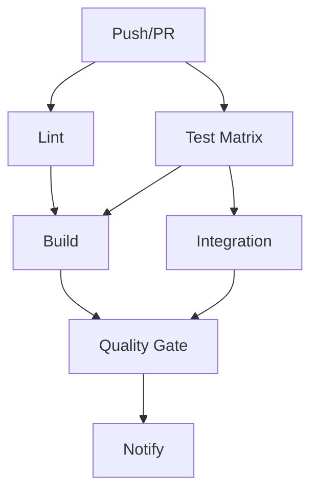

# CI/CD Environment Setup Guide

**Last Updated:** 2025-11-11  
**Version:** 2.0.0

Complete guide to configuring the GitHub Actions CI/CD environment.

---

## Table of Contents

1. [Overview](#overview)
2. [GitHub Actions Configuration](#github-actions-configuration)
3. [Environment Variables](#environment-variables)
4. [Secrets Management](#secrets-management)
5. [Conda Environment Setup](#conda-environment-setup)
6. [Python Version Matrix](#python-version-matrix)
7. [Dependencies and Caching](#dependencies-and-caching)
8. [Artifact Management](#artifact-management)
9. [Workflow Triggers](#workflow-triggers)
10. [Troubleshooting](#troubleshooting)

---

## Overview

The CI/CD pipeline runs in GitHub Actions using Ubuntu runners with Conda environments, testing across Python 3.11, 3.12, and 3.13.

**Key Components:**

- **Runner:** ubuntu-latest
- **Environment:** Miniconda
- **Python:** 3.11, 3.12, 3.13
- **Test Framework:** Pytest with coverage
- **Artifacts:** 30-day retention

---

## GitHub Actions Configuration

### Workflow File

**Location:** `.github/workflows/ci.yml`

```yaml
name: CI/CD Pipeline

on:
  push:
    branches: [main, develop, feature/**, fix/**]
  pull_request:
    branches: [main, develop]

jobs:
  lint:          # Code quality
  test:          # Test matrix
  build:         # Verification
  integration:   # Integration tests
  quality-gate:  # Standards enforcement
  notify:        # Status reporting
```

### Job Dependencies



---

## Environment Variables

### GitHub Actions Defaults

```bash
# Workflow context
GITHUB_WORKFLOW="CI/CD Pipeline"
GITHUB_RUN_ID="1234567890"
GITHUB_ACTION="run-tests"

# Repository
GITHUB_REPOSITORY="owner/repo"
GITHUB_SHA="abc123..."
GITHUB_REF="refs/heads/main"

# Runner
RUNNER_OS="Linux"
RUNNER_ARCH="X64"
CI="true"
```

### Custom Variables

```yaml
env:
  # Python
  PYTHONUNBUFFERED: 1
  PYTHONDONTWRITEBYTECODE: 1

  # Application
  CASCOR_DEBUG: 0
  CASCOR_DEMO_MODE: 1
  CASCOR_DEMO_INTERVAL: 0.1

  # Testing
  PYTEST_ADDOPTS: "--verbose --color=yes"
  COVERAGE_CORE: sysmon
```

### Accessing Variables

**In workflow:**

```yaml
- run: echo "Python: ${{ matrix.python-version }}"
```

**In Python:**

```python
import os
is_ci = os.getenv('CI') == 'true'
debug = os.getenv('CASCOR_DEBUG', '0') == '1'
```

---

## Secrets Management

### Required Secrets

**CODECOV_TOKEN** (for coverage reporting)

**Setup:**

1. Go to [codecov.io](https://codecov.io)
2. Sign in with GitHub
3. Add repository
4. Copy token
5. Add to GitHub:
   - Settings → Secrets → Actions
   - Name: `CODECOV_TOKEN`
   - Value: [token]

**Use in workflow:**

```yaml
- uses: codecov/codecov-action@v4
  with:
    token: ${{ secrets.CODECOV_TOKEN }}
```

### Security Best Practices

- ✅ Never log secret values
- ✅ Rotate secrets regularly
- ✅ Limit access to necessary jobs
- ❌ Never commit secrets
- ❌ Never use in untrusted PRs

---

## Conda Environment Setup

### Environment File

**Location:** `conf/conda_environment.yaml`

```yaml
name: JuniperCanopy
channels:
  - conda-forge
  - pytorch
  - plotly
dependencies:
  - python=3.14
  - pip
  - numpy
  - pandas
  - plotly
  - dash
  - fastapi
  - uvicorn
  - pytest
  - pytest-cov
```

### Workflow Configuration

```yaml
- uses: conda-incubator/setup-miniconda@v3
  with:
    python-version: ${{ matrix.python-version }}
    channels: conda-forge,pytorch,plotly,defaults
    environment-file: conf/conda_environment.yaml
```

### Conda Activation

**All steps must use:**

```yaml
- name: Run Command
  shell: bash -el {0}  # Activates conda
  run: |
    python --version
    pytest --version
```

**Why `bash -el {0}`?**

- `-e`: Exit on error
- `-l`: Login shell (sources conda)
- `{0}`: Command placeholder

---

## Python Version Matrix

### Configuration

```yaml
strategy:
  fail-fast: false
  matrix:
    python-version: ["3.11", "3.12", "3.13"]
```

### Execution

3 parallel jobs:

```bash
Test Suite (Python 3.11)  ─┐
Test Suite (Python 3.12)  ─┼─ Parallel
Test Suite (Python 3.13)  ─┘
```

### Using Matrix Values

```yaml
- name: Test Python ${{ matrix.python-version }}
  run: pytest tests/ -v

- uses: actions/upload-artifact@v4
  with:
    name: test-results-${{ matrix.python-version }}
```

---

## Dependencies and Caching

### Without Caching

```yaml
- name: Install Dependencies
  run: pip install -r conf/requirements.txt
```

**Duration:** ~2-3 minutes

### With Caching

```yaml
- uses: actions/cache@v3
  with:
    path: ~/.cache/pip
    key: ${{ runner.os }}-pip-${{ hashFiles('**/requirements.txt') }}

- run: pip install -r conf/requirements.txt
```

**Benefits:**

- ~30 seconds vs 2-3 minutes
- Reduced bandwidth
- More reliable

### Cache Conda

```yaml
- uses: actions/cache@v3
  with:
    path: |
      /usr/share/miniconda/envs/JuniperPython-CI
      ~/.conda/pkgs
    key: conda-${{ hashFiles('**/conda_environment.yaml') }}
```

---

## Artifact Management

### Test Results

```yaml
- uses: actions/upload-artifact@v4
  if: always()
  with:
    name: test-results-${{ matrix.python-version }}
    path: |
      reports/junit/results.xml
      reports/test_report.html
    retention-days: 30
```

### Coverage Reports

```yaml
- uses: actions/upload-artifact@v4
  with:
    name: coverage-report-${{ matrix.python-version }}
    path: reports/coverage/
    retention-days: 30
```

### Downloading

**Via UI:**

1. Workflow run page
2. Artifacts section
3. Download

**Via CLI:**

```bash
gh run download RUN_ID -n coverage-report-3.13
```

---

## Workflow Triggers

### Push Triggers

```yaml
on:
  push:
    branches:
      - main
      - develop
      - feature/**
      - fix/**
    paths-ignore:
      - '**.md'
      - 'docs/**'
```

### Pull Request

```yaml
on:
  pull_request:
    branches: [main, develop]
    types:
      - opened
      - synchronize
      - reopened
```

### Manual Dispatch

```yaml
on:
  workflow_dispatch:
    inputs:
      python-version:
        type: choice
        options: ['3.11', '3.12', '3.13']
```

### Schedule

```yaml
on:
  schedule:
    - cron: '0 2 * * *'  # Daily 2 AM UTC
```

---

## Troubleshooting

### Conda Activation Fails

**Problem:** `conda: command not found`

**Fix:**

```yaml
shell: bash -el {0}  # Correct
```

### Dependencies Not Found

**Problem:** `ModuleNotFoundError`

**Debug:**

```yaml
- run: |
    which python
    python --version
    pip list
    conda list
  shell: bash -el {0}
```

### Artifacts Too Large

**Limit:** 500 MB

**Fix:**

```yaml
- run: tar -czf reports.tar.gz reports/
- uses: actions/upload-artifact@v4
  with:
    path: reports.tar.gz
```

### Workflow Not Triggering

**Check:**

1. File location: `.github/workflows/ci.yml`
2. YAML syntax valid
3. Actions enabled in settings
4. Correct branch/path filters

---

## Best Practices

### Environment

1. Use environment files for dependencies
2. Pin versions for reproducibility
3. Cache dependencies
4. Minimize setup time (<5 min)

### Secrets

1. Never commit secrets
2. Rotate quarterly
3. Use minimum permissions
4. Audit access regularly

### Resources

1. Use caching
2. Set appropriate timeouts
3. Use concurrency limits
4. Archive old artifacts

---

## Project Resources

### Documentation

- [GitHub Actions](https://docs.github.com/en/actions)
- [Setup Miniconda](https://github.com/conda-incubator/setup-miniconda)
- [Codecov Action](https://github.com/codecov/codecov-action)

### Project Files

- [Quick Start](CICD_QUICK_START.md)
- [Manual](CICD_MANUAL.md)
- [Reference](CICD_REFERENCE.md)

---

**Status:** ✅ Production ready
