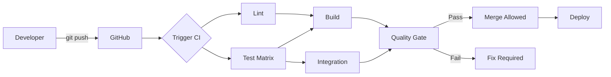

# CI/CD Manual

**Last Updated:** 2026-04-05
**Version:** 0.26.0
**Status:** Current

## Table of Contents

1. [Introduction](#introduction)
2. [For Developers](#for-developers)
3. [For Code Reviewers](#for-code-reviewers)
4. [For Maintainers](#for-maintainers)
5. [Developer Workflow](#developer-workflow)
6. [Maintainer Runbooks](#maintainer-runbooks)
7. [Quality Gates and Merge Criteria](#quality-gates-and-merge-criteria)
8. [Troubleshooting by Failing Job](#troubleshooting-by-failing-job)
9. [References](#references)

---

## Introduction

### What is CI/CD?

**Continuous Integration (CI):**

- Automatically test code on every commit
- Catch bugs early before they reach production
- Ensure code quality through automated checks

**Continuous Deployment (CD):**

- Automatically deploy passing code
- Reduce manual deployment errors
- Enable rapid iteration

### Our CI/CD Stack

```bash
GitHub Actions     # CI/CD platform
├── Conda          # Environment management
├── Pytest         # Test framework
├── Coverage.py    # Coverage tracking
├── Codecov        # Coverage reporting
├── Pre-commit     # Local quality checks
└── Artifacts      # Build outputs
```

### Pipeline Overview



---

## For Developers

### Daily Workflow

#### 1. Before You Start Coding

**Ensure pre-commit hooks are installed:**

```bash
pre-commit install
```

**Pull latest changes:**

```bash
git checkout develop
git pull origin develop
git checkout -b feature/your-feature
```

#### 2. While Coding

**Run tests frequently:**

```bash
cd src
pytest tests/ -v
```

**Check specific module:**

```bash
pytest tests/unit/test_demo_mode.py -v
```

**Watch mode (if pytest-watch installed):**

```bash
uv pip compile pyproject.toml \
  --extra juniper-data \
  --extra juniper-cascor \
  --extra observability \
  -o /tmp/requirements.lock.check
tail -n +3 requirements.lock > /tmp/lock_body
tail -n +3 /tmp/requirements.lock.check > /tmp/check_body
diff -u /tmp/lock_body /tmp/check_body
```

**Run documentation link validation (matches CI docs job):**

```bash
python scripts/check_doc_links.py \
  --exclude templates --exclude history \
  --exclude pull_requests --exclude releases \
  --exclude analysis --exclude fixes --exclude development \
  --exclude CHANGELOG.md \
  --cross-repo skip
```

**Fix any formatting issues:**

```bash
black src/ --line-length=120
isort src/ --profile=black
```

**Run full test suite with coverage:**

```bash
cd src
pytest tests/ --cov=. --cov-report=term-missing
```

**Check coverage meets minimum (60%):**

```bash
# Look for line:
# TOTAL    1234   456    63%
# Must be ≥60%
```

#### 4. Committing

**Stage your changes:**

```bash
git add src/your_file.py tests/unit/test_your_file.py
```

**Commit (hooks run automatically):**

```bash
git commit -m "feat: Add new feature

- Implement feature X
- Add tests for feature X
- Update documentation
"
```

**If hooks fail:**

```bash
# Hooks auto-fix most issues, so:
git add .
git commit -m "feat: Add new feature"  # Try again
```

**Push to GitHub:**

```bash
git push origin feature/your-feature
```

#### 5. Creating Pull Request

**On GitHub:**

1. Navigate to repository
2. Click "Pull requests" → "New pull request"
3. Base: `develop`, Compare: `feature/your-feature`
4. Fill in PR template:
   - **Title:** Brief description
   - **Description:** What changed and why
   - **Tests:** Note test coverage
   - **Screenshots:** If UI changes

**Example PR description:**

```markdown
## Summary
Add pause/resume functionality to demo mode

## Changes
- Added `pause()` and `resume()` methods to DemoMode class
- Implemented thread-safe control flow using Events
- Added 8 new tests for pause/resume functionality

## Testing
- All existing tests pass
- Coverage increased from 78% → 84%
- Manually tested pause/resume in demo mode

## Checklist
- [x] Tests added/updated
- [x] Documentation updated
- [x] Coverage maintained/increased
- [x] Pre-commit hooks pass
```

#### 6. Monitoring CI

**Watch CI progress:**

1. Go to "Checks" tab on your PR
2. Watch jobs complete:
   - ✓ Pre-commit (~2 min)
   - ✓ Unit Tests Python 3.12/3.13/3.14 (~8 min each)
   - ✓ Integration Tests (~5 min, PR/main/develop)
   - ✓ Build (~2 min)
   - ✓ Lockfile Freshness (~1 min)
   - ✓ Documentation Links (~1 min)
   - ✓ Quality Gate (~30 sec)

**If CI fails:**

1. Click on failed job
2. Expand failed step
3. Read error message
4. Fix locally
5. Push fix:

   ```bash
   git add .
   git commit -m "fix: Address CI failure"
   git push
   ```

#### 7. Addressing Review Comments

**Make requested changes:**

```bash
# Make changes
vim src/your_file.py

# Test locally
pytest tests/unit/test_your_file.py -v

# Commit
git add src/your_file.py
git commit -m "Address review feedback: improve error handling"
git push
```

```markdown
**CI runs again automatically on each push**
```

#### 8. After Merge

**Clean up local branch:**

```bash
git checkout develop
git pull origin develop
git branch -d feature/your-feature
```

### Writing Tests

#### Test File Placement

**Follow mirror structure:**

```bash
src/demo_mode.py           → src/tests/unit/test_demo_mode.py
src/config_manager.py      → src/tests/unit/test_config_manager.py
src/communication/websocket_manager.py → src/tests/unit/test_websocket_manager.py
```

#### Test Naming

```python
# File: tests/unit/test_demo_mode.py
class TestDemoMode:
    """Test suite for DemoMode class."""

    def test_start_stop(self):
        """Test starting and stopping demo mode."""
        pass

    def test_thread_safety(self):
        """Test concurrent access to demo mode state."""
        pass
```

#### Test Structure

```python
def test_feature():
    """Test description."""
    # Arrange: Set up test data
    demo = DemoMode()

    # Act: Perform action
    demo.start()
    state = demo.get_current_state()

    # Assert: Verify result
    assert state['running'] is True

    # Cleanup
    demo.stop()
```

#### Coverage Goals

**By module priority:**

```python
# P0: Critical modules - 100% target
config_manager.py
demo_mode.py
communication/websocket_manager.py

# P1: Core modules - 80% target
backend/cascor_integration.py
logger/logger.py

# P2: Frontend - 60% target
frontend/dashboard_manager.py
frontend/components/*.py
```

#### Running Specific Tests

```bash
# Single test
pytest tests/unit/test_demo_mode.py::test_start_stop -v

# Test class
pytest tests/unit/test_demo_mode.py::TestDemoMode -v

# By marker
pytest -m unit -v
pytest -m integration -v
pytest -m "not slow" -v
```

### Coverage Workflow

#### Generate Coverage Report

```bash
cd src
pytest tests/ --cov=. --cov-report=html --cov-report=term-missing
```

#### View HTML Report

```bash
# macOS
open ../reports/coverage/index.html

# Linux
xdg-open ../reports/coverage/index.html

# Windows
start ../reports/coverage/index.html
```

#### Identify Gaps

**In coverage report:**

1. Click on file name
2. Red lines = not covered
3. Yellow lines = partially covered (branches)
4. Green lines = covered

**Focus on:**

- Error handling paths
- Edge cases
- Branch conditions
- Uncovered functions

#### Write Tests for Gaps

```python
# Coverage shows line 45 uncovered:
def process_data(data):
    if not data:
        return None  # Line 45 - RED
    return transform(data)

# Add test:
def test_process_data_empty():
    """Test process_data with empty input."""
    assert process_data(None) is None
    assert process_data([]) is None
    assert process_data({}) is None
```

### Common Development Scenarios

#### Scenario 1: Quick Fix

```bash
# 1. Create branch
git checkout -b fix/quick-fix

# 2. Make change
vim src/config_manager.py

# 3. Test
pytest tests/unit/test_config_manager.py -v

# 4. Commit
git add src/config_manager.py
git commit -m "fix: Handle None in config validation"

# 5. Push
git push origin fix/quick-fix

# 6. Create PR
# GitHub UI → Create pull request

# 7. Wait for CI (should be fast for small fix)

# 8. Merge when approved and CI passes
```

#### Scenario 2: Large Feature

```bash
# 1. Create feature branch
git checkout -b feature/large-feature

# 2. Work in small commits
git commit -m "feat: Add database schema"
git commit -m "feat: Implement database layer"
git commit -m "test: Add database tests"
git commit -m "docs: Update database documentation"

# 3. Keep up to date with develop
git fetch origin
git rebase origin/develop

# 4. Run full test suite before PR
cd src
pytest tests/ --cov=. --cov-report=term

# 5. Create PR when complete
# 6. Address review feedback
# 7. Merge when approved
```

#### Scenario 3: Debugging Test Failure

```bash
# 1. Test fails in CI but passes locally
# Check Python version
python --version  # Local

# 2. Test with CI Python versions
conda create -n test-py311 python=3.11
conda activate test-py311
pip install -r conf/requirements.txt
cd src && pytest tests/ -v

# 3. Identify issue (e.g., Python 3.11 incompatibility)

# 4. Fix
vim src/problematic_file.py

# 5. Test with all versions
for ver in 3.11 3.12 3.13; do
    conda activate test-py${ver}
    pytest tests/ -v
done

# 6. Commit fix
git commit -am "fix: Ensure compatibility with Python 3.11+"
git push
```

---

## For Code Reviewers

### Review Checklist

#### Before Looking at Code

**Check CI status:**

- [ ] All jobs passed (green checkmarks)
- [ ] Coverage maintained or increased
- [ ] No security warnings
- [ ] Artifacts generated successfully

**If CI failed:**

1. Don't review code yet
2. Comment: "Please fix CI failures before review"
3. Wait for green build

#### Code Quality Review

**Check for:**

- [ ] Code follows project style (Black/isort formatted)
- [ ] No unused imports or variables
- [ ] Proper error handling
- [ ] No hardcoded credentials or secrets
- [ ] Thread safety (locks for shared state)
- [ ] Bounded collections (no memory leaks)
- [ ] Docstrings for public methods
- [ ] Type hints where appropriate

#### Test Coverage Review

**Check coverage report:**

1. Go to PR → Checks → Test job → Coverage
2. Look for coverage percentage
3. Expand coverage details

**Verify:**

- [ ] New code has tests
- [ ] Coverage hasn't decreased
- [ ] Critical paths 100% covered
- [ ] Edge cases tested
- [ ] Error paths tested

**Example feedback:**

```markdown
The `validate_config` function looks good, but I don't see tests for:
- Invalid config format
- Missing required fields
- Type validation

Could you add tests for these error cases?
```

#### Documentation Review

**Check:**

- [ ] README updated if API changed
- [ ] CHANGELOG.md has entry
- [ ] Docstrings added/updated
- [ ] Code comments only where needed
- [ ] AGENTS.md updated if dev process changed

#### Functional Review

**Questions to ask:**

1. Does this solve the stated problem?
2. Is the approach appropriate?
3. Are there edge cases not handled?
4. Is it performant?
5. Is it maintainable?
6. Does it follow existing patterns?

### Requesting Changes

**Be specific and constructive:**

❌ **Bad:**

```markdown
This code is messy.
```

✅ **Good:**

```markdown
This function is doing multiple things. Consider splitting it:
- `load_config()` - Load from file
- `validate_config()` - Validate structure
- `apply_config()` - Apply to application

This would improve testability and maintainability.
```

**Prioritize feedback:**

**P0 (Must fix):**

- Security issues
- Correctness bugs
- Test failures
- Breaking changes

**P1 (Should fix):**

- Code quality issues
- Missing tests
- Documentation gaps
- Performance concerns

**P2 (Nice to have):**

- Style preferences
- Refactoring suggestions
- Future improvements

### Approving Changes

**Before approving:**

- [ ] All CI checks passed
- [ ] Code reviewed thoroughly
- [ ] All concerns addressed
- [ ] Coverage acceptable
- [ ] Documentation updated

**Approval message template:**

```markdown
LGTM! 👍

Nice work on the pause/resume functionality. The tests are comprehensive and coverage looks good.

One minor suggestion for future: Consider extracting the state management to a separate class. But that can be a future refactor.

Approved pending green CI.
```

---

## For Maintainers

### Overview

This manual describes how the current GitHub Actions pipeline works and how to operate it safely.
It is source-verified against:

- `.github/workflows/ci.yml`
- `.github/workflows/security-scan.yml`
- `.github/workflows/lockfile-update.yml`
- `.github/workflows/publish.yml`
- `pyproject.toml`
- `scripts/check_doc_links.py`

### Pipeline Intent and Architecture

The pipeline enforces three outcomes:

- Code quality and test safety (`pre-commit`, `unit-tests`, `integration-tests`)
- Supply-chain and security hygiene (`security`, lockfile, scheduled scan)
- Operational correctness of artifacts and docs (`build`, `docker-build`, `docs`, `dependency-docs`)

Primary workflow (`ci.yml`) flow:

1. `pre-commit` runs on Python `3.12/3.13/3.14`
2. `unit-tests` runs matrix tests with coverage gate (`--cov-fail-under=80`)
3. `build` runs once on Python `3.14`
4. Parallel validation jobs run:
   - `integration-tests`
   - `security`
   - `dependency-docs`
   - `lockfile-check`
   - `docs`
   - `docker-build`
5. `required-checks` aggregates results and blocks on failures
6. `notify` emits final summary

## Developer Workflow

### 1. Before pushing a branch

```bash
pre-commit run --all-files

cd src
python -m pytest \
  -m "not requires_cascor and not requires_server and not slow" \
  tests/unit/ tests/regression/ \
  --verbose \
  --cov=. \
  --cov-report=term-missing
```

For integration-sensitive changes:

```bash
cd src
python -m pytest \
  -m "integration and not requires_cascor and not requires_server and not slow" \
  tests/integration \
  --verbose
```

### 2. If dependencies changed

Regenerate lockfile exactly as CI expects:

```bash
uv pip compile pyproject.toml \
  --extra juniper-data \
  --extra juniper-cascor \
  --extra observability \
  -o requirements.lock
```

### 3. If docs changed

Validate links with CI-equivalent arguments:

```bash
python scripts/check_doc_links.py \
  --exclude templates --exclude history \
  --exclude pull_requests --exclude releases \
  --exclude analysis --exclude fixes --exclude development \
  --exclude CHANGELOG.md \
  --cross-repo skip
```

## Maintainer Runbooks

### Runbook: Dependabot lockfile automation

When Dependabot pushes to `dependabot/pip/**`, `lockfile-update.yml`:

1. Regenerates `requirements.lock` via `uv pip compile`
2. Commits `[dependabot skip] Update requirements.lock` if changed
3. Pushes with `CROSS_REPO_DISPATCH_TOKEN` so downstream CI is triggered

Operational constraints:

- Keep `CROSS_REPO_DISPATCH_TOKEN` valid
- Keep compile extras aligned with `ci.yml` (`juniper-data`, `juniper-cascor`, `observability`)
- Keep `requirements.lock` committed in PRs that modify dependency constraints

### Runbook: Scheduled security scan

`security-scan.yml` runs weekly and manually:

1. Installs `bandit[sarif]`, `pip-audit`, and project package (`pip install -e .`)
2. Runs Bandit with SARIF output and text output
3. Runs `pip-audit --strict --desc on`
4. Uploads `reports/security/` artifacts

Use this runbook after dependency updates to confirm no new vulnerabilities are introduced.

### Runbook: Release publishing

`publish.yml` is release-triggered (`release: published`) and uses OIDC:

1. Build and `twine check`
2. Publish to TestPyPI (`environment: testpypi`)
3. Verify installation from TestPyPI
4. Publish to PyPI (`environment: pypi`)

Do not bypass TestPyPI stage; production publish is intentionally downstream.

## Quality Gates and Merge Criteria

PRs are merge-safe when `Quality Gate` succeeds.

`required-checks` enforces:

- Must succeed:
  - `pre-commit`
  - `unit-tests`
  - `lockfile-check`
- Must not fail:
  - `integration-tests` (allowed skipped outside configured refs)
  - `security`
  - `docs`
  - `dependency-docs` (skipped acceptable, failure not)
  - `docker-build` (skipped acceptable, failure not)

Coverage policy:

- Unit-test matrix uses `--cov-fail-under=80` from workflow env and pytest command line.

## Troubleshooting by Failing Job

### `unit-tests` failing on one Python version only

- Reproduce with that interpreter locally.
- Confirm dependency compatibility with `conf/requirements_ci.txt`.
- Re-run marker-filtered command from this manual.

### `lockfile-check` fails with diff

- Recompile `requirements.lock` using all three extras.
- Ensure no manual edits were made to lockfile body.

### `docs` fails

- Run `scripts/check_doc_links.py` with workflow excludes and `--cross-repo skip`.
- Fix broken relative paths or heading anchors.

### `dependency-docs` fails

- Re-run `scripts/generate_dep_docs.sh` locally.
- Validate `conf/conda_environment_ci.yaml` parses and contains dependencies.

### `docker-build` fails

- Build local image from root `Dockerfile`.
- Start container and verify `/v1/health` response.
- Check image startup logs for import/config errors.

### `security` fails

- For Bandit: review `reports/security/bandit.txt` and prioritize medium/high findings.
- For pip-audit: update vulnerable dependencies and regenerate lockfile.

## References

- [CI/CD Quick Start](CICD_QUICK_START.md)
- [CI/CD Environment Setup](CICD_ENVIRONMENT_SETUP.md)
- [CI/CD Reference](CICD_REFERENCE.md)
- [Testing Manual](../testing/TESTING_MANUAL.md)
