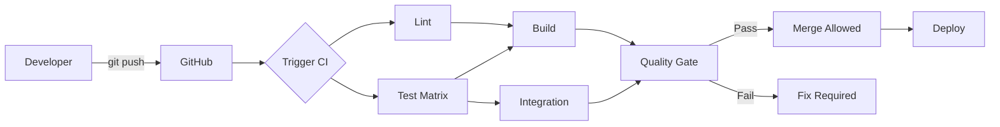

# CI/CD Manual

**Last Updated:** 2026-04-04  
**Version:** 0.26.0  
**Status:** Current

Practical runbook for developers, reviewers, and maintainers based on the active workflows in `.github/workflows/`.

---

## Table of Contents

1. [Overview](#overview)
2. [Developer Workflow](#developer-workflow)
3. [Reviewer Workflow](#reviewer-workflow)
4. [Maintainer Workflow](#maintainer-workflow)
5. [Quality Gates And Failure Handling](#quality-gates-and-failure-handling)
6. [Common CI Failure Patterns](#common-ci-failure-patterns)
7. [Operational Best Practices](#operational-best-practices)

---

## Overview

The primary CI gate is `.github/workflows/ci.yml` and includes:

- pre-commit checks
- fast unit/regression tests with coverage threshold
- fast integration tests
- security scanning
- build/package validation
- lockfile freshness validation
- documentation link validation
- Docker build smoke test
- final aggregate gate (`required-checks`)

Additional workflows:

```bash
GitHub Actions      # CI/CD platform
├── Pip + uv        # CI dependency and lockfile management
├── Pytest          # Test framework
├── Coverage.py     # Coverage tracking and gate
├── Pre-commit      # Local and CI quality checks
├── Doc link check  # scripts/check_doc_links.py
└── Artifacts       # Test/build/security outputs
```

### Pipeline Overview



---

## Developer Workflow

### Before opening a PR

Run the same core checks locally:

```bash
python -m pip install --upgrade pip
pip install pre-commit uv
pip install torch --index-url https://download.pytorch.org/whl/cpu
pip install -r conf/requirements_ci.txt
pip install -e .

pre-commit run --all-files --show-diff-on-failure
```

Run the fast test subsets used in CI:

```bash
python -m pytest \
  -m "not requires_cascor and not requires_server and not slow" \
  src/tests/unit/ src/tests/regression/ -v
```

**Check specific module:**

```bash
python -m pytest src/tests/unit/test_demo_mode.py -v
```

**Watch mode (if pytest-watch installed):**

```bash
ptw tests/ -- -v
```

#### 3. Before Committing

**Run pre-commit hooks manually:**

```bash
pre-commit run --all-files
```

**Fix any formatting issues:**

```bash
black src/ --line-length=120
isort src/ --profile=black
```

```bash
python -m pytest \
  -m "not requires_cascor and not requires_server and not slow" \
  src/tests/unit/ src/tests/regression/ \
  --cov=src --cov-report=term-missing --cov-fail-under=80
```

**Check coverage meets minimum (80%):**

```bash
# Look for line:
# TOTAL    1234   456    83%
# Must be ≥80%
```

#### 4. Committing

**Stage your changes:**

```bash
git add src/your_file.py tests/unit/test_your_file.py
```

**Commit (hooks run automatically):**

```bash
git commit -m "feat: Add new feature

- Implement feature X
- Add tests for feature X
- Update documentation
"
```

**If hooks fail:**

```bash
# Hooks auto-fix most issues, so:
git add .
git commit -m "feat: Add new feature"  # Try again
```

**Push to GitHub:**

```bash
git push origin feature/your-feature
```

#### 5. Creating Pull Request

**On GitHub:**

1. Navigate to repository
2. Click "Pull requests" → "New pull request"
3. Base: `develop`, Compare: `feature/your-feature`
4. Fill in PR template:
   - **Title:** Brief description
   - **Description:** What changed and why
   - **Tests:** Note test coverage
   - **Screenshots:** If UI changes

**Example PR description:**

```markdown
## Summary
Add pause/resume functionality to demo mode

## Changes
- Added `pause()` and `resume()` methods to DemoMode class
- Implemented thread-safe control flow using Events
- Added 8 new tests for pause/resume functionality

## Testing
- All existing tests pass
- Coverage increased from 78% → 84%
- Manually tested pause/resume in demo mode

## Checklist
- [x] Tests added/updated
- [x] Documentation updated
- [x] Coverage maintained/increased
- [x] Pre-commit hooks pass
```

#### 6. Monitoring CI

**Watch CI progress:**

1. Go to "Checks" tab on your PR
2. Watch jobs complete:
   - ✓ pre-commit (Python 3.12/3.13/3.14)
   - ✓ unit-tests
   - ✓ integration-tests
   - ✓ build
   - ✓ security
   - ✓ dependency-docs
   - ✓ lockfile-check
   - ✓ docs
   - ✓ docker-build
   - ✓ required-checks

**If CI fails:**

1. Click on failed job
2. Expand failed step
3. Read error message
4. Fix locally
5. Push fix:

   ```bash
   git add .
   git commit -m "fix: Address CI failure"
   git push
   ```

#### 7. Addressing Review Comments

**Make requested changes:**

```bash
# Make changes
vim src/your_file.py

# Test locally
pytest tests/unit/test_your_file.py -v

# Commit
git add src/your_file.py
git commit -m "Address review feedback: improve error handling"
git push
```

```markdown
**CI runs again automatically on each push**
```

#### 8. After Merge

**Clean up local branch:**

```bash
git checkout develop
git pull origin develop
git branch -d feature/your-feature
```

### Writing Tests

#### Test File Placement

**Follow mirror structure:**

```bash
src/demo_mode.py           → src/tests/unit/test_demo_mode.py
src/config_manager.py      → src/tests/unit/test_config_manager.py
src/communication/websocket_manager.py → src/tests/unit/test_websocket_manager.py
```

#### Test Naming

```python
# File: tests/unit/test_demo_mode.py
class TestDemoMode:
    """Test suite for DemoMode class."""

    def test_start_stop(self):
        """Test starting and stopping demo mode."""
        pass

    def test_thread_safety(self):
        """Test concurrent access to demo mode state."""
        pass
```

#### Test Structure

```python
def test_feature():
    """Test description."""
    # Arrange: Set up test data
    demo = DemoMode()

    # Act: Perform action
    demo.start()
    state = demo.get_current_state()

    # Assert: Verify result
    assert state['running'] is True

    # Cleanup
    demo.stop()
```

#### Coverage Goals

**By module priority:**

```python
# P0: Critical modules - 100% target
config_manager.py
demo_mode.py
communication/websocket_manager.py

# P1: Core modules - 80% target
backend/cascor_integration.py
logger/logger.py

# P2: Frontend - 60% target
frontend/dashboard_manager.py
frontend/components/*.py
```

#### Running Specific Tests

```bash
# Single test
pytest tests/unit/test_demo_mode.py::test_start_stop -v

# Test class
pytest tests/unit/test_demo_mode.py::TestDemoMode -v

# By marker
pytest -m unit -v
pytest -m integration -v
pytest -m "not slow" -v
```

### Validate lockfile and docs gates

```bash
uv pip compile pyproject.toml \
  --extra juniper-data \
  --extra juniper-cascor \
  --extra observability \
  -o /tmp/requirements.lock.check
diff -u requirements.lock /tmp/requirements.lock.check
```

```bash
python scripts/check_doc_links.py \
  --exclude templates --exclude history \
  --exclude pull_requests --exclude releases \
  --exclude analysis --exclude fixes --exclude development \
  --exclude CHANGELOG.md \
  --cross-repo skip
```

### Push and monitor

After pushing your branch, monitor the `CI/CD Pipeline` run in GitHub Actions.  
If `Quality Gate` fails, treat the PR as non-mergeable until fixed.

---

## Reviewer Workflow

### What to check first

1. `Quality Gate` must be green.
2. If red, request the author resolve CI before detailed review.

### Review focus after CI passes

1. Behavior correctness for changed code paths.
2. Tests added/updated for behavior changes.
3. Lockfile updates present when dependencies changed.
4. Documentation updates for API/workflow/operator-impact changes.

### Useful reviewer checks

1. Confirm job failure context (if any) in Actions logs.
2. Verify failure is not hidden by `continue-on-error` in critical stages.
3. Confirm docs-only changes still satisfy `docs` link checks.

---

## Maintainer Workflow

### Required branch gate

Set branch protection to require `Quality Gate` from `ci.yml`.

Why:

- it aggregates all critical jobs
- it normalizes handling for conditional jobs (like integration/docker on specific events)

### Weekly maintenance

1. Review recurring failure trends in CI logs.
2. Check if lockfile failures are frequent (dependency churn signal).
3. Check docs link failures for recurring stale paths/anchors.
4. Review scheduled `security-scan.yml` output artifacts.

### Dependency update flow

Dependabot branch updates trigger `.github/workflows/lockfile-update.yml`, which:

1. compiles lockfile candidate via `uv`
2. applies to `requirements.lock`
3. commits only when changed

If CI lockfile check fails on a non-Dependabot branch, author should regenerate locally and commit:

```bash
uv pip compile pyproject.toml \
  --extra juniper-data \
  --extra juniper-cascor \
  --extra observability \
  -o requirements.lock
```

---

## Quality Gates And Failure Handling

### Hard gate semantics

`required-checks` fails on:

- failed `pre-commit`
- failed `unit-tests`
- failed `security`
- failed `integration-tests`
- failed `dependency-docs`
- failed `docs`
- non-success `lockfile-check`
- failed `docker-build`

### Typical triage order

1. Fix `pre-commit` failures first.
2. Fix `unit-tests` (highest signal for regressions).
3. Fix `lockfile-check` if stale.
4. Fix `docs` link issues if documentation touched.
5. Fix `docker-build` for packaging/runtime health.

---

## Common CI Failure Patterns

### 1. Stale lockfile

Symptom:

- `lockfile-check` fails with diff output

Fix:

```bash
uv pip compile pyproject.toml \
  --extra juniper-data \
  --extra juniper-cascor \
  --extra observability \
  -o requirements.lock
git add requirements.lock
```

### 2. Docs link validation failures

Symptom:

- `docs` job reports broken file/anchor links

Fix:

```bash
python scripts/check_doc_links.py --cross-repo skip
```

Then repair the exact path/anchor indicated by the script.

### 3. Test collection or marker mismatch

Symptom:

- pytest exits during collection or marker parsing

Fix:

1. Run the exact command from CI locally.
2. Validate markers in `pyproject.toml` and test files.
3. Ensure imports and test paths are stable under `cd src`.

### 4. CI-only dependency resolution differences

Symptom:

- local pass, CI import/module failure

Fix:

```bash
python -m pip install --upgrade pip
pip install torch --index-url https://download.pytorch.org/whl/cpu
pip install -r conf/requirements_ci.txt
pip install -e .
```

---

## Operational Best Practices

1. Keep PRs scoped and avoid mixing code, dependency, and large docs rewrites when possible.
2. Update docs in the same change set when workflow behavior changes.
3. Prefer failing early and explicitly in CI jobs over implicit downstream failures.
4. Run lockfile/docs checks locally before requesting review.
5. Treat `security-scan.yml` as a maintenance signal, not just a compliance box.

---

1. Set up Conda environment
2. Install dependencies
3. Run pytest with coverage
4. Generate reports (XML, HTML, JUnit)
5. Upload to Codecov
6. Upload artifacts
7. Check coverage threshold

**Duration:** ~8 minutes per version

**Failure conditions:**

- Any test fails
- Coverage <60%
- Collection errors

### Build Stage

**Purpose:** Verify project can be packaged

**Steps:**

1. Verify project structure
2. Check Python syntax
3. Generate build metadata

**Duration:** ~2 minutes

**Failure conditions:**

- Syntax errors
- Missing critical files

### Integration Stage

**Purpose:** Test component interactions

**When:** Pull requests only

**Steps:**

1. Run integration tests (`tests/integration/`)
2. Skip external dependencies (`-m "not requires_cascor"`)

**Duration:** ~5 minutes

**Failure conditions:**

- Integration test failures

### Quality Gate Stage

**Purpose:** Aggregate results and enforce standards

**Checks:**

```python
if test_result == "failure":
    fail("Tests failed")
elif build_result == "failure":
    fail("Build failed")
elif lint_result == "failure":
    warn("Linting failed")
else:
    pass("Quality gate passed")
```

**Duration:** ~30 seconds

### Notify Stage

**Purpose:** Report final status

**Information logged:**

- Workflow name
- Branch
- Commit SHA
- Actor (who triggered)
- Final status

**Duration:** ~10 seconds

---

## Quality Gates and Metrics

### Coverage Metrics

**Overall coverage:**

```bash
Current:  73%
Target:   80%
Minimum:  80%
```

**By module:**

| Module            | Current | Target | Status     |
| ----------------- | ------- | ------ | ---------- |
| config_manager    | 93%     | 100%   | ⚠️ Close   |
| demo_mode         | 84%     | 100%   | ⚠️ Close   |
| websocket_manager | 78%     | 100%   | ❌ Gap     |
| dashboard_manager | 84%     | 60%    | ✅ Exceeds |
| metrics_panel     | 94%     | 60%    | ✅ Exceeds |

### Test Metrics

**Test counts:**

```bash
Total:        170 tests
Unit:         120 tests (71%)
Integration:   40 tests (23%)
Performance:   10 tests (6%)
```

**Pass rate:**

```bash
Required:     100%
Current:      100%
Status:       ✅ Pass
```

### Performance Metrics

**Build times:**

```bash
Lint:         2 min
Test (3.11):  8 min
Test (3.12):  8 min
Test (3.13):  8 min
Build:        2 min
Integration:  5 min
Total:        ~15 min (with parallelization)
```

**Targets:**

- Total build: <20 min
- Individual job: <10 min
- Critical path: <15 min

---

## Debugging Failed Builds

### Systematic Debugging Process

**1. Identify failure type:**

```bash
✓ Lint
✗ Test Suite (Python 3.13)
✓ Build
✓ Integration
✗ Quality Gate
```

**2. Examine failed job:**

- Click on failed job
- Expand failed step
- Read error message

**3. Reproduce locally:**

```bash
# Match CI environment
conda create -n debug-ci python=3.13
conda activate debug-ci
pip install -r conf/requirements.txt

# Run failing test
cd src
pytest tests/unit/test_failing.py -vv
```

**4. Debug with more verbosity:**

```bash
# Maximum verbosity
pytest tests/ -vv -s --tb=long

# Drop into debugger on failure
pytest tests/ --pdb

# Show local variables
pytest tests/ --showlocals
```

**5. Fix and verify:**

```bash
# Fix code
vim src/module.py

# Verify fix
pytest tests/unit/test_module.py -v

# Run full suite
pytest tests/ -v
```

**6. Push fix:**

```bash
git add src/module.py
git commit -m "fix: Resolve test failure in module"
git push
```

### Common Failure Patterns

#### Pattern 1: Import Error

**Symptom:**

```bash
ERROR: ModuleNotFoundError: No module named 'uvicorn'
```

**Causes:**

1. Missing from `requirements.txt`
2. Conda environment not activated
3. Typo in import statement

**Fix:**

```bash
# Add to requirements.txt
echo "uvicorn>=0.20.0" >> conf/requirements.txt

# Verify locally
pip install -r conf/requirements.txt
pytest tests/ -v
```

#### Pattern 2: Fixture Not Found

**Symptom:**

```bash
ERROR: fixture 'mock_config_file' not found
```

**Causes:**

1. `conftest.py` not in correct location
2. Fixture name typo
3. Pytest not discovering fixtures

**Fix:**

```bash
# Ensure conftest.py at tests root
ls src/tests/conftest.py

# Check fixture definition
grep "def mock_config_file" src/tests/conftest.py
```

#### Pattern 3: Assertion Failure

**Symptom:**

```bash
FAILED tests/unit/test_demo_mode.py::test_metrics
AssertionError: assert {'epoch': 1} == {'epoch': 0}
```

**Causes:**

1. Logic bug
2. Test assumption wrong
3. Race condition
4. State not reset

**Fix:**

```python
# Debug test
def test_metrics():
    demo = DemoMode()
    demo.start()

    # Add debug output
    state = demo.get_current_state()
    print(f"State: {state}")  # Use -s flag to see

    assert state['epoch'] == 0
```

#### Pattern 4: Coverage Too Low

**Symptom:**

```bash
ERROR: Coverage is critically low: 55% (minimum: 60%)
```

**Causes:**

1. New code without tests
2. Tests deleted
3. Dead code added

**Fix:**

```bash
# Generate coverage report
cd src
pytest tests/ --cov=. --cov-report=html

# View report
open ../reports/coverage/index.html

# Add tests for uncovered code
vim tests/unit/test_new_feature.py
```

---

## Performance Optimization

### Current Performance

**Baseline:**

```bash
Lint:         2 min
Test Matrix:  24 min (8 min × 3 versions)
Build:        2 min
Integration:  5 min
Total:        33 min sequential
              15 min parallel (current)
```

### Optimization Strategies

#### 1. Dependency Caching

**Before:** Install dependencies every run (~2 min)

**After:** Cache dependencies (~30 sec)

```yaml
- name: Cache pip packages
  uses: actions/cache@668228422ae6a00e4ad889ee87cd7109ec5666a7  # v5.0.4
  with:
    path: ~/.cache/pip
    key: ${{ runner.os }}-pip-${{ hashFiles('**/requirements.txt') }}
```

**Savings:** ~1.5 min per job

#### 2. Pytest Cache

**Before:** Full test discovery every run

**After:** Cache test results

```yaml
- name: Cache pytest
  uses: actions/cache@668228422ae6a00e4ad889ee87cd7109ec5666a7  # v5.0.4
  with:
    path: src/.pytest_cache
    key: ${{ runner.os }}-pytest-${{ hashFiles('**/tests/**') }}
```

**Savings:** ~10-20 seconds

#### 3. Parallel Test Execution

**Before:** Tests run sequentially

**After:** Tests run in parallel

```bash
# Install pytest-xdist
pip install pytest-xdist

# Run tests in parallel
pytest tests/ -n auto  # Auto-detect CPU count
pytest tests/ -n 4     # Use 4 workers
```

**Savings:** 30-50% reduction in test time

#### 4. Skip Slow Tests

**Mark slow tests:**

```python
@pytest.mark.slow
def test_long_running_operation():
    # Takes 30+ seconds
    pass
```

**Skip in CI:**

```yaml
- name: Run Tests (skip slow)
  run: pytest tests/ -m "not slow"
```

**Savings:** Variable, depends on slow tests

#### 5. Optimize Matrix

**Before:** Test all versions

```yaml
matrix:
  python-version: ["3.11", "3.12", "3.13"]
```

**After:** Primary version + periodic full matrix

```yaml
matrix:
  python-version: ["3.13"]  # Fast feedback

# Full matrix on:
# - Pull requests to main
# - Nightly builds
# - Release tags
```

**Savings:** ~16 min (2 fewer versions)

### Recommended Optimizations

#### Phase 1: Quick wins

1. Add pip caching
2. Add pytest caching
3. Skip slow tests on non-main branches

**Expected improvement:** 15 min → 10 min

#### Phase 2: Medium effort

1. Use pytest-xdist for parallel tests
2. Optimize test fixtures
3. Conditional matrix (single version for PRs)

**Expected improvement:** 10 min → 7 min

#### Phase 3: Advanced

1. Split test suite into shards
2. Use self-hosted runners
3. Implement test impact analysis

**Expected improvement:** 7 min → 5 min

---

## Security Considerations

### Secrets Management

**Never commit:**

- API keys
- Passwords
- Private keys
- Tokens
- Certificates

**Always use GitHub Secrets:**

```yaml
- name: Use Secret
  env:
    TOKEN: ${{ secrets.API_TOKEN }}
  run: |
    # Secret available as $TOKEN
    # Never echo the value!
```

### Security Scanning

**Bandit security scanner:**

```yaml
- name: Security Scan
  run: bandit -r src/ -c pyproject.toml
```

**Common issues caught:**

- Hardcoded passwords
- SQL injection
- Use of `eval()`/`exec()`
- Insecure random

### Dependency Security

**Dependabot alerts:**

1. Enable Dependabot in repository settings
2. Review alerts weekly
3. Update vulnerable dependencies promptly

**Example:**

```yaml
# .github/dependabot.yml
version: 2
updates:
  - package-ecosystem: "pip"
    directory: "/"
    schedule:
      interval: "weekly"
```

### Code Scanning

**GitHub Advanced Security:**

1. Enable code scanning
2. Run CodeQL analysis
3. Review and fix findings

```yaml
# .github/workflows/codeql.yml
- name: Initialize CodeQL
  uses: github/codeql-action/init@v2
  with:
    languages: python
```

---

## Emergency Procedures

### Build System Down

**Symptoms:**

- All workflows failing
- GitHub Actions unavailable
- Runners not available

**Actions:**

1. Check [GitHub Status](https://www.githubstatus.com)
2. If outage, wait for resolution
3. Communicate to team
4. Delay merges until restored

**Workaround:**

```bash
# Run tests locally before merge
pytest tests/ --cov=. -v

# Get manual approval from maintainer
# Merge with --no-verify if urgent
```

### Critical Bug in Production

**Scenario:** Need to deploy fix immediately

**Procedure:**

```bash
# 1. Create hotfix branch
git checkout -b hotfix/critical-fix

# 2. Make minimal fix
vim src/broken_module.py

# 3. Test locally
pytest tests/ -v

# 4. Commit
git commit -am "hotfix: Fix critical bug"

# 5. Push
git push origin hotfix/critical-fix

# 6. Create PR
# Title: "[HOTFIX] Fix critical bug"

# 7. Request immediate review

# 8. If CI taking too long and fix is verified:
# - Get approval from 2+ maintainers
# - Merge despite CI running
# - Monitor CI completion
# - Revert if CI fails
```

### Coverage Threshold Blocking Valid Work

**Scenario:** Coverage drop due to external factors

**Temporary bypass:**

```yaml
# .github/workflows/ci.yml
- name: Check Coverage Threshold
  run: |
    # Temporarily disabled due to refactoring
    echo "Coverage check disabled - Issue #789"
  continue-on-error: true
```

**Process:**

1. Create issue documenting reason
2. Set deadline for re-enabling
3. Announce to team
4. Track progress on issue
5. Re-enable threshold
6. Close issue

### Flaky Test Epidemic

**Scenario:** Multiple tests failing intermittently

**Immediate action:**

```bash
# Disable flaky tests temporarily
# File: tests/unit/test_flaky.py

@pytest.mark.skip(reason="Flaky - Issue #456")
def test_problematic():
    pass
```

**Create issues:**

```markdown
# Issue: Fix flaky test_websocket_connection

## Symptoms
- Fails ~30% of time
- ConnectionRefusedError
- Only on CI, not local

## Investigation needed
- [ ] Check timing assumptions
- [ ] Review WebSocket lifecycle
- [ ] Add retries
- [ ] Improve test isolation

## Deadline
Fix by: 2025-11-12

### Track and fix systematically
```

---

## Best Practices Summary

### For Developers: Best Practices

1. ✅ Run tests locally before pushing
2. ✅ Keep PRs focused and small
3. ✅ Write tests for new code
4. ✅ Maintain/increase coverage
5. ✅ Update documentation
6. ✅ Monitor CI results
7. ✅ Fix failures promptly

### For Reviewers: Best Practices

1. ✅ Check CI before reviewing code
2. ✅ Verify tests exist and are meaningful
3. ✅ Check coverage hasn't decreased
4. ✅ Look for security issues
5. ✅ Provide constructive feedback
6. ✅ Approve only when CI passes

### For Maintainers: Best Practices

1. ✅ Monitor CI health metrics
2. ✅ Keep dependencies updated
3. ✅ Optimize build performance
4. ✅ Adjust thresholds appropriately
5. ✅ Fix flaky tests promptly
6. ✅ Document processes
7. ✅ Plan for emergencies

---

## Resources

### Internal Documentation

- [CICD_QUICK_START.md](CICD_QUICK_START.md) - Quick start guide
- [CICD_ENVIRONMENT_SETUP.md](CICD_ENVIRONMENT_SETUP.md) - Environment configuration
- [CICD_REFERENCE.md](CICD_REFERENCE.md) - Technical reference
- [AGENTS.md](../../AGENTS.md) - Project development guide
- [README.md](../../README.md) - Project overview

### External Resources

- [GitHub Actions Documentation](https://docs.github.com/en/actions)
- [Pytest Documentation](https://docs.pytest.org/)
- [Coverage.py Documentation](https://coverage.readthedocs.io/)
- [Codecov Documentation](https://docs.codecov.com/)
- [Pre-commit Documentation](https://pre-commit.com/)

---

- [CI/CD Quick Start](CICD_QUICK_START.md)
- [CI/CD Environment Setup](CICD_ENVIRONMENT_SETUP.md)
- [CI/CD Reference](CICD_REFERENCE.md)
