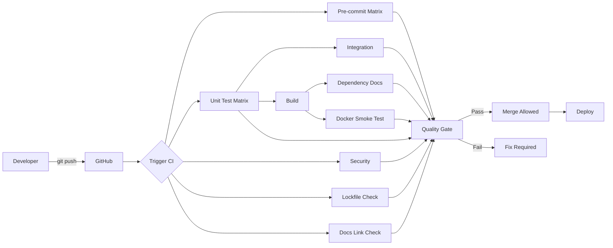

# CI/CD Manual

**Last Updated:** 2026-04-04
**Version:** 0.26.0
**Status:** Current

Comprehensive operational guide for developers, reviewers, and maintainers working with JuniperCanopy CI workflows.

---

## Table of Contents

1. [Overview](#overview)
2. [For Developers](#for-developers)
3. [For Reviewers](#for-reviewers)
4. [For Maintainers](#for-maintainers)
5. [Workflow Deep Dive](#workflow-deep-dive)
6. [Lockfile and Dependency Workflow](#lockfile-and-dependency-workflow)
7. [Documentation Link Validation Workflow](#documentation-link-validation-workflow)
8. [Troubleshooting Playbook](#troubleshooting-playbook)

---

## Overview

JuniperCanopy CI is implemented with GitHub Actions and enforces a multi-stage quality gate:

- pre-commit checks on Python `3.12`, `3.13`, `3.14`
- unit/regression tests with coverage gate on Python `3.12`, `3.13`, `3.14`
- integration subset tests
- security scans
- build verification
- lockfile freshness verification
- documentation link verification
- Docker build and smoke test
- final aggregate quality gate

Primary workflow files:

```bash
GitHub Actions     # CI/CD platform
├── setup-python   # Python runtime setup
├── pip            # Dependency installation
├── Pytest         # Test framework
├── Coverage.py    # Coverage tracking
├── Pre-commit     # Local quality checks
├── Link Checker   # Documentation link validation
├── uv             # Lockfile freshness checks
└── Artifacts      # Build outputs
```

### Pipeline Overview



---

## For Developers

### Daily Workflow

#### 1. Before You Start Coding

**Ensure pre-commit hooks are installed:**

```bash
pre-commit install
```

**Pull latest changes:**

```bash
git checkout develop
git pull origin develop
git checkout -b feature/your-feature
```

#### 2. While Coding

**Run tests frequently:**

```bash
python -m pytest src/tests/ -v
```

**Check specific module:**

```bash
python -m pytest src/tests/unit/test_demo_mode.py -v
```

**Watch mode (if pytest-watch installed):**

```bash
ptw src/tests/ -- -v
```

#### 3. Before Committing

**Run pre-commit hooks manually:**

```bash
pre-commit run --all-files
```

**Fix any formatting issues:**

```bash
black src/ --line-length=120
isort src/ --profile=black
```

**Run full test suite with coverage:**

```bash
python -m pytest src/tests/ --cov=src --cov-report=term-missing
```

**Check coverage meets minimum (80%):**

```bash
# Look for line:
# TOTAL    1234   456    63%
# Must be ≥80%
```

#### 4. Committing

**Stage your changes:**

```bash
git add src/your_file.py tests/unit/test_your_file.py
```

**Commit (hooks run automatically):**

```bash
git commit -m "feat: Add new feature

- Implement feature X
- Add tests for feature X
- Update documentation
"
```

**If hooks fail:**

```bash
# Hooks auto-fix most issues, so:
git add .
git commit -m "feat: Add new feature"  # Try again
```

**Push to GitHub:**

```bash
git push origin feature/your-feature
```

#### 5. Creating Pull Request

**On GitHub:**

1. Navigate to repository
2. Click "Pull requests" → "New pull request"
3. Base: `develop`, Compare: `feature/your-feature`
4. Fill in PR template:
   - **Title:** Brief description
   - **Description:** What changed and why
   - **Tests:** Note test coverage
   - **Screenshots:** If UI changes

**Example PR description:**

```markdown
## Summary
Add pause/resume functionality to demo mode

## Changes
- Added `pause()` and `resume()` methods to DemoMode class
- Implemented thread-safe control flow using Events
- Added 8 new tests for pause/resume functionality

## Testing
- All existing tests pass
- Coverage increased from 78% → 84%
- Manually tested pause/resume in demo mode

## Checklist
- [x] Tests added/updated
- [x] Documentation updated
- [x] Coverage maintained/increased
- [x] Pre-commit hooks pass
```

#### 6. Monitoring CI

**Watch CI progress:**

1. Go to "Checks" tab on your PR
2. Watch jobs complete:
   - ✓ Pre-commit (Python 3.12/3.13/3.14)
   - ✓ Unit Tests + Coverage (Python 3.12/3.13/3.14)
   - ✓ Integration Tests
   - ✓ Security Scans
   - ✓ Build Distribution
   - ✓ Dependency Documentation
   - ✓ Lockfile Freshness
   - ✓ Documentation Links
   - ✓ Docker Build & Smoke Test
   - ✓ Quality Gate

**If CI fails:**

1. Click on failed job
2. Expand failed step
3. Read error message
4. Fix locally
5. Push fix:

   ```bash
   git add .
   git commit -m "fix: Address CI failure"
   git push
   ```

#### 7. Addressing Review Comments

**Make requested changes:**

```bash
# Make changes
vim src/your_file.py

# Test locally
python -m pytest src/tests/unit/test_your_file.py -v

# Commit
git add src/your_file.py
git commit -m "Address review feedback: improve error handling"
git push
```

```markdown
**CI runs again automatically on each push**
```

#### 8. After Merge

**Clean up local branch:**

```bash
git checkout develop
git pull origin develop
git branch -d feature/your-feature
```

### Writing Tests

#### Test File Placement

**Follow mirror structure:**

```bash
src/demo_mode.py           → src/tests/unit/test_demo_mode.py
src/config_manager.py      → src/tests/unit/test_config_manager.py
src/communication/websocket_manager.py → src/tests/unit/test_websocket_manager.py
```

#### Test Naming

```python
# File: tests/unit/test_demo_mode.py
class TestDemoMode:
    """Test suite for DemoMode class."""

    def test_start_stop(self):
        """Test starting and stopping demo mode."""
        pass

    def test_thread_safety(self):
        """Test concurrent access to demo mode state."""
        pass
```

#### Test Structure

```python
def test_feature():
    """Test description."""
    # Arrange: Set up test data
    demo = DemoMode()

    # Act: Perform action
    demo.start()
    state = demo.get_current_state()

    # Assert: Verify result
    assert state['running'] is True

    # Cleanup
    demo.stop()
```

#### Coverage Goals

**By module priority:**

```python
# P0: Critical modules - 100% target
config_manager.py
demo_mode.py
communication/websocket_manager.py

# P1: Core modules - 80% target
backend/cascor_integration.py
logger/logger.py

# P2: Frontend - 60% target
frontend/dashboard_manager.py
frontend/components/*.py
```

#### Running Specific Tests

```bash
# Single test
python -m pytest src/tests/unit/test_demo_mode.py::test_start_stop -v

# Test class
python -m pytest src/tests/unit/test_demo_mode.py::TestDemoMode -v

# By marker
python -m pytest -m unit -v
python -m pytest -m integration -v
python -m pytest -m "not slow" -v
```

### Coverage Workflow

#### Generate Coverage Report

```bash
python -m pytest src/tests/ --cov=src --cov-report=html:reports/htmlcov --cov-report=term-missing
```

#### View HTML Report

```bash
# macOS
open reports/htmlcov/index.html

# Linux
xdg-open reports/htmlcov/index.html

# Windows
start reports/htmlcov/index.html
```

#### Identify Gaps

**In coverage report:**

1. Install/refresh development tooling.

    ```bash
    python -m pip install --upgrade pip
    pip install pre-commit uv
    pre-commit install


2. Run the same fast unit/regression subset used by CI:

    ```bash
    python -m pytest \
      -m "not requires_cascor and not requires_server and not slow" \
      src/tests/unit/ src/tests/regression/ \
      --verbose \
      --cov=src \
      --cov-report=term-missing \
      --cov-fail-under=80
    ```

3. Run the same fast integration subset used by CI:

# 3. Test
python -m pytest src/tests/unit/test_config_manager.py -v

4. Run docs-link validation with CI-equivalent flags:

    ```bash
    python scripts/check_doc_links.py \
      --exclude templates --exclude history \
      --exclude pull_requests --exclude releases \
      --exclude analysis --exclude fixes --exclude development \
      --exclude CHANGELOG.md \
      --cross-repo skip
    ```

5. If dependencies changed, regenerate lockfile before push:

    ```bash
    uv pip compile pyproject.toml \
      --extra juniper-data \
      --extra juniper-cascor \
      --extra observability \
      -o requirements.lock
    ```

### Monitoring CI on PRs

```bash
# 1. Create feature branch
git checkout -b feature/large-feature

# 2. Work in small commits
git commit -m "feat: Add database schema"
git commit -m "feat: Implement database layer"
git commit -m "test: Add database tests"
git commit -m "docs: Update database documentation"

# 3. Keep up to date with develop
git fetch origin
git rebase origin/develop

# 4. Run full test suite before PR
python -m pytest src/tests/ --cov=src --cov-report=term

# 5. Create PR when complete
# 6. Address review feedback
# 7. Merge when approved
```

- `Pre-commit (Python 3.12/3.13/3.14)`
- `Unit Tests + Coverage (Python 3.12/3.13/3.14)`
- `Integration Tests`
- `Security Scans`
- `Build Distribution`
- `Dependency Documentation`
- `Lockfile Freshness`
- `Documentation Links`
- `Docker Build & Smoke Test`
- `Quality Gate`

```bash
# 1. Test fails in CI but passes locally
# Check Python version
python --version  # Local

# 2. Test with CI Python versions
conda create -n test-py314 python=3.14
conda activate test-py314
pip install -r conf/requirements.txt
python -m pytest src/tests/ -v

# 3. Identify issue (e.g., Python 3.12+ incompatibility)

# 4. Fix
vim src/problematic_file.py

# 5. Test with all versions
for ver in 3.12 3.13 3.14; do
    conda activate test-py${ver}
    python -m pytest src/tests/ -v
done

# 6. Commit fix
git commit -am "fix: Ensure compatibility with Python 3.12+"
git push
```

---

## For Reviewers

### Review Checklist

1. Confirm CI reached `Quality Gate` success.
2. Confirm test-related changes include corresponding test updates.
3. Confirm dependency changes include:
   - `pyproject.toml` updates
   - `requirements.lock` regeneration
   - CI lockfile-check compatibility
4. Confirm documentation changes do not break internal links.
5. Confirm no workflow drift was introduced unintentionally.

### High-Signal Failure Patterns

- `Lockfile Freshness` failed: lockfile is stale vs `pyproject.toml`.
- `Documentation Links` failed: broken markdown link or heading anchor.
- `Unit Tests + Coverage` failed at 80% threshold or test failures.
- `Docker Build & Smoke Test` failed: packaging/runtime mismatch.

---

## For Maintainers

### Monitoring CI Health

#### Weekly Tasks

**1. Review CI metrics:**

```bash
# Average build time
# Target: <15 minutes

# Success rate
# Target: >90%

# Flaky test rate
# Target: <5%
```

**2. Check resource usage:**

- GitHub Actions minutes used
- Artifact storage used
- Security scan trends (Bandit/pip-audit findings)

**3. Review failed builds:**

- Identify patterns
- Fix flaky tests
- Update documentation

#### Monthly Tasks

**1. Update dependencies:**

```bash
# Update pre-commit hooks
pre-commit autoupdate

# Update GitHub Actions versions
# Edit .github/workflows/ci.yml
# - uses: actions/checkout@v6  # check for new major
# - uses: actions/setup-python@v6  # check for new major
```

**2. Review coverage trends:**

- Overall coverage increasing?
- Any modules losing coverage?
- Critical modules at target?

- Keep matrix and pinned runtime versions aligned across workflows.
- Keep lockfile-generation command consistent between:
  - local contributor guidance
  - CI lockfile-check job
  - lockfile-update workflow
- Ensure docs-link exclusions remain intentional and minimal.
- Periodically review artifact retention and workflow runtime cost.

- Rotate any CI service/API secrets in use
- Check secret access logs
- Remove unused secrets

Require at minimum:

- `Quality Gate`

```yaml
# Are thresholds appropriate?
coverage:
  target: 80%  # Too high/low?
  minimum: 80%  # Adjust based on reality
```

**2. Optimize build performance:**

---

## Workflow Deep Dive

### CI Trigger Model

`ci.yml` triggers on:

- `push` to `main`, `develop`, `feature/**`, `fix/**`
- `pull_request` to `main`, `develop`
- `repository_dispatch` for client update events
- manual `workflow_dispatch`

```yaml
Coverage:
  Warning: <80%
  Failure: <80%

1. `pre-commit` matrix runs first.
2. `unit-tests` matrix depends on `pre-commit`.
3. `integration-tests` and `build` depend on `unit-tests`.
4. `dependency-docs` and `docker-build` depend on `build`.
5. `security`, `lockfile-check`, and `docs` run independently.
6. `required-checks` aggregates all critical outcomes.
7. `notify` runs after `required-checks`.

### Unit Tests Special Case: Python 3.12 Exit 134

CI includes a deliberate workaround for rare Python 3.12 `SIGABRT` (`exit 134`) after pytest completion:

- If JUnit XML reports `failures=0` and `errors=0`, job exits success.
- Otherwise, CI preserves failure.

This behavior is specific to CI robustness and is implemented directly in `.github/workflows/ci.yml`.

---

## Lockfile and Dependency Workflow

### Why this exists

`requirements.lock` is the reproducibility contract for container and CI dependency resolution.

### Canonical regeneration command

```bash
# .github/workflows/ci.yml
- Check Coverage Threshold
  if (( $(echo "$COVERAGE < 60" | bc -l) )); then

# .github/workflows/ci.yml
- name: Run Unit Tests with Coverage Gate
  run: |
    python -m pytest src/tests/unit/ src/tests/regression/ \
      --cov=src \
      --cov-fail-under=80

# pyproject.toml (local tooling)
[tool.coverage.report]
fail_under = 80
```

### CI freshness check behavior

CI compiles to `/tmp/requirements.lock.check`, strips first two header lines from both files, then diffs remaining content to avoid false positives caused by output-path metadata in uv headers.

### Dependabot lockfile update behavior

# Known issue → Document
# Known Issues:
# - Test X fails on Python 3.12 (Issue #456)
```

- runs only for `dependabot[bot]` pushes to `dependabot/pip/**`
- compiles via `/tmp/requirements.lock.check`
- moves generated file to `requirements.lock`
- commits only when changed

---

## Documentation Link Validation Workflow

### CI command

```bash
python scripts/check_doc_links.py \
  --exclude templates --exclude history \
  --exclude pull_requests --exclude releases \
  --exclude analysis --exclude fixes --exclude development \
  --exclude CHANGELOG.md \
  --cross-repo skip
```

### What is validated

- relative markdown file links
- same-file heading anchors
- repository boundary safety for resolved paths

### Why `--cross-repo skip` in CI

CI runners do not guarantee sibling Juniper repositories on disk; cross-repo validation is skipped to avoid false negatives from absent checkouts.

3. **External dependencies:**

   ```python
   # Bad: Depends on network
   response = requests.get("https://api.example.com")

   # Good: Mock external calls
   @patch('requests.get')
   def test_api_call(mock_get):
       mock_get.return_value.json.return_value = {...}
   ```

### Managing Coverage Artifacts

## Troubleshooting Playbook

Coverage is enforced directly by pytest in CI (`--cov-fail-under=80`) and stored as build artifacts.

#### Understanding Coverage Artifacts

**Typical coverage summary:**

```markdown
## Coverage Summary

Coverage: 73.45% (+0.23%)
Files Changed: 3
Lines Changed: +45 / -12

### `Documentation Links` failed

Run exact CI command locally (same excludes and cross-repo policy), fix broken links/anchors, and re-run until clean.

- **Overall coverage:** reported in job logs and coverage artifact
- **Δ** (delta): compare to base branch manually or with repository tooling
- **Green:** Coverage increased
- **Red:** Coverage decreased

#### Troubleshooting Coverage Artifacts

**Coverage artifact missing:**

```yaml
# Check GitHub Actions logs
- name: Upload Coverage Artifacts
  uses: actions/upload-artifact@v4
  with:
    name: coverage-report-py${{ matrix.python-version }}
    path: reports/htmlcov/
```

Verify:

```yaml
# Verify coverage include/omit patterns in pyproject.toml
[tool.coverage.run]
source = ["src"]
```

---

## Workflow Deep Dive

### Lint Stage

**Purpose:** Enforce code quality standards

**Tools:**

1. **Black** - Code formatting
2. **isort** - Import sorting
3. **Flake8** - Linting
4. **MyPy** - Type checking (optional)

**Duration:** ~2 minutes

**Failure conditions:**

- Syntax errors
- Undefined names
- Critical code smells

**Note:** Style warnings don't fail build

### Test Stage

**Purpose:** Run test suite across Python versions

**Matrix:**

```yaml
python-version: ["3.12", "3.13", "3.14"]
```

**For each version:**

1. Set up Python with `actions/setup-python`
2. Install dependencies from `conf/requirements_ci.txt`
3. Run pytest with coverage
4. Generate reports (XML, HTML, JUnit)
5. Upload artifacts
6. Check coverage threshold
7. Apply Python 3.12 exit-134 workaround via JUnit XML validation

**Duration:** ~8 minutes per version

**Failure conditions:**

- Any test fails
- Coverage <80%
- Collection errors

### Build Stage

**Purpose:** Verify project can be packaged

**Steps:**

1. Verify project structure
2. Check Python syntax
3. Generate build metadata

**Duration:** ~2 minutes

**Failure conditions:**

- Syntax errors
- Missing critical files

### Integration Stage

**Purpose:** Test component interactions

**When:** Pull requests only

**Steps:**

1. Run integration tests (`src/tests/integration/`)
2. Skip external dependencies (`-m "not requires_cascor"`)

**Duration:** ~5 minutes

**Failure conditions:**

- Integration test failures

### Quality Gate Stage

**Purpose:** Aggregate results and enforce standards

**Checks:**

```python
if pre_commit_result != "success":
    fail("Pre-commit checks failed")
if unit_tests_result != "success":
    fail("Unit tests failed")
if security_result == "failure":
    fail("Security scans failed")
if integration_result == "failure":
    fail("Integration tests failed")
if dependency_docs_result == "failure":
    fail("Dependency documentation generation failed")
if docs_result == "failure":
    fail("Documentation link validation failed")
if lockfile_result != "success":
    fail("requirements.lock is stale")
if docker_result == "failure":
    fail("Docker build/smoke test failed")
pass_()
```

**Duration:** ~30 seconds

### Notify Stage

**Purpose:** Report final status

**Information logged:**

- Workflow name
- Branch
- Commit SHA
- Actor (who triggered)
- Final status

**Duration:** ~10 seconds

---

## Quality Gates and Metrics

### Coverage Metrics

**Overall coverage:**

```bash
Current:  73%
Target:   80%
Minimum:  80%
```

**By module:**

| Module            | Current | Target | Status     |
| ----------------- | ------- | ------ | ---------- |
| config_manager    | 93%     | 100%   | ⚠️ Close   |
| demo_mode         | 84%     | 100%   | ⚠️ Close   |
| websocket_manager | 78%     | 100%   | ❌ Gap     |
| dashboard_manager | 84%     | 80%    | ✅ Exceeds |
| metrics_panel     | 94%     | 80%    | ✅ Exceeds |

### Test Metrics

**Test counts:**

```bash
Total:        170 tests
Unit:         120 tests (71%)
Integration:   40 tests (23%)
Performance:   10 tests (6%)
```

**Pass rate:**

```bash
Required:     100%
Current:      100%
Status:       ✅ Pass
```

### Performance Metrics

**Build times:**

```bash
Lint:         2 min
Test (3.12):  8 min
Test (3.13):  8 min
Test (3.14):  8 min
Build:        2 min
Integration:  5 min
Total:        ~15 min (with parallelization)
```

**Targets:**

- Total build: <20 min
- Individual job: <10 min
- Critical path: <15 min

---

## Debugging Failed Builds

### Systematic Debugging Process

**1. Identify failure type:**

```bash
✓ Lint
✗ Test Suite (Python 3.13)
✓ Build
✓ Integration
✗ Quality Gate
```

**2. Examine failed job:**

- Click on failed job
- Expand failed step
- Read error message

**3. Reproduce locally:**

```bash
# Match CI environment
conda create -n debug-ci python=3.14
conda activate debug-ci
pip install -r conf/requirements.txt

# Run failing test
python -m pytest src/tests/unit/test_failing.py -vv
```

**4. Debug with more verbosity:**

```bash
# Maximum verbosity
python -m pytest src/tests/ -vv -s --tb=long

# Drop into debugger on failure
python -m pytest src/tests/ --pdb

# Show local variables
python -m pytest src/tests/ --showlocals
```

**5. Fix and verify:**

```bash
# Fix code
vim src/module.py

# Verify fix
python -m pytest src/tests/unit/test_module.py -v

# Run full suite
python -m pytest src/tests/ -v
```

**6. Push fix:**

```bash
git add src/module.py
git commit -m "fix: Resolve test failure in module"
git push
```

### Common Failure Patterns

#### Pattern 1: Import Error

**Symptom:**

```bash
ERROR: ModuleNotFoundError: No module named 'uvicorn'
```

**Causes:**

1. Missing from `requirements.txt`
2. Conda environment not activated
3. Typo in import statement

**Fix:**

```bash
# Add to requirements.txt
echo "uvicorn>=0.20.0" >> conf/requirements.txt

# Verify locally
pip install -r conf/requirements.txt
python -m pytest src/tests/ -v
```

#### Pattern 2: Fixture Not Found

**Symptom:**

```bash
ERROR: fixture 'mock_config_file' not found
```

**Causes:**

1. `conftest.py` not in correct location
2. Fixture name typo
3. Pytest not discovering fixtures

**Fix:**

```bash
# Ensure conftest.py at tests root
ls src/tests/conftest.py

# Check fixture definition
grep "def mock_config_file" src/tests/conftest.py
```

#### Pattern 3: Assertion Failure

**Symptom:**

```bash
FAILED tests/unit/test_demo_mode.py::test_metrics
AssertionError: assert {'epoch': 1} == {'epoch': 0}
```

**Causes:**

1. Logic bug
2. Test assumption wrong
3. Race condition
4. State not reset

**Fix:**

```python
# Debug test
def test_metrics():
    demo = DemoMode()
    demo.start()

    # Add debug output
    state = demo.get_current_state()
    print(f"State: {state}")  # Use -s flag to see

    assert state['epoch'] == 0
```

#### Pattern 4: Coverage Too Low

**Symptom:**

```bash
ERROR: Coverage is critically low: 76% (minimum: 80%)
```

**Causes:**

1. New code without tests
2. Tests deleted
3. Dead code added

**Fix:**

```bash
# Generate coverage report
python -m pytest src/tests/ --cov=src --cov-report=html:reports/htmlcov

# View report
xdg-open reports/htmlcov/index.html

# Add tests for uncovered code
vim src/tests/unit/test_new_feature.py
```

---

## Performance Optimization

### Current Performance

**Baseline:**

```bash
Lint:         2 min
Test Matrix:  24 min (8 min × 3 versions)
Build:        2 min
Integration:  5 min
Total:        33 min sequential
              15 min parallel (current)
```

### Optimization Strategies

#### 1. Dependency Caching

**Before:** Install dependencies every run (~2 min)

**After:** Cache dependencies (~30 sec)

```yaml
- name: Cache pip packages
  uses: actions/cache@668228422ae6a00e4ad889ee87cd7109ec5666a7  # v5.0.4
  with:
    path: ~/.cache/pip
    key: ${{ runner.os }}-pip-${{ hashFiles('**/requirements.txt') }}
```

**Savings:** ~1.5 min per job

#### 2. Pytest Cache

**Before:** Full test discovery every run

**After:** Cache test results

```yaml
- name: Cache pytest
  uses: actions/cache@668228422ae6a00e4ad889ee87cd7109ec5666a7  # v5.0.4
  with:
    path: src/.pytest_cache
    key: ${{ runner.os }}-pytest-${{ hashFiles('**/tests/**') }}
```

**Savings:** ~10-20 seconds

#### 3. Parallel Test Execution

**Before:** Tests run sequentially

**After:** Tests run in parallel

```bash
# Install pytest-xdist
pip install pytest-xdist

# Run tests in parallel
python -m pytest src/tests/ -n auto  # Auto-detect CPU count
python -m pytest src/tests/ -n 4     # Use 4 workers
```

**Savings:** 30-50% reduction in test time

#### 4. Skip Slow Tests

**Mark slow tests:**

```python
@pytest.mark.slow
def test_long_running_operation():
    # Takes 30+ seconds
    pass
```

**Skip in CI:**

```yaml
- name: Run Tests (skip slow)
  run: python -m pytest src/tests/ -m "not slow"
```

**Savings:** Variable, depends on slow tests

#### 5. Optimize Matrix

**Before:** Test all versions

```yaml
matrix:
  python-version: ["3.12", "3.13", "3.14"]
```

**After:** Primary version + periodic full matrix

```yaml
matrix:
  python-version: ["3.14"]  # Fast feedback

# Full matrix on:
# - Pull requests to main
# - Nightly builds
# - Release tags
```

**Savings:** ~16 min (2 fewer versions)

### Recommended Optimizations

#### Phase 1: Quick wins

1. Add pip caching
2. Add pytest caching
3. Skip slow tests on non-main branches

**Expected improvement:** 15 min → 10 min

#### Phase 2: Medium effort

1. Use pytest-xdist for parallel tests
2. Optimize test fixtures
3. Conditional matrix (single version for PRs)

**Expected improvement:** 10 min → 7 min

#### Phase 3: Advanced

1. Split test suite into shards
2. Use self-hosted runners
3. Implement test impact analysis

**Expected improvement:** 7 min → 5 min

---

## Security Considerations

### Secrets Management

**Never commit:**

- API keys
- Passwords
- Private keys
- Tokens
- Certificates

**Always use GitHub Secrets:**

```yaml
- name: Use Secret
  env:
    TOKEN: ${{ secrets.API_TOKEN }}
  run: |
    # Secret available as $TOKEN
    # Never echo the value!
```

### Security Scanning

**Bandit security scanner:**

```yaml
- name: Security Scan
  run: bandit -r src/ -c pyproject.toml
```

**Common issues caught:**

- Hardcoded passwords
- SQL injection
- Use of `eval()`/`exec()`
- Insecure random

### Dependency Security

**Dependabot alerts:**

1. Enable Dependabot in repository settings
2. Review alerts weekly
3. Update vulnerable dependencies promptly

**Example:**

```yaml
# .github/dependabot.yml
version: 2
updates:
  - package-ecosystem: "pip"
    directory: "/"
    schedule:
      interval: "weekly"
```

### Code Scanning

**GitHub Advanced Security:**

1. Enable code scanning
2. Run CodeQL analysis
3. Review and fix findings

```yaml
# .github/workflows/codeql.yml
- name: Initialize CodeQL
  uses: github/codeql-action/init@v2
  with:
    languages: python
```

---

## Emergency Procedures

### Build System Down

**Symptoms:**

- All workflows failing
- GitHub Actions unavailable
- Runners not available

**Actions:**

1. Check [GitHub Status](https://www.githubstatus.com)
2. If outage, wait for resolution
3. Communicate to team
4. Delay merges until restored

**Workaround:**

```bash
# Run tests locally before merge
python -m pytest src/tests/ --cov=src -v

# Get manual approval from maintainer
# Merge with --no-verify if urgent
```

### Critical Bug in Production

**Scenario:** Need to deploy fix immediately

**Procedure:**

```bash
# 1. Create hotfix branch
git checkout -b hotfix/critical-fix

# 2. Make minimal fix
vim src/broken_module.py

# 3. Test locally
python -m pytest src/tests/ -v

# 4. Commit
git commit -am "hotfix: Fix critical bug"

# 5. Push
git push origin hotfix/critical-fix

# 6. Create PR
# Title: "[HOTFIX] Fix critical bug"

# 7. Request immediate review

# 8. If CI taking too long and fix is verified:
# - Get approval from 2+ maintainers
# - Merge despite CI running
# - Monitor CI completion
# - Revert if CI fails
```

### Coverage Threshold Blocking Valid Work

**Scenario:** Coverage drop due to external factors

**Temporary bypass:**

```yaml
# .github/workflows/ci.yml
- name: Check Coverage Threshold
  run: |
    # Temporarily disabled due to refactoring
    echo "Coverage check disabled - Issue #789"
  continue-on-error: true
```

**Process:**

1. Create issue documenting reason
2. Set deadline for re-enabling
3. Announce to team
4. Track progress on issue
5. Re-enable threshold
6. Close issue

### Flaky Test Epidemic

**Scenario:** Multiple tests failing intermittently

**Immediate action:**

```bash
# Disable flaky tests temporarily
# File: tests/unit/test_flaky.py

@pytest.mark.skip(reason="Flaky - Issue #456")
def test_problematic():
    pass
```

**Create issues:**

```markdown
# Issue: Fix flaky test_websocket_connection

## Symptoms
- Fails ~30% of time
- ConnectionRefusedError
- Only on CI, not local

## Investigation needed
- [ ] Check timing assumptions
- [ ] Review WebSocket lifecycle
- [ ] Add retries
- [ ] Improve test isolation

## Deadline
Fix by: 2025-11-12

### Track and fix systematically
```

---

## Best Practices Summary

### For Developers: Best Practices

1. ✅ Run tests locally before pushing
2. ✅ Keep PRs focused and small
3. ✅ Write tests for new code
4. ✅ Maintain/increase coverage
5. ✅ Update documentation
6. ✅ Monitor CI results
7. ✅ Fix failures promptly

### For Reviewers: Best Practices

1. ✅ Check CI before reviewing code
2. ✅ Verify tests exist and are meaningful
3. ✅ Check coverage hasn't decreased
4. ✅ Look for security issues
5. ✅ Provide constructive feedback
6. ✅ Approve only when CI passes

### For Maintainers: Best Practices

1. ✅ Monitor CI health metrics
2. ✅ Keep dependencies updated
3. ✅ Optimize build performance
4. ✅ Adjust thresholds appropriately
5. ✅ Fix flaky tests promptly
6. ✅ Document processes
7. ✅ Plan for emergencies

---

## Resources

### Internal Documentation

- [CICD_QUICK_START.md](CICD_QUICK_START.md) - Quick start guide
- [CICD_ENVIRONMENT_SETUP.md](CICD_ENVIRONMENT_SETUP.md) - Environment configuration
- [CICD_REFERENCE.md](CICD_REFERENCE.md) - Technical reference
- [AGENTS.md](../../AGENTS.md) - Project development guide
- [README.md](../../README.md) - Project overview

### External Resources

- [GitHub Actions Documentation](https://docs.github.com/en/actions)
- [Pytest Documentation](https://docs.pytest.org/)
- [Coverage.py Documentation](https://coverage.readthedocs.io/)
- [Pre-commit Documentation](https://pre-commit.com/)

---

**Last Updated:** 2026-04-04  
**Version:** 0.26.0  
**Status:** ✅ Complete
