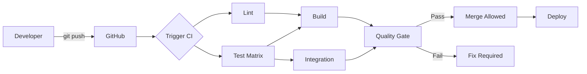

# CI/CD Manual

**Last Updated:** 2026-04-05  
**Version:** 0.26.0  
**Status:** Current

---

## Table of Contents

1. [Introduction](#introduction)
2. [For Developers](#for-developers)
3. [For Code Reviewers](#for-code-reviewers)
4. [For Maintainers](#for-maintainers)
5. [Workflow Deep Dive](#workflow-deep-dive)
6. [Failure Triage Runbook](#failure-triage-runbook)
7. [Performance Optimization](#performance-optimization)
8. [Artifacts and Diagnostics](#artifacts-and-diagnostics)
9. [Security and Release Workflows](#security-and-release-workflows)
10. [References](#references)

---

## Introduction

### What is CI/CD?

**Continuous Integration (CI):**

- Automatically test code on every commit
- Catch bugs early before they reach production
- Ensure code quality through automated checks

**Continuous Deployment (CD):**

- Automatically deploy passing code
- Reduce manual deployment errors
- Enable rapid iteration

### Our CI/CD Stack

```bash
GitHub Actions     # CI/CD platform
├── Conda          # Environment management
├── Pytest         # Test framework
├── Coverage.py    # Coverage tracking
├── Codecov        # Coverage reporting
├── Pre-commit     # Local quality checks
└── Artifacts      # Build outputs
```

### Pipeline Overview



---

## For Developers

### Daily Workflow

#### 1. Before You Start Coding

**Ensure pre-commit hooks are installed:**

```bash
pre-commit install
```

**Pull latest changes:**

```bash
git checkout develop
git pull origin develop
git checkout -b feature/your-feature
```

#### 2. While Coding

**Run tests frequently:**

```bash
cd src
pytest tests/ -v
```

**Check specific module:**

```bash
pytest tests/unit/test_demo_mode.py -v
```

**Watch mode (if pytest-watch installed):**

```bash
uv pip compile pyproject.toml \
  --extra juniper-data \
  --extra juniper-cascor \
  --extra observability \
  -o /tmp/requirements.lock.check
tail -n +3 requirements.lock > /tmp/lock_body
tail -n +3 /tmp/requirements.lock.check > /tmp/check_body
diff -u /tmp/lock_body /tmp/check_body
```

**Run documentation link validation (matches CI docs job):**

```bash
python scripts/check_doc_links.py \
  --exclude templates --exclude history \
  --exclude pull_requests --exclude releases \
  --exclude analysis --exclude fixes --exclude development \
  --exclude CHANGELOG.md \
  --cross-repo skip
```

**Fix any formatting issues:**

```bash
black src/ --line-length=120
isort src/ --profile=black
```

**Run full test suite with coverage:**

```bash
cd src
pytest tests/ --cov=. --cov-report=term-missing
```

**Check coverage meets minimum (60%):**

```bash
# Look for line:
# TOTAL    1234   456    63%
# Must be ≥60%
```

#### 4. Committing

**Stage your changes:**

```bash
git add src/your_file.py tests/unit/test_your_file.py
```

**Commit (hooks run automatically):**

```bash
git commit -m "feat: Add new feature

- Implement feature X
- Add tests for feature X
- Update documentation
"
```

**If hooks fail:**

```bash
# Hooks auto-fix most issues, so:
git add .
git commit -m "feat: Add new feature"  # Try again
```

**Push to GitHub:**

```bash
git push origin feature/your-feature
```

#### 5. Creating Pull Request

**On GitHub:**

1. Navigate to repository
2. Click "Pull requests" → "New pull request"
3. Base: `develop`, Compare: `feature/your-feature`
4. Fill in PR template:
   - **Title:** Brief description
   - **Description:** What changed and why
   - **Tests:** Note test coverage
   - **Screenshots:** If UI changes

**Example PR description:**

```markdown
## Summary
Add pause/resume functionality to demo mode

## Changes
- Added `pause()` and `resume()` methods to DemoMode class
- Implemented thread-safe control flow using Events
- Added 8 new tests for pause/resume functionality

## Testing
- All existing tests pass
- Coverage increased from 78% → 84%
- Manually tested pause/resume in demo mode

## Checklist
- [x] Tests added/updated
- [x] Documentation updated
- [x] Coverage maintained/increased
- [x] Pre-commit hooks pass
```

#### 6. Monitoring CI

**Watch CI progress:**

1. Go to "Checks" tab on your PR
2. Watch jobs complete:
   - ✓ Pre-commit (~2 min)
   - ✓ Unit Tests Python 3.12/3.13/3.14 (~8 min each)
   - ✓ Integration Tests (~5 min, PR/main/develop)
   - ✓ Build (~2 min)
   - ✓ Lockfile Freshness (~1 min)
   - ✓ Documentation Links (~1 min)
   - ✓ Quality Gate (~30 sec)

**If CI fails:**

1. Click on failed job
2. Expand failed step
3. Read error message
4. Fix locally
5. Push fix:

   ```bash
   git add .
   git commit -m "fix: Address CI failure"
   git push
   ```

#### 7. Addressing Review Comments

**Make requested changes:**

```bash
# Make changes
vim src/your_file.py

# Test locally
pytest tests/unit/test_your_file.py -v

# Commit
git add src/your_file.py
git commit -m "Address review feedback: improve error handling"
git push
```

```markdown
**CI runs again automatically on each push**
```

#### 8. After Merge

**Clean up local branch:**

```bash
git checkout develop
git pull origin develop
git branch -d feature/your-feature
```

### Writing Tests

#### Test File Placement

**Follow mirror structure:**

```bash
src/demo_mode.py           → src/tests/unit/test_demo_mode.py
src/config_manager.py      → src/tests/unit/test_config_manager.py
src/communication/websocket_manager.py → src/tests/unit/test_websocket_manager.py
```

#### Test Naming

```python
# File: tests/unit/test_demo_mode.py
class TestDemoMode:
    """Test suite for DemoMode class."""

    def test_start_stop(self):
        """Test starting and stopping demo mode."""
        pass

    def test_thread_safety(self):
        """Test concurrent access to demo mode state."""
        pass
```

#### Test Structure

```python
def test_feature():
    """Test description."""
    # Arrange: Set up test data
    demo = DemoMode()

    # Act: Perform action
    demo.start()
    state = demo.get_current_state()

    # Assert: Verify result
    assert state['running'] is True

    # Cleanup
    demo.stop()
```

#### Coverage Goals

**By module priority:**

```python
# P0: Critical modules - 100% target
config_manager.py
demo_mode.py
communication/websocket_manager.py

# P1: Core modules - 80% target
backend/cascor_integration.py
logger/logger.py

# P2: Frontend - 60% target
frontend/dashboard_manager.py
frontend/components/*.py
```

#### Running Specific Tests

```bash
# Single test
pytest tests/unit/test_demo_mode.py::test_start_stop -v

# Test class
pytest tests/unit/test_demo_mode.py::TestDemoMode -v

# By marker
pytest -m unit -v
pytest -m integration -v
pytest -m "not slow" -v
```

### Coverage Workflow

#### Generate Coverage Report

```bash
cd src
pytest tests/ --cov=. --cov-report=html --cov-report=term-missing
```

#### View HTML Report

```bash
# macOS
open ../reports/coverage/index.html

# Linux
xdg-open ../reports/coverage/index.html

# Windows
start ../reports/coverage/index.html
```

#### Identify Gaps

**In coverage report:**

1. Click on file name
2. Red lines = not covered
3. Yellow lines = partially covered (branches)
4. Green lines = covered

**Focus on:**

- Error handling paths
- Edge cases
- Branch conditions
- Uncovered functions

#### Write Tests for Gaps

```python
# Coverage shows line 45 uncovered:
def process_data(data):
    if not data:
        return None  # Line 45 - RED
    return transform(data)

# Add test:
def test_process_data_empty():
    """Test process_data with empty input."""
    assert process_data(None) is None
    assert process_data([]) is None
    assert process_data({}) is None
```

### Common Development Scenarios

#### Scenario 1: Quick Fix

```bash
# 1. Create branch
git checkout -b fix/quick-fix

# 2. Make change
vim src/config_manager.py

# 3. Test
pytest tests/unit/test_config_manager.py -v

# 4. Commit
git add src/config_manager.py
git commit -m "fix: Handle None in config validation"

# 5. Push
git push origin fix/quick-fix

# 6. Create PR
# GitHub UI → Create pull request

# 7. Wait for CI (should be fast for small fix)

# 8. Merge when approved and CI passes
```

#### Scenario 2: Large Feature

```bash
# 1. Create feature branch
git checkout -b feature/large-feature

# 2. Work in small commits
git commit -m "feat: Add database schema"
git commit -m "feat: Implement database layer"
git commit -m "test: Add database tests"
git commit -m "docs: Update database documentation"

# 3. Keep up to date with develop
git fetch origin
git rebase origin/develop

# 4. Run full test suite before PR
cd src
pytest tests/ --cov=. --cov-report=term

# 5. Create PR when complete
# 6. Address review feedback
# 7. Merge when approved
```

#### Scenario 3: Debugging Test Failure

```bash
# 1. Test fails in CI but passes locally
# Check Python version
python --version  # Local

# 2. Test with CI Python versions
conda create -n test-py311 python=3.11
conda activate test-py311
pip install -r conf/requirements.txt
cd src && pytest tests/ -v

# 3. Identify issue (e.g., Python 3.11 incompatibility)

# 4. Fix
vim src/problematic_file.py

# 5. Test with all versions
for ver in 3.11 3.12 3.13; do
    conda activate test-py${ver}
    pytest tests/ -v
done

# 6. Commit fix
git commit -am "fix: Ensure compatibility with Python 3.11+"
git push
```

---

## For Code Reviewers

### Review Checklist

#### Before Looking at Code

**Check CI status:**

- [ ] All jobs passed (green checkmarks)
- [ ] Coverage maintained or increased
- [ ] No security warnings
- [ ] Artifacts generated successfully

**If CI failed:**

1. Don't review code yet
2. Comment: "Please fix CI failures before review"
3. Wait for green build

#### Code Quality Review

**Check for:**

- [ ] Code follows project style (Black/isort formatted)
- [ ] No unused imports or variables
- [ ] Proper error handling
- [ ] No hardcoded credentials or secrets
- [ ] Thread safety (locks for shared state)
- [ ] Bounded collections (no memory leaks)
- [ ] Docstrings for public methods
- [ ] Type hints where appropriate

#### Test Coverage Review

**Check coverage report:**

1. Go to PR → Checks → Test job → Coverage
2. Look for coverage percentage
3. Expand coverage details

**Verify:**

- [ ] New code has tests
- [ ] Coverage hasn't decreased
- [ ] Critical paths 100% covered
- [ ] Edge cases tested
- [ ] Error paths tested

**Example feedback:**

```markdown
The `validate_config` function looks good, but I don't see tests for:
- Invalid config format
- Missing required fields
- Type validation

Could you add tests for these error cases?
```

#### Documentation Review

**Check:**

- [ ] README updated if API changed
- [ ] CHANGELOG.md has entry
- [ ] Docstrings added/updated
- [ ] Code comments only where needed
- [ ] AGENTS.md updated if dev process changed

#### Functional Review

**Questions to ask:**

1. Does this solve the stated problem?
2. Is the approach appropriate?
3. Are there edge cases not handled?
4. Is it performant?
5. Is it maintainable?
6. Does it follow existing patterns?

### Requesting Changes

**Be specific and constructive:**

❌ **Bad:**

```markdown
This code is messy.
```

✅ **Good:**

```markdown
This function is doing multiple things. Consider splitting it:
- `load_config()` - Load from file
- `validate_config()` - Validate structure
- `apply_config()` - Apply to application

This would improve testability and maintainability.
```

**Prioritize feedback:**

**P0 (Must fix):**

- Security issues
- Correctness bugs
- Test failures
- Breaking changes

**P1 (Should fix):**

- Code quality issues
- Missing tests
- Documentation gaps
- Performance concerns

**P2 (Nice to have):**

- Style preferences
- Refactoring suggestions
- Future improvements

### Approving Changes

**Before approving:**

- [ ] All CI checks passed
- [ ] Code reviewed thoroughly
- [ ] All concerns addressed
- [ ] Coverage acceptable
- [ ] Documentation updated

**Approval message template:**

```markdown
LGTM! 👍

Nice work on the pause/resume functionality. The tests are comprehensive and coverage looks good.

One minor suggestion for future: Consider extracting the state management to a separate class. But that can be a future refactor.

Approved pending green CI.
```

---

## For Maintainers

### Monitoring CI Health

#### Weekly Tasks

**1. Review CI metrics:**

```bash
# Average build time
# Target: <15 minutes

# Success rate
# Target: >90%

# Flaky test rate
# Target: <5%
```

**2. Check resource usage:**

- GitHub Actions minutes used
- Artifact storage used
- Codecov credits used

**3. Review failed builds:**

- Identify patterns
- Fix flaky tests
- Update documentation

#### Monthly Tasks

**1. Update dependencies:**

```bash
# Update pre-commit hooks
pre-commit autoupdate

# Update GitHub Actions versions
# Edit .github/workflows/ci.yml
# - uses: actions/checkout@v4  # Check for v5
# - uses: codecov/codecov-action@v4  # Check for v5
```

**2. Review coverage trends:**

- Overall coverage increasing?
- Any modules losing coverage?
- Critical modules at target?

**3. Audit secrets:**

- Rotate Codecov token
- Check secret access logs
- Remove unused secrets

#### Quarterly Tasks

**1. Review quality gates:**

```yaml
# Are thresholds appropriate?
coverage:
  target: 80%  # Too high/low?
  minimum: 60%  # Adjust based on reality
```

**2. Optimize build performance:**

- Add/update caching
- Parallelize jobs
- Remove slow tests

**3. Security audit:**

- Review Dependabot alerts
- Update vulnerable dependencies
- Check for exposed secrets

### Managing Quality Gates

#### Current Thresholds

```yaml
Coverage:
  Warning: <80%
  Failure: <60%

Test Pass Rate:
  Requirement: 100%

Lint:
  Errors: Block merge
  Warnings: Allow merge

Build:
  Syntax errors: Block merge
```

#### Adjusting Thresholds

**When to increase:**

- Coverage consistently >target for 2+ weeks
- Team agrees higher standards achievable
- Critical bugs traced to untested code

**When to decrease:**

- Coverage consistently <target despite effort
- Blocking legitimate work
- Not achievable for legacy code

**How to change:**

````markdown
1. Discuss with team
2. Update in multiple places:

```bash
# .github/workflows/ci.yml
- Check Coverage Threshold
  if (( $(echo "$COVERAGE < 60" | bc -l) )); then

# .codecov.yml
coverage:
  status:
    project:
      default:
        target: 80%

# pyproject.toml
[tool.coverage.report]
fail_under = 60
```

3. Announce change to team
4. Monitor impact
````

### Handling CI Failures

#### Systematic Approach

**1. Triage:**

```bash
# Classify failure
- Test failure (logic bug)
- Flaky test (timing/race condition)
- Environment issue (dependency/config)
- Infrastructure issue (GitHub Actions)
```

**2. Quick fixes:**

```bash
# Flaky test → Disable temporarily
@pytest.mark.skip(reason="Flaky test - under investigation #123")

# Known issue → Document
# Known Issues:
# - Test X fails on Python 3.11 (Issue #456)
```

**3. Long-term fixes:**

```bash
# Fix root cause
# Add regression test
# Update documentation
# Close related issues
```

#### Flaky Test Management

**Identify flaky tests:**

```bash
# Run test multiple times
for i in {1..10}; do
    pytest tests/unit/test_suspected_flaky.py -v || echo "FAIL $i"
done
```

**Common causes:**

1. **Timing/race conditions:**

   ```python
   # Bad
   time.sleep(0.1)
   assert condition

   # Good
   for i in range(50):  # 5 seconds total
       if condition:
           break
       time.sleep(0.1)
   else:
       assert False, "Timeout waiting for condition"
   ```

2. **Shared state:**

   ```python
   # Bad: Tests depend on execution order

   # Good: Each test independent
   def test_feature(reset_singleton):
       # Fixture resets state
   ```

3. **External dependencies:**

   ```python
   # Bad: Depends on network
   response = requests.get("https://api.example.com")

   # Good: Mock external calls
   @patch('requests.get')
   def test_api_call(mock_get):
       mock_get.return_value.json.return_value = {...}
   ```

### Managing Codecov

#### Setup and Configuration

**File:** `.codecov.yml`

```yaml
coverage:
  precision: 2
  round: down
  range: 70..100

  status:
    project:
      default:
        target: 80%
        threshold: 5%
    patch:
      default:
        target: 60%
        threshold: 10%
```

#### Understanding Codecov Reports

**PR Comment:**

```markdown
## Codecov Report

Coverage: 73.45% (+0.23%)
Files Changed: 3
Lines Changed: +45 / -12

| File                 | Coverage | Δ     |
| -------------------- | -------- | ----- |
| config_manager.py    | 93.2%    | +2.1% |
| demo_mode.py         | 84.5%    | -1.2% |
| websocket_manager.py | 78.3%    | +0.5% |
```

**Interpreting:**

- **Overall coverage:** 73.45% (up from 73.22%)
- **Δ** (delta): Change from base branch
- **Green:** Coverage increased
- **Red:** Coverage decreased

#### Troubleshooting Codecov

**Coverage not uploading:**

```yaml
# Check GitHub Actions logs
- name: Upload Coverage to Codecov
  uses: codecov/codecov-action@v4
  with:
    file: ./coverage.xml
    token: ${{ secrets.CODECOV_TOKEN }}  # Verify secret set
    fail_ci_if_error: false  # Change to true to debug
```

**Coverage report missing files:**

```yaml
# Check .codecov.yml ignore section
ignore:
  - src/tests/**  # Are you ignoring too much?
```

---

## Workflow Deep Dive

### Lint Stage

**Purpose:** Enforce code quality standards

**Tools:**

1. **Black** - Code formatting
2. **isort** - Import sorting
3. **Flake8** - Linting
4. **MyPy** - Type checking (optional)

**Duration:** ~2 minutes

**Failure conditions:**

- Syntax errors
- Undefined names
- Critical code smells

**Note:** Style warnings don't fail build

### Test Stage

**Purpose:** Run test suite across Python versions

**Matrix:**

```yaml
python-version: ["3.11", "3.12", "3.13"]
```

**For each version:**

1. Set up Conda environment
2. Install dependencies
3. Run pytest with coverage
4. Generate reports (XML, HTML, JUnit)
5. Upload to Codecov
6. Upload artifacts
7. Check coverage threshold

**Duration:** ~8 minutes per version

**Failure conditions:**

- Any test fails
- Coverage <60%
- Collection errors

### Build Stage

**Purpose:** Verify project can be packaged

**Steps:**

1. Verify project structure
2. Check Python syntax
3. Generate build metadata

**Duration:** ~2 minutes

**Failure conditions:**

- Syntax errors
- Missing critical files

### Integration Stage

**Purpose:** Test component interactions

**When:** Pull requests only

**Steps:**

1. Run integration tests (`tests/integration/`)
2. Skip external dependencies (`-m "not requires_cascor"`)

**Duration:** ~5 minutes

**Failure conditions:**

- Integration test failures

### Documentation Links Stage

**Purpose:** Validate internal markdown links and anchors before merge.

**What runs in CI (`docs` job):**

```bash
python scripts/check_doc_links.py \
  --exclude templates --exclude history \
  --exclude pull_requests --exclude releases \
  --exclude analysis --exclude fixes --exclude development \
  --exclude CHANGELOG.md \
  --cross-repo skip
```

**Behavior and constraints:**

1. Validates relative file links and same-file heading anchors in markdown files.
2. Skips external URLs (`http`, `https`, `mailto`, `ftp`) and links inside inline/fenced code blocks.
3. Rejects unsafe link targets:
   - Absolute paths
   - Null-byte targets
   - Excessive traversal (`..` depth > 5)
   - Paths escaping repository boundaries
4. Classifies Juniper ecosystem cross-repo links. CI uses `--cross-repo skip` because sibling repositories are not guaranteed on runners.

**Failure conditions:**

- Broken internal file links
- Broken same-file anchors
- Unsafe link-target validation errors

### Quality Gate Stage

1. [Introduction](#introduction)
2. [Pipeline Behavior](#pipeline-behavior)
3. [Developer Workflow](#developer-workflow)
4. [Reviewer Workflow](#reviewer-workflow)
5. [Maintainer Workflow](#maintainer-workflow)
6. [Failure Triage Runbook](#failure-triage-runbook)
7. [Artifacts and Diagnostics](#artifacts-and-diagnostics)
8. [Security and Release Workflows](#security-and-release-workflows)
9. [References](#references)

---

```python
if test_result == "failure":
    fail("Tests failed")
elif build_result == "failure":
    fail("Build failed")
elif docs_result == "failure":
    fail("Documentation link validation failed")
elif lint_result == "failure":
    warn("Linting failed")
else:
    pass("Quality gate passed")
```

Primary CI source of truth:

- `.github/workflows/ci.yml`

Related workflows:

- `.github/workflows/security-scan.yml` (scheduled weekly scan)
- `.github/workflows/publish.yml` (release publishing)

Current CI characteristics:

- Runners: `ubuntu-latest`
- Python matrix: `3.12`, `3.13`, `3.14` for `pre-commit` and `unit-tests`
- Single Python: `3.14` for integration/security/build/docs/lockfile/dependency-docs
- Install model: `pip` + `conf/requirements_ci.txt` + editable install (`pip install -e .`)
- Coverage enforcement: `--cov-fail-under=80`
- No Codecov upload in current workflow

---

## Pipeline Behavior

### Triggers

`CI/CD Pipeline` runs on:

- `push` to `main`, `develop`, `feature/**`, `fix/**`
- `pull_request` targeting `main` or `develop`
- `repository_dispatch` (`data-client-updated`, `cascor-client-updated`)
- `workflow_dispatch`

### Job Graph

Main jobs in execution order/dependency chains:

1. `pre-commit`
2. `unit-tests` (needs `pre-commit`)
3. `integration-tests` (needs `unit-tests`; PR/main/develop only)
4. `build` (needs `unit-tests`)
5. `security` (needs `pre-commit`)
6. `dependency-docs` (needs `build`)
7. `lockfile-check`
8. `docs`
9. `docker-build` (needs `build`; PR/main/develop only)
10. `required-checks` (aggregates outcomes)
11. `notify`

### Quality Gate Rules

`required-checks` fails on:

- failed `pre-commit`
- failed `unit-tests`
- failed `integration-tests` (if it ran)
- failed `security`
- failed `lockfile-check`
- failed `docs`
- failed `docker-build` (if it ran)
- failed `dependency-docs` (skipped is allowed)

---

## Developer Workflow

### Before Pushing

Run the same core checks locally:

```bash
python -m pip install --upgrade pip
pip install -r conf/requirements_ci.txt
pip install -e .
pip install pre-commit

pre-commit run --all-files

python -m pytest \
  -m "not requires_cascor and not requires_server and not slow" \
  src/tests/unit/ src/tests/regression/ \
  --cov=src --cov-report=term-missing --cov-fail-under=80
```

Optional integration parity check:

```bash
python -m pytest \
  -m "integration and not requires_cascor and not requires_server and not slow" \
  src/tests/integration \
  --verbose
```

### Push and Validate

```bash
git add .
git commit -m "docs: <summary>"
git push origin <branch>
```

After push, confirm CI jobs complete and check:

- matrix failures isolated to one Python version
- lockfile freshness status
- docs link validation status
- Docker smoke test status on PRs

---

## Reviewer Workflow

Reviewers should verify:

- `required-checks` is green
- coverage gate is passing (80 threshold enforced by CI command)
- no skipped critical jobs unexpectedly (except intentionally conditional jobs)
- artifacts exist for failing runs when debugging is needed

Reviewer prompts to use on failures:

- "Please rerun local pre-commit and unit/regression coverage command from `docs/ci_cd/CICD_QUICK_START.md`."
- "Please include lockfile regeneration if `lockfile-check` failed."

---

## Maintainer Workflow

### Routine Operations

Keep these aligned with source code:

- Python versions in `ci.yml` and docs
- install commands (`requirements_ci.txt`, editable install)
- marker-gating assumptions used by `src/tests/conftest.py`
- lockfile compile command and extras

### Common Maintenance Tasks

Lockfile refresh:

```bash
pip install uv
uv pip compile pyproject.toml \
  --extra juniper-data \
  --extra juniper-cascor \
  --extra observability \
  -o requirements.lock
```

Docs link check used by CI:

```bash
python scripts/check_doc_links.py \
  --exclude templates --exclude history \
  --exclude pull_requests --exclude releases \
  --exclude analysis --exclude fixes --exclude development \
  --exclude CHANGELOG.md \
  --cross-repo skip
```

## Test Selection Behavior

## Failure Triage Runbook

### `pre-commit` Failure

Run:

```bash
pre-commit run --all-files --show-diff-on-failure
```

### `unit-tests` Failure

Useful local variants:

```bash
# See cross-repo references without failing
python scripts/check_doc_links.py --cross-repo warn

# Validate cross-repo links when sibling repos are checked out
python scripts/check_doc_links.py --cross-repo check
```

Common causes and how to resolve:

1. **Broken same-file anchor**: normalize heading anchors to GitHub style (lowercase, punctuation stripped, spaces -> `-`).
2. **False positives from example markdown in docs**: move link examples into fenced code blocks or inline code spans so they are intentionally ignored.
3. **Rejected unsafe path target**: replace absolute paths, null-byte targets, or excessive `..` traversal with valid repository-relative links.
4. **Cross-repo structure violation**: ensure cross-repo links do not traverse back out of the target repo (no `../` after repo segment).

### 3. Test collection or marker mismatch

```bash
python -m pytest \
  -m "not requires_cascor and not requires_server and not slow" \
  src/tests/unit/ src/tests/regression/ \
  --timeout=60 --maxfail=5 \
  --cov=src --cov-report=term-missing --cov-fail-under=80
```

#### Pattern 5: Documentation Link Validation Failure

**Symptom:**

```bash
FAILED: Documentation link validation
FOUND <N> broken link(s) in <M> file(s)
```

**Common causes:**

1. Moved/renamed markdown files with stale links
2. Heading text changed, but anchor links were not updated
3. Absolute paths in markdown links (`/path/to/file`)
4. Link paths that escape repository boundaries

**Fix:**

```bash
# Reproduce CI docs job locally
python scripts/check_doc_links.py \
  --exclude templates --exclude history \
  --exclude pull_requests --exclude releases \
  --exclude analysis --exclude fixes --exclude development \
  --exclude CHANGELOG.md \
  --cross-repo skip
```

#### Pattern 5: Documentation Links Job Fails

**Symptom:**

```bash
FAILED: Documentation link validation
... broken link [label](docs/missing.md) -> file not found
... broken anchor #missing-heading (heading not found)
```

**Causes:**

1. Renamed or moved markdown files without updating links
2. Anchor target no longer exists after heading edits
3. Unsafe path forms in docs links (absolute paths, null bytes, deep traversal)
4. Cross-repo references checked in local `check` mode without sibling repos present

**Fix:**

```bash
# Reproduce CI behavior locally
python scripts/check_doc_links.py \
  --exclude templates --exclude history \
  --exclude pull_requests --exclude releases \
  --exclude analysis --exclude fixes --exclude development \
  --exclude CHANGELOG.md \
  --cross-repo skip

# Optional deep debugging
python scripts/check_doc_links.py --verbose --cross-repo warn docs/ notes/
```

**Tip:** Use `--cross-repo check` only when sibling Juniper repositories are available locally.

---

## Performance Optimization

### Current Performance

Run:

```bash
python -m pytest \
  -m "integration and not requires_cascor and not requires_server and not slow" \
  src/tests/integration \
  --timeout=120 --maxfail=3
```

### `lockfile-check` Failure

Regenerate `requirements.lock` using the command in [Maintainer Workflow](#maintainer-workflow), then commit the updated lockfile.

### `docs` Failure

Run the docs link command from [Maintainer Workflow](#maintainer-workflow) and fix broken links/anchors.

### `docker-build` Failure

Reproduce locally:

```bash
docker build -t juniper-canopy:test .
docker run --rm -p 8050:8050 juniper-canopy:test
curl -sf http://localhost:8050/v1/health
```

---

## Artifacts and Diagnostics

Common artifacts from `ci.yml`:

- `coverage-report-py<version>` (coverage XML + HTML, 30 days)
- `unit-test-results-py<version>` (JUnit XML, 30 days)
- `integration-test-results` (JUnit XML, 30 days)
- `security-reports` (bandit/pip-audit outputs, 30 days)
- `dist-packages` (build artifacts, 30 days)
- `dependency-docs` (dependency snapshots, 90 days)

For failures, inspect uploaded artifacts before attempting speculative fixes.

---

## Security and Release Workflows

### Scheduled Security

`.github/workflows/security-scan.yml`:

- schedule: weekly Monday 06:00 UTC
- manual trigger: supported
- tools: `bandit` + `pip-audit`

### Publish Workflow

`.github/workflows/publish.yml`:

- trigger: `release.published`
- stages: `build` -> `testpypi` -> `pypi`
- auth model: OIDC trusted publishing (`id-token: write`)
- package verification: TestPyPI install check before PyPI publish

---

## References

**Last Updated:** 2026-04-05  
**Version:** 0.25.2  
**Status:** ✅ Complete
