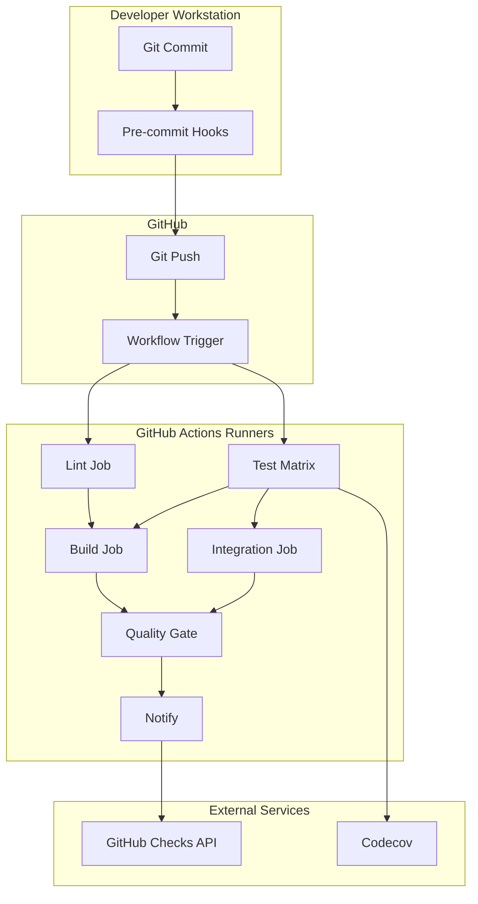

# CI/CD Technical Reference

**Last Updated:** 2026-04-05  
**Version:** 0.26.0  
**Status:** Current

## Table of Contents

1. [Pipeline Architecture](#pipeline-architecture)
2. [Workflow Specification](#workflow-specification)
3. [Configuration Files](#configuration-files)
4. [Tool Configurations](#tool-configurations)
5. [Environment Variables](#environment-variables)
6. [Artifact Specifications](#artifact-specifications)
7. [API Reference](#api-reference)
8. [Documentation Link Validation](#documentation-link-validation)
9. [Troubleshooting Reference](#troubleshooting-reference)

---

## Pipeline Architecture

### System Diagram



### Job Dependencies

```yaml
jobs:
  lint:
    runs-on: ubuntu-latest

  test:
    runs-on: ubuntu-latest
    strategy:
      matrix:
        python-version: ["3.11", "3.12", "3.13"]

  build:
    runs-on: ubuntu-latest
    needs: [lint, test]

  integration:
    runs-on: ubuntu-latest
    needs: [test]
    if: github.event_name == 'pull_request'

  quality-gate:
    runs-on: ubuntu-latest
    needs: [lint, test, build]
    if: always()

  notify:
    runs-on: ubuntu-latest
    needs: [quality-gate]
    if: always()
```

---

## Workflow Specification

### Trigger Specification

```yaml
on:
  # Push triggers
  push:
    branches:
      - main                # Production branch
      - develop             # Development branch
      - 'feature/**'        # Feature branches
      - 'fix/**'            # Bugfix branches
    paths-ignore:
      - '**.md'             # Skip docs-only changes
      - 'docs/**'
      - 'notes/**'

  # Pull request triggers
  pull_request:
    branches:
      - main
      - develop
    types:
      - opened              # PR created
      - synchronize         # New commits pushed
      - reopened            # PR reopened
      - ready_for_review    # Draft → Ready

  # Manual trigger
  workflow_dispatch:
    inputs:
      python-version:
        description: 'Python version to test'
        required: false
        default: '3.13'
        type: choice
        options:
          - '3.11'
          - '3.12'
          - '3.13'
      skip-slow-tests:
        description: 'Skip slow tests'
        required: false
        default: true
        type: boolean
```

### Job Specification

#### Lint Job

```yaml
lint:
  name: Code Quality Checks
  runs-on: ubuntu-latest
  timeout-minutes: 10

  steps:
    - name: Checkout Code
      uses: actions/checkout@v4
      with:
        fetch-depth: 0  # Full history for better analysis

    - name: Set up Python
      uses: actions/setup-python@v5
      with:
        python-version: '3.13'
        cache: 'pip'

    - name: Install Linting Tools
      run: |
        python -m pip install --upgrade pip
        pip install black isort flake8 mypy bandit

## Workflow Inventory

| Workflow File | Trigger | Primary Purpose |
| --- | --- | --- |
| `.github/workflows/ci.yml` | `push`, `pull_request`, `repository_dispatch`, `workflow_dispatch` | Full quality pipeline and merge gate |
| `.github/workflows/security-scan.yml` | weekly cron + manual | Scheduled security posture scan |
| `.github/workflows/lockfile-update.yml` | Dependabot push branches | Auto-refresh `requirements.lock` |
| `.github/workflows/publish.yml` | release published | Build + TestPyPI + PyPI publish |

## Main CI Workflow (`ci.yml`)

### Trigger and concurrency

- Triggers on pushes to `main`, `develop`, `feature/**`, `fix/**`
- Triggers on PRs targeting `main` and `develop`
- Supports `repository_dispatch` for dependency-change events
- Uses concurrency group `ci-${{ github.ref }}` with `cancel-in-progress: true`

### Global environment

```yaml
env:
  ENV_NAME: juniper-canopy
  PYTHON_TEST_VERSION: "3.14"
  COVERAGE_FAIL_UNDER: "80"
```

### Jobs and dependencies

| Job | Needs | Python | Notes |
| --- | --- | --- | --- |
| `pre-commit` | — | matrix `3.12/3.13/3.14` | Runs `pre-commit --all-files` |
| `unit-tests` | `pre-commit` | matrix `3.12/3.13/3.14` | Runs unit + regression markers with coverage gate |
| `integration-tests` | `unit-tests` | `3.14` | Runs fast integration subset |
| `build` | `unit-tests` | `3.14` | Builds sdist and wheel |
| `security` | `pre-commit` | `3.14` | Gitleaks + Bandit + pip-audit |
| `dependency-docs` | `build` | `3.14` | Generates dependency docs via script |
| `lockfile-check` | — | `3.14` | Recompiles lockfile and diffs body |
| `docs` | — | `3.14` | Runs doc-link validation script |
| `docker-build` | `build` | docker engine | Builds image + health smoke test |
| `required-checks` | all core jobs | n/a | Aggregated merge gate |
| `notify` | `required-checks` | n/a | Run summary |

### Test marker expressions in CI

Unit/regression gate:

```bash
-m "not requires_cascor and not requires_server and not slow"
```

Integration gate:

```bash
-m "integration and not requires_cascor and not requires_server and not slow"
```

### Coverage gate

Unit tests enforce:

```bash
--cov-fail-under=${COVERAGE_FAIL_UNDER}
```

With current `COVERAGE_FAIL_UNDER=80`.

### Lockfile freshness behavior

CI compiles with:

```bash
uv pip compile pyproject.toml \
  --extra juniper-data \
  --extra juniper-cascor \
  --extra observability \
  -o /tmp/requirements.lock.check
```

Then strips first two lines from both lockfiles before diffing to avoid path-only header differences.

### Documentation links behavior

CI validates links with:

```bash
python scripts/check_doc_links.py \
  --exclude templates --exclude history \
  --exclude pull_requests --exclude releases \
  --exclude analysis --exclude fixes --exclude development \
  --exclude CHANGELOG.md \
  --cross-repo skip
```

This catches broken internal file and heading links without requiring sibling repos.

## Auxiliary Workflows

### `security-scan.yml`

- Scheduled: Mondays at `06:00 UTC`
- Installs `bandit[sarif]` and `pip-audit`
- Runs:
  - `bandit -r src -c .bandit.yml -f sarif ... --exit-zero`
  - `bandit -r src -c .bandit.yml --confidence-level medium --severity-level medium`
  - `pip-audit --strict --desc on`
- Uploads `reports/security/` artifacts

### `lockfile-update.yml`

- Trigger: push to `dependabot/pip/**`
- Guard: `if: github.actor == 'dependabot[bot]'`
- Uses `CROSS_REPO_DISPATCH_TOKEN` for checkout/push
- Compiles lockfile with:
  - `--extra juniper-data`
  - `--extra juniper-cascor`
- Commits only when diff exists

### `publish.yml`

- Trigger: GitHub release published
- `id-token: write` for trusted publishing
- Stages:
  1. Build + `twine check`
  2. Publish to TestPyPI + install verification
  3. Publish to PyPI

## Tooling and Configuration Sources

| Concern | Source of Truth |
| --- | --- |
| Pytest markers and defaults | `pyproject.toml` (`[tool.pytest.ini_options]`) |
| Coverage thresholds | `pyproject.toml` and `ci.yml` job args |
| CI dependencies | `conf/requirements_ci.txt` |
| Security scan excludes | `.bandit.yml` + workflow commands |
| Doc-link validation rules | `scripts/check_doc_links.py` |

## Documentation Link Validation

The CI workflow includes a dedicated documentation validation job (`docs`) that runs the internal link checker script:

```bash
python scripts/check_doc_links.py \
  --exclude templates --exclude history \
  --exclude pull_requests --exclude releases \
  --exclude analysis --exclude fixes --exclude development \
  --exclude CHANGELOG.md \
  --cross-repo skip
```

### Purpose

- Verify that internal relative documentation links resolve to existing files.
- Verify same-file heading anchors resolve to existing headings.
- Catch security-sensitive link inputs (absolute paths, null bytes, and excessive traversal).
- Enforce deterministic behavior for cross-repo links in CI (`--cross-repo skip`).

### Behavioral Constraints

- External links (`http://`, `https://`, `mailto:`, `ftp://`) are ignored.
- Links inside fenced code blocks and inline code spans are ignored.
- Cross-repo links are classified against known Juniper ecosystem repo names.
- Cross-repo structural escapes (for example traversing out of the target repo path) fail validation.

### Operational Notes

- CI uses `--cross-repo skip` so sibling repositories do not need to be checked out.
- Local maintainers can use `--cross-repo check` when working in a full ecosystem checkout.
- Script exit codes:
  - `0`: all links valid
  - `1`: broken links found or invalid arguments

---

## Troubleshooting Reference

| Job | Artifact | Typical Contents |
| --- | --- | --- |
| `unit-tests` | `coverage-report-py*` | XML + HTML coverage outputs |
| `unit-tests` | `unit-test-results-py*` | JUnit XML test outputs |
| `integration-tests` | `integration-test-results` | Integration JUnit XML |
| `build` | `dist-packages` | Wheel and sdist |
| `security` | `security-reports` | Bandit + pip-audit reports |
| `dependency-docs` | `dependency-docs` | Generated requirements/conda docs |

## Command Equivalents for Local Reproduction

```bash
# Pre-commit
pre-commit run --all-files

# Unit/regression gate
cd src
python -m pytest \
  -m "not requires_cascor and not requires_server and not slow" \
  tests/unit/ tests/regression/ \
  --verbose \
  --cov=. \
  --cov-report=term-missing \
  --cov-fail-under=80

# Integration gate
python -m pytest \
  -m "integration and not requires_cascor and not requires_server and not slow" \
  tests/integration \
  --verbose

# Lockfile gate
uv pip compile pyproject.toml \
  --extra juniper-data \
  --extra juniper-cascor \
  --extra observability \
  -o requirements.lock

| Stage            | Duration | CPU     | Memory |
| ---------------- | -------- | ------- | ------ |
| Lint             | 2 min    | 1 core  | 512 MB |
| Test (each)      | 8 min    | 2 cores | 2 GB   |
| Build            | 2 min    | 1 core  | 512 MB |
| Integration      | 5 min    | 2 cores | 1 GB   |
| Quality Gate     | 30 sec   | 1 core  | 256 MB |
| Total (parallel) | ~15 min  | -       | -      |

### Optimization Targets

| Metric            | Current | Target | Stretch |
| ----------------- | ------- | ------ | ------- |
| Total build time  | 15 min  | 10 min | 7 min   |
| Test suite        | 8 min   | 5 min  | 3 min   |
| Lint              | 2 min   | 1 min  | 30 sec  |
| Coverage overhead | 20%     | 10%    | 5%      |

---

## Version History

### Version 1.0.0 (2025-11-05)

**Initial release:**

- Complete CI/CD pipeline
- Multi-version Python testing
- Coverage reporting
- Pre-commit hooks
- Quality gates
- Comprehensive documentation

---

## References

### Official Documentation

- [GitHub Actions Docs](https://docs.github.com/en/actions)
- [Workflow Syntax](https://docs.github.com/en/actions/reference/workflow-syntax-for-github-actions)
- [Pytest Docs](https://docs.pytest.org/)
- [Coverage.py Docs](https://coverage.readthedocs.io/)
- [Pre-commit Docs](https://pre-commit.com/)
- [Codecov Docs](https://docs.codecov.com/)

### Project Documentation

- [CICD_QUICK_START.md](CICD_QUICK_START.md)
- [CICD_ENVIRONMENT_SETUP.md](CICD_ENVIRONMENT_SETUP.md)
- [CICD_MANUAL.md](CICD_MANUAL.md)
- [AGENTS.md](../../AGENTS.md)
- [README.md](../../README.md)

---

**Last Updated:** 2026-04-05  
**Version:** 0.25.1  
**Maintained By:** Development Team  
**Status:** ✅ Current
