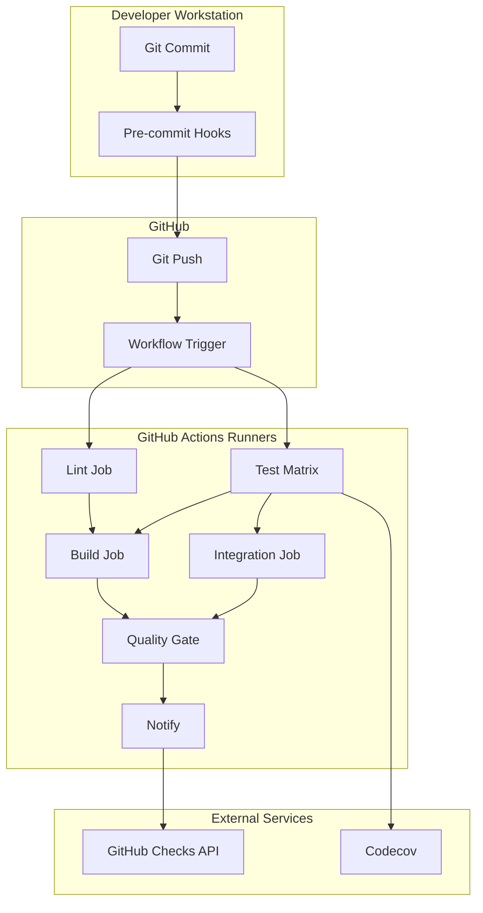

# CI/CD Technical Reference

**Last Updated:** 2026-04-05  
**Version:** 0.26.1  
**Status:** Current

---

## Table of Contents

1. [Pipeline Architecture](#pipeline-architecture)
2. [Workflow Specification](#workflow-specification)
3. [Configuration Files](#configuration-files)
4. [Documentation Link Validation](#documentation-link-validation)
5. [Tool Configurations](#tool-configurations)
6. [Dependency Reference](#dependency-reference)
7. [Documentation Link Checker Reference](#documentation-link-checker-reference)
8. [Common Failure Classes](#common-failure-classes)
9. [Troubleshooting Reference](#troubleshooting-reference)

---

## Pipeline Architecture

### System Diagram



### Job Dependencies

```yaml
jobs:
  lint:
    runs-on: ubuntu-latest

  test:
    runs-on: ubuntu-latest
    strategy:
      matrix:
        python-version: ["3.11", "3.12", "3.13"]

  build:
    runs-on: ubuntu-latest
    needs: [lint, test]

  integration:
    runs-on: ubuntu-latest
    needs: [test]
    if: github.event_name == 'pull_request'

  quality-gate:
    runs-on: ubuntu-latest
    needs: [lint, test, build]
    if: always()

  notify:
    runs-on: ubuntu-latest
    needs: [quality-gate]
    if: always()
```

---

## Workflow Specification

### Trigger Specification

```yaml
on:
  # Push triggers
  push:
    branches:
      - main                # Production branch
      - develop             # Development branch
      - 'feature/**'        # Feature branches
      - 'fix/**'            # Bugfix branches
    paths-ignore:
      - '**.md'             # Skip docs-only changes
      - 'docs/**'
      - 'notes/**'

  # Pull request triggers
  pull_request:
    branches:
      - main
      - develop
    types:
      - opened              # PR created
      - synchronize         # New commits pushed
      - reopened            # PR reopened
      - ready_for_review    # Draft → Ready

  # Manual trigger
  workflow_dispatch:
    inputs:
      python-version:
        description: 'Python version to test'
        required: false
        default: '3.13'
        type: choice
        options:
          - '3.11'
          - '3.12'
          - '3.13'
      skip-slow-tests:
        description: 'Skip slow tests'
        required: false
        default: true
        type: boolean
```

### Job Specification

#### Lint Job

```yaml
lint:
  name: Code Quality Checks
  runs-on: ubuntu-latest
  timeout-minutes: 10

  steps:
    - name: Checkout Code
      uses: actions/checkout@v4
      with:
        fetch-depth: 0  # Full history for better analysis

    - name: Set up Python
      uses: actions/setup-python@v5
      with:
        python-version: '3.13'
        cache: 'pip'

    - name: Install Linting Tools
      run: |
        python -m pip install --upgrade pip
        pip install black isort flake8 mypy bandit

    - name: Run Black
      run: black --check --diff src/
      continue-on-error: true

    - name: Run isort
      run: isort --check-only --diff src/
      continue-on-error: true

    - name: Run Flake8
      run: |
        flake8 src/ --count --select=E9,F63,F7,F82 --show-source --statistics
        flake8 src/ --count --max-line-length=120 --statistics --exit-zero
      continue-on-error: true

    - name: Run MyPy
      run: mypy src/ --ignore-missing-imports --no-strict-optional
      continue-on-error: true

    - name: Run Bandit
      run: bandit -r src -c .bandit.yml
      continue-on-error: true
```

#### Test Job

```yaml
test:
  name: Unit Tests + Coverage (Python ${{ matrix.python-version }})
  runs-on: ubuntu-latest
  timeout-minutes: 30

  strategy:
    fail-fast: false
    matrix:
      python-version: ["3.12", "3.13", "3.14"]

  steps:
    - name: Checkout Code
      uses: actions/checkout@v4

    - name: Set up Conda
      uses: conda-incubator/setup-miniconda@v3
      with:
        python-version: ${{ matrix.python-version }}
        channels: conda-forge,pytorch,plotly,defaults
        channel-priority: flexible
        activate-environment: JuniperPython-CI
        environment-file: conf/conda_environment.yaml
        auto-activate-base: false

    - name: Verify Environment
      shell: bash -el {0}
      run: |
        conda info
        conda list
        which python
        python --version

    - name: Install Dependencies
      shell: bash -el {0}
      run: |
        python -m pip install --upgrade pip
        pip install -r conf/requirements.txt

    - name: Run Unit Tests
      shell: bash -el {0}
      run: |
        python -m pytest \
          src/tests \
          --verbose \
          --cov=src \
          --cov-report=xml:reports/coverage.xml \
          --cov-report=term-missing \
          --junit-xml=reports/junit/unit-tests.xml

    - name: Upload Test Results
      uses: actions/upload-artifact@v4
      if: always()
      with:
        name: test-results-${{ matrix.python-version }}
        path: |
          reports/junit/unit-tests.xml
          reports/coverage.xml
        retention-days: 30

    # Coverage threshold enforcement should be configured in pytest invocation
    # (for example: --cov-fail-under=80)
```

#### Documentation Links Job

```yaml
docs:
  name: Documentation Links
  runs-on: ubuntu-latest

  steps:
    - name: Checkout Code
      uses: actions/checkout@de0fac2e4500dabe0009e67214ff5f5447ce83dd  # v6.0.2

    - name: Set up Python
      uses: actions/setup-python@a309ff8b426b58ec0e2a45f0f869d46889d02405  # v6.2.0
      with:
        python-version: "3.14"

    - name: Validate Documentation Links
      run: |
        python scripts/check_doc_links.py \
          --exclude templates --exclude history \
          --exclude pull_requests --exclude releases \
          --exclude analysis --exclude fixes --exclude development \
          --exclude CHANGELOG.md \
          --cross-repo skip
```

This job validates internal documentation links and same-file anchors before the quality gate passes. CI uses `--cross-repo skip` because sibling Juniper repositories are not guaranteed to exist on the runner filesystem.

---

## Documentation Link Validation

### Purpose

The documentation link checker validates:

- Relative markdown links resolve to existing files
- Same-file anchor links resolve to real headings
- Links remain within repository boundaries
- Unsafe patterns (absolute paths, excessive traversal, invalid cross-repo escapes) are rejected

### Script

- Path: `scripts/check_doc_links.py`
- Unit tests: `src/tests/unit/test_doc_link_checker.py`
- CI invocation: `.github/workflows/ci.yml` (`docs` job)

### Local Commands

```bash
# Match CI behavior
python scripts/check_doc_links.py \
  --exclude templates --exclude history \
  --exclude pull_requests --exclude releases \
  --exclude analysis --exclude fixes --exclude development \
  --exclude CHANGELOG.md \
  --cross-repo skip

# Validate cross-repo links when sibling repos exist locally
python scripts/check_doc_links.py --cross-repo check

### scripts/check_doc_links.py

**Location:** `scripts/check_doc_links.py`

**Purpose:** Validate internal markdown links and anchor references, and enforce path-safety constraints for documentation links.

**Core behaviors:**

1. Validates relative file links and same-file heading anchors.
2. Skips external URL targets (`http`, `https`, `mailto`, `ftp`) and data/host-relative targets (`data:`, `//`).
3. Ignores links inside inline code and fenced code blocks.
4. Rejects unsafe inputs:
   - Absolute paths
   - Null bytes in targets
   - Excessive traversal (`..` count > 5)
   - Paths escaping repository boundaries
5. Classifies Juniper cross-repo links and applies policy:
   - `skip`: skip cross-repo checks, count skipped links
   - `warn`: emit warnings without failing
   - `check`: validate links against a discovered ecosystem root

---

## Documentation Link Validation

### CI Invocation

The `docs` job in `.github/workflows/ci.yml` runs:

```bash
python scripts/check_doc_links.py \
  --exclude templates --exclude history \
  --exclude pull_requests --exclude releases \
  --exclude analysis --exclude fixes --exclude development \
  --exclude CHANGELOG.md \
  --cross-repo skip
```

### CLI Modes

```bash
# Default mode: validate current repo docs (cross-repo policy defaults to check)
python scripts/check_doc_links.py

# CI-equivalent mode
python scripts/check_doc_links.py --cross-repo skip \
  --exclude templates --exclude history \
  --exclude pull_requests --exclude releases \
  --exclude analysis --exclude fixes --exclude development \
  --exclude CHANGELOG.md

# Warn for cross-repo links without failing
python scripts/check_doc_links.py --cross-repo warn --verbose docs/ notes/
```

### Cross-Repo Policy Notes

- `check` mode tries to discover an ecosystem root containing multiple sibling repositories.
- If discovery fails in `check` mode, behavior falls back to `skip` with a warning.
- CI intentionally uses `skip` to avoid false failures when sibling repositories are absent on runners.

### .pre-commit-config.yaml

### Cross-Repo Modes

| Mode    | Behavior                                                          | Typical Use                           |
|---------|-------------------------------------------------------------------|---------------------------------------|
| `skip`  | Skip cross-repo file existence checks (still validates structure) | CI and isolated clones                |
| `warn`  | Emit warnings for cross-repo links without failing                | Local cleanup passes                  |
| `check` | Validate cross-repo targets on disk                               | Full local Juniper ecosystem checkout |

---

## Configuration Files

### .github/workflows/ci.yml

**Last Updated:** 2026-04-04
**Version:** 0.26.0
**Status:** Current

## Scope

This reference documents the current CI behavior implemented in:

- `.github/workflows/ci.yml`
- `scripts/check_doc_links.py`
- `conf/requirements_ci.txt`
- `pyproject.toml`

## Workflow Summary

Workflow name: `CI/CD Pipeline`

Trigger events:

- `push` (`main`, `develop`, `feature/**`, `fix/**`)
- `pull_request` (`main`, `develop`)
- `repository_dispatch` (`data-client-updated`, `cascor-client-updated`)
- `workflow_dispatch`

Concurrency:

```yaml
concurrency:
  group: ci-${{ github.ref }}
  cancel-in-progress: true
```

**Ignore Patterns:**

```yaml
ignore:
  - src/tests/**           # Test files
  - utils/**               # Utility scripts
  - docs/**                # Documentation
  - "**/__pycache__/**"    # Cache files
```

### pyproject.toml

**Location:** `pyproject.toml`

**Purpose:** Python project and tool configuration

**Sections:**

1. **Project metadata**

   ```toml
   [project]
   name = "juniper-canopy"
   version = "0.4.0"
   requires-python = ">=3.11"
   ```

2. **Black configuration**

   ```toml
   [tool.black]
   line-length = 120
   target-version = ['py311', 'py312', 'py313']
   ```

3. **isort configuration**

    ```yaml
    # `pre-commit`
    - Python matrix: `3.12`, `3.13`, `3.14`
    - Installs `pre-commit`
    - Runs `pre-commit run --all-files --show-diff-on-failure`
    - Caches pre-commit hooks (`~/.cache/pre-commit`)
    ```

4. **Bandit configuration**

   ```yaml
   # .bandit.yml
   exclude_dirs:
     - src/tests
     - util/verification
   skips:
     - B311
   confidence: MEDIUM
   severity: MEDIUM
   ```

5. **MyPy configuration**

   ```toml
   [tool.mypy]
   python_version = "3.14"
   ignore_missing_imports = true
   ```

6. **Pytest configuration**

   ```toml
   [tool.pytest.ini_options]
   minversion = "7.0"
   testpaths = ["src/tests"]
   addopts = ["--verbose", "--cov=src"]
   ```

7. **Coverage configuration**

   ```toml
   [tool.coverage.report]
   show_missing = true
   fail_under = 80
   precision = 2
   ```

---

## Tool Configurations

### Black

**Purpose:** Code formatting

**Configuration:**

```toml
[tool.black]
line-length = 120
target-version = ['py311', 'py312', 'py313']
include = '\.pyi?$'
extend-exclude = '''
/(
    \.eggs
    | \.git
    | \.venv
    | logs
    | reports
)/
'''
```

**Usage:**

```bash
python -m pytest \
  -m "not requires_cascor and not requires_server and not slow" \
  src/tests/unit/ src/tests/regression/ \
  --timeout=60 \
  --maxfail=5 \
  --junitxml=reports/junit/junit-unit.xml \
  --cov=src \
  --cov-report=term-missing \
  --cov-report=xml:reports/coverage.xml \
  --cov-report=html:reports/htmlcov \
  --cov-fail-under=80
```

Special behavior:

- Handles Python 3.12 `pytest` cleanup SIGABRT (`exit 134`) by checking JUnit `failures/errors` before deciding failure.

Artifacts:

- `coverage-report-py<version>`
- `unit-test-results-py<version>`

### `integration-tests`

- Python: `3.14`
- Runs only on PRs and pushes to `main`/`develop`
- Marker filter:

```bash
integration and not requires_cascor and not requires_server and not slow
```

Artifact:

- `integration-test-results`

### `build`

- Python: `3.14`
- Uses `python -m build --sdist --wheel`
- Verifies both `.tar.gz` and `.whl`
- Uploads `dist-packages`

### `security`

- Python: `3.14`
- Tools: `gitleaks`, `bandit`, `pip-audit`
- Uploads SARIF and security report artifacts

### `dependency-docs`

```yaml
# .bandit.yml
exclude_dirs:
  - src/tests
  - util/verification
skips:
  - B311
confidence: MEDIUM
severity: MEDIUM
```

Artifact:

```bash
# Security scan
bandit -r src

# With config
bandit -r src -c .bandit.yml

# Specific severity
bandit -r src -ll  # Low severity and up
```

### Lockfile and Dependency Audit

**Purpose:** Keep `requirements.lock` synchronized with `pyproject.toml` extras and audit installed dependencies.

**Usage:**

```bash
# Regenerate lockfile with the same extras used in CI lockfile check
uv pip compile pyproject.toml \
  --extra juniper-data \
  --extra juniper-cascor \
  --extra observability \
  -o requirements.lock

# Mimic CI security job's dependency audit input
pip install dash fastapi uvicorn plotly numpy scipy
pip freeze > reports/security/pip-freeze.txt
pip-audit -r reports/security/pip-freeze.txt --output reports/security/pip-audit.txt
```

**Authoritative workflow files:**

- `.github/workflows/ci.yml`
- `.github/workflows/lockfile-update.yml`
- `.github/workflows/security-scan.yml`

### Pytest

**Purpose:** Testing framework

**Configuration:**

```toml
[tool.pytest.ini_options]
minversion = "7.0"
testpaths = ["src/tests"]
python_files = ["test_*.py"]
python_classes = ["Test*"]
python_functions = ["test_*"]
addopts = [
    "--verbose",
    "--color=yes",
    "--cov=src",
    "--cov-report=term-missing"
]
markers = [
    "unit: Unit tests",
    "integration: Integration tests",
    "slow: Slow-running tests"
]
```

- Python: `3.14`
- Runs doc link validator with excluded directories/files:

```bash
python scripts/check_doc_links.py \
  --exclude templates --exclude history \
  --exclude pull_requests --exclude releases \
  --exclude analysis --exclude fixes --exclude development \
  --exclude CHANGELOG.md \
  --cross-repo skip
```

### `docker-build`

- Builds image from root `Dockerfile`
- Starts container and waits for healthy state
- Verifies:
  - package import
  - `/v1/health` response

### `required-checks`

Aggregates job results and enforces final pass/fail semantics used by branch protection.

## Environment Variables Used in CI

Top-level workflow env:

```yaml
env:
  ENV_NAME: juniper-canopy
  PYTHON_TEST_VERSION: "3.14"
  COVERAGE_FAIL_UNDER: "80"
```

Test gating envs in unit/integration jobs:

```yaml
CASCOR_BACKEND_AVAILABLE: 0
RUN_SERVER_TESTS: 0
ENABLE_SLOW_TESTS: 0
```

## Dependency Reference

Primary CI dependency file:

- `conf/requirements_ci.txt`

Notable required entries:

- `prometheus-client>=0.20.0`
- `sentry-sdk>=2.0.0`

These support observability-import paths used during tests and runtime checks.

## Documentation Link Checker Reference

Script: `scripts/check_doc_links.py`

Core capabilities:

- Validates relative file links and same-file anchors.
- Skips fenced code blocks and inline code spans.
- Supports cross-repo handling modes:
  - `skip` (CI default)
  - `warn`
  - `check`

Exit codes:

- `0`: all valid
- `1`: broken links or invalid arguments

## Common Failure Classes

### Stale lockfile

Symptom:

- `lockfile-check` fails diff

Fix:

```bash
uv pip compile pyproject.toml \
  --extra juniper-data \
  --extra juniper-cascor \
  --extra observability \
  -o requirements.lock
```

### Broken docs links

Symptom:

- `docs` job reports missing files/anchors

Fix:

- run checker locally with the CI command and repair relative paths or heading anchors

### Optional testing modules skipped

Symptom:

- Service/e2e tests skipped via `importorskip`

Fix (local full-run only):

```bash
pip install "juniper-cascor-client[testing]"
pip install "juniper-data-client[testing]"
```

#### Artifacts

**List artifacts:**

```bash
GET /repos/{owner}/{repo}/actions/runs/{run_id}/artifacts
```

**Download artifact:**

```bash
GET /repos/{owner}/{repo}/actions/artifacts/{artifact_id}/zip
```

**Delete artifact:**

```bash
DELETE /repos/{owner}/{repo}/actions/artifacts/{artifact_id}
```

### Codecov API

#### Upload Coverage

```bash
curl -X POST \
  --data-binary @coverage.xml \
  -H "Authorization: token $CODECOV_TOKEN" \
  https://codecov.io/upload/v4
```

#### Get Coverage Report

```bash
curl https://codecov.io/api/v2/repos/OWNER/REPO/coverage
```

---

## Troubleshooting Reference

### Common Error Codes

| Error | Cause                    | Solution                            |
|-------|--------------------------|-------------------------------------|
| E001  | Workflow syntax error    | Validate YAML syntax                |
| E002  | Missing required field   | Add required field to workflow      |
| E003  | Invalid expression       | Fix workflow expression syntax      |
| E101  | Job timeout              | Increase timeout or optimize job    |
| E102  | Job cancelled            | Check concurrency settings          |
| E201  | Step failed              | Check step logs for details         |
| E202  | Command not found        | Install required tool               |
| E203  | Permission denied        | Check file permissions              |
| E301  | Artifact upload failed   | Check size and path                 |
| E302  | Artifact download failed | Verify artifact exists              |
| D401  | Broken markdown link     | Update link target path             |
| D402  | Broken heading anchor    | Update anchor or heading            |
| D403  | Unsafe link path         | Remove absolute/null/deep traversal |

### Exit Codes

| Code | Meaning                 |
| ---- | ----------------------- |
| 0    | Success                 |
| 1    | General error           |
| 2    | Misuse of shell command |
| 126  | Command cannot execute  |
| 127  | Command not found       |
| 128  | Invalid exit argument   |
| 130  | Terminated by Ctrl+C    |
| 137  | Killed (out of memory)  |
| 139  | Segmentation fault      |

### Log Analysis

**Search patterns:**

```bash
# Errors
grep -i "error" workflow.log

# Warnings
grep -i "warning" workflow.log

# Failed tests
grep "FAILED" workflow.log

# Coverage issues
grep "coverage" workflow.log | grep -i "low\|fail"
```

### Documentation Link Validation Failures

**Symptom:**

```bash
FAILED: Documentation link validation
FOUND <N> broken link(s) in <M> file(s)
```

**Local reproduction (CI-equivalent):**

```bash
python scripts/check_doc_links.py \
  --exclude templates --exclude history \
  --exclude pull_requests --exclude releases \
  --exclude analysis --exclude fixes --exclude development \
  --exclude CHANGELOG.md \
  --cross-repo skip
```

**Common causes:**

- Moved/renamed markdown files without updating references
- Heading text changed but same-file anchor remained unchanged
- Absolute paths in markdown links
- Directory traversal links that resolve outside repository boundaries

**Fix approach:**

1. Update links to repository-relative paths.
2. Regenerate heading anchors from the current markdown heading text.
3. Re-run the command above before pushing.

---

## Performance Metrics

### Baseline Performance

| Stage            | Duration | CPU     | Memory |
| ---------------- | -------- | ------- | ------ |
| Lint             | 2 min    | 1 core  | 512 MB |
| Test (each)      | 8 min    | 2 cores | 2 GB   |
| Build            | 2 min    | 1 core  | 512 MB |
| Integration      | 5 min    | 2 cores | 1 GB   |
| Quality Gate     | 30 sec   | 1 core  | 256 MB |
| Total (parallel) | ~15 min  | -       | -      |

- validates internal documentation links and same-file anchors
- enforces path-safety constraints for link targets
- supports cross-repo policies: `skip`, `warn`, `check`

Primary invocation in CI:

```bash
python scripts/check_doc_links.py \
  --exclude templates --exclude history \
  --exclude pull_requests --exclude releases \
  --exclude analysis --exclude fixes --exclude development \
  --exclude CHANGELOG.md \
  --cross-repo skip
```

#### Supported `--cross-repo` Modes

| Mode | Behavior | Typical Use |
| ---- | -------- | ----------- |
| `skip` | Skip cross-repo links, report skipped count | CI default for deterministic isolated runners |
| `warn` | Print warnings for each cross-repo link, do not fail | Local visibility during documentation review |
| `check` | Resolve and validate target path in sibling repo checkout | Full Juniper ecosystem local validation |

#### Validation Rules (Current Behavior)

- External URLs are skipped (`http`, `https`, `mailto`, `ftp`)
- Links inside fenced code blocks are ignored
- Links inside inline code spans are ignored
- Same-file anchors (for example `#section-name`) must match extracted heading anchors
- Relative file links must resolve to an existing path within repository bounds

#### Path-Safety Constraints

- Absolute paths are rejected
- Null bytes in link targets are rejected
- Excessive traversal depth (`..`) is rejected
- Paths that resolve outside repository boundaries are rejected
- Cross-repo links are structurally checked to prevent escaping target repo boundaries

#### Cross-Repo Check-Mode Fallback

In `check` mode, the script tries to discover a Juniper ecosystem root (containing sibling repos).  
If not found, it emits a warning and falls back to `skip` mode.

#### Regression Coverage

Behavioral regression tests for this script live in:

- `src/tests/unit/test_doc_link_checker.py`

Coverage includes code-fence/inline-code parsing, anchor normalization checks, cross-repo mode behavior, and path-safety rejection cases.

---

## Version History

### Version 1.0.0 (2025-11-05)

**Initial release:**

- Complete CI/CD pipeline
- Multi-version Python testing
- Coverage reporting
- Pre-commit hooks
- Quality gates
- Comprehensive documentation

---

## References

### Official Documentation

- [GitHub Actions Docs](https://docs.github.com/en/actions)
- [Workflow Syntax](https://docs.github.com/en/actions/reference/workflow-syntax-for-github-actions)
- [Pytest Docs](https://docs.pytest.org/)
- [Coverage.py Docs](https://coverage.readthedocs.io/)
- [Pre-commit Docs](https://pre-commit.com/)
- [Codecov Docs](https://docs.codecov.com/)

### Project Documentation

- [CICD_QUICK_START.md](CICD_QUICK_START.md)
- [CICD_ENVIRONMENT_SETUP.md](CICD_ENVIRONMENT_SETUP.md)
- [CICD_MANUAL.md](CICD_MANUAL.md)
- [AGENTS.md](../../AGENTS.md)
- [README.md](../../README.md)

---

**Last Updated:** 2026-04-05
**Version:** 0.25.1
**Maintained By:** Development Team
**Status:** ✅ Current
