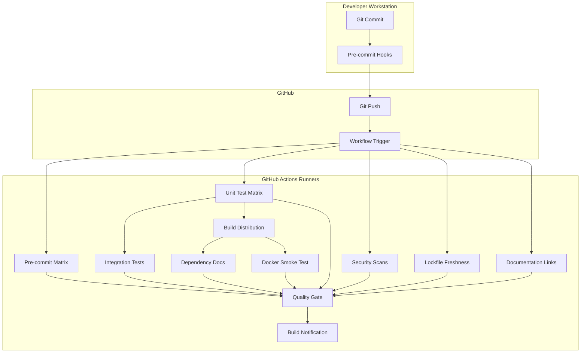

# CI/CD Technical Reference

## Complete technical reference for the CI/CD pipeline

---

## Table of Contents

1. [Pipeline Architecture](#pipeline-architecture)
2. [Workflow Specification](#workflow-specification)
3. [Configuration Files](#configuration-files)
4. [Tool Configurations](#tool-configurations)
5. [Environment Variables](#environment-variables)
6. [Artifact Specifications](#artifact-specifications)
7. [API Reference](#api-reference)
8. [Troubleshooting Reference](#troubleshooting-reference)

---

## Pipeline Architecture

### System Diagram



### Job Dependencies

```yaml
jobs:
  pre-commit:
    strategy:
      matrix:
        python-version: ["3.12", "3.13", "3.14"]

  unit-tests:
    needs: [pre-commit]
    strategy:
      matrix:
        python-version: ["3.12", "3.13", "3.14"]

  integration-tests:
    needs: [unit-tests]
    if: github.event_name == 'pull_request' || github.ref_name == 'main' || github.ref_name == 'develop'

  build:
    needs: [unit-tests]

  dependency-docs:
    needs: [build]

  security:
    needs: [pre-commit]

  lockfile-check:
    runs-on: ubuntu-latest

  docs:
    runs-on: ubuntu-latest

  docker-build:
    needs: [build]
    if: github.event_name == 'pull_request' || github.ref_name == 'main' || github.ref_name == 'develop'

  required-checks:
    if: always()
    needs: [pre-commit, unit-tests, integration-tests, security, build, dependency-docs, lockfile-check, docs, docker-build]

  notify:
    needs: [required-checks]
    if: always()
```

---

## Workflow Specification

### Trigger Specification

```yaml
on:
  push:
    branches:
      - main
      - develop
      - feature/**
      - fix/**
  pull_request:
    branches:
      - main
      - develop
  repository_dispatch:
    types: [data-client-updated, cascor-client-updated]
  workflow_dispatch:
```

### Job Specification

#### Lint Job

```yaml
lint:
  name: Code Quality Checks
  runs-on: ubuntu-latest
  timeout-minutes: 10

  steps:
    - name: Checkout Code
      uses: actions/checkout@v4
      with:
        fetch-depth: 0  # Full history for better analysis

    - name: Set up Python
      uses: actions/setup-python@v5
      with:
        python-version: '3.13'
        cache: 'pip'

    - name: Install Linting Tools
      run: |
        python -m pip install --upgrade pip
        pip install black isort flake8 mypy bandit

    - name: Run Black
      run: black --check --diff src/
      continue-on-error: true

    - name: Run isort
      run: isort --check-only --diff src/
      continue-on-error: true

    - name: Run Flake8
      run: |
        flake8 src/ --count --select=E9,F63,F7,F82 --show-source --statistics
        flake8 src/ --count --max-line-length=120 --statistics --exit-zero
      continue-on-error: true

    - name: Run MyPy
      run: mypy src/ --ignore-missing-imports --no-strict-optional
      continue-on-error: true

    - name: Run Bandit
      run: bandit -r src/ -c pyproject.toml
      continue-on-error: true
```

#### Test Job

```yaml
unit-tests:
  name: Unit Tests + Coverage (Python ${{ matrix.python-version }})
  runs-on: ubuntu-latest
  needs: [pre-commit]
  strategy:
    fail-fast: false
    matrix:
      python-version: ["3.12", "3.13", "3.14"]

  steps:
    - name: Set up Python ${{ matrix.python-version }}
      uses: actions/setup-python@v6
      with:
        python-version: ${{ matrix.python-version }}
        cache: pip

    - name: Install dependencies
      run: |
        python -m pip install --upgrade pip
        pip install torch --index-url https://download.pytorch.org/whl/cpu
        pip install -r conf/requirements_ci.txt
        pip install -e .

    - name: Run Unit Tests with Coverage Gate
      run: |
        set +e
        python -m pytest \
          -m "not requires_cascor and not requires_server and not slow" \
          src/tests/unit/ src/tests/regression/ \
          --verbose \
          --timeout=60 \
          --maxfail=5 \
          --junitxml=reports/junit/junit-unit.xml \
          --cov=src \
          --cov-report=term-missing \
          --cov-report=xml:reports/coverage.xml \
          --cov-report=html:reports/htmlcov \
          --cov-fail-under=80
        PYTEST_EXIT=$?
        set -e

        if [ $PYTEST_EXIT -eq 134 ] && [ -f reports/junit/junit-unit.xml ]; then
          FAILURES=$(python -c "import xml.etree.ElementTree as ET; root = ET.parse('reports/junit/junit-unit.xml').getroot(); print(root.attrib.get('failures', '0'))")
          ERRORS=$(python -c "import xml.etree.ElementTree as ET; root = ET.parse('reports/junit/junit-unit.xml').getroot(); print(root.attrib.get('errors', '0'))")
          if [ "$FAILURES" = "0" ] && [ "$ERRORS" = "0" ]; then
            exit 0
          fi
        fi
        exit $PYTEST_EXIT
```

---

## Configuration Files

### .github/workflows/ci.yml

**Location:** `.github/workflows/ci.yml`

**Purpose:** Main CI/CD pipeline definition

**Key Sections:**

1. **Workflow metadata**
   - Name: `CI/CD Pipeline`
   - Version: Tracked in file header

2. **Trigger configuration**
   - Push events
   - Pull request events
   - Manual dispatch

3. **Job definitions**
   - Lint
   - Test (matrix)
   - Build
   - Integration
   - Quality gate
   - Notify

4. **Environment variables**
   - Python settings
   - Application settings
   - Test settings

### .pre-commit-config.yaml

**Location:** `.pre-commit-config.yaml`

**Purpose:** Pre-commit hook configuration

**Hook Categories:**

1. **Standard hooks** (trailing-whitespace, end-of-file-fixer, etc.)
2. **Black** (code formatting)
3. **isort** (import sorting)
4. **Flake8** (linting)
5. **MyPy** (type checking - manual stage)
6. **Bandit** (security scanning)
7. **YAML lint**
8. **Python syntax check**

**Configuration:**

```yaml
repos:
  - repo: https://github.com/psf/black
    rev: 24.1.1
    hooks:
      - id: black
        language_version: python3.13
        args: [--line-length=120]

  - repo: https://github.com/PyCQA/isort
    rev: 5.13.2
    hooks:
      - id: isort
        args: [--profile=black, --line-length=120]
```

### .codecov.yml

**Location:** `.codecov.yml`

**Status:** Not used in current CI pipeline

**Notes:**

- The current `ci.yml` does not upload coverage to Codecov.
- Coverage enforcement happens directly in pytest with `--cov-fail-under=80`.
- Coverage artifacts are uploaded via `actions/upload-artifact` as `coverage-report-py{python-version}`.

### pyproject.toml

**Location:** `pyproject.toml`

**Purpose:** Python project and tool configuration

**Sections:**

1. **Project metadata**

   ```toml
   [project]
   name = "juniper_canopy"
   version = "0.2.1"
   requires-python = ">=3.11"
   ```

2. **Black configuration**

   ```toml
   [tool.black]
   line-length = 120
   target-version = ['py312', 'py313']
   ```

3. **isort configuration**

   ```toml
   [tool.isort]
   profile = "black"
   line_length = 120
   ```

4. **Bandit configuration**

   ```toml
   [tool.bandit]
   exclude_dirs = ["/tests/", "/.venv/"]
   skips = ["B101", "B601"]
   ```

5. **MyPy configuration**

   ```toml
   [tool.mypy]
   python_version = "3.14"
   ignore_missing_imports = true
   ```

6. **Pytest configuration**

   ```toml
   [tool.pytest.ini_options]
   minversion = "7.0"
   testpaths = ["src/tests"]
   addopts = ["--verbose", "--cov=src"]
   ```

7. **Coverage configuration**

   ```toml
   [tool.coverage.report]
   show_missing = true
   fail_under = 80
   precision = 2
   ```

---

## Tool Configurations

### Black

**Purpose:** Code formatting

**Configuration:**

```toml
[tool.black]
line-length = 120
target-version = ['py312', 'py313']
include = '\.pyi?$'
extend-exclude = '''
/(
    \.eggs
    | \.git
    | \.venv
    | logs
    | reports
)/
'''
```

**Usage:**

```bash
# Check formatting
black --check --diff src/

# Apply formatting
black src/

# Specific line length
black --line-length=100 src/
```

### isort

**Purpose:** Import sorting

**Configuration:**

```toml
[tool.isort]
profile = "black"
line_length = 120
multi_line_output = 3
include_trailing_comma = true
force_grid_wrap = 0
use_parentheses = true
```

**Usage:**

```bash
# Check imports
isort --check-only --diff src/

# Sort imports
isort src/

# Specific profile
isort --profile=black src/
```

### Flake8

**Purpose:** Linting

**Configuration:**

```ini
# .flake8 or setup.cfg
[flake8]
max-line-length = 120
extend-ignore = E203, E266, E501, W503
max-complexity = 15
select = B,C,E,F,W,T4,B9
```

**Usage:**

```bash
# Lint code
flake8 src/

# With specific options
flake8 src/ --max-line-length=120 --statistics

# Ignore specific errors
flake8 src/ --extend-ignore=E501,W503
```

### MyPy

**Purpose:** Type checking

**Configuration:**

```toml
[tool.mypy]
python_version = "3.14"
warn_return_any = true
warn_unused_configs = true
disallow_untyped_defs = false
ignore_missing_imports = true
show_error_codes = true
```

**Usage:**

```bash
# Type check
mypy src/

# With options
mypy src/ --ignore-missing-imports --no-strict-optional

# Check specific file
mypy src/config_manager.py
```

### Bandit

**Purpose:** Security scanning

**Configuration:**

```toml
[tool.bandit]
exclude_dirs = ["/tests/", "/.venv/"]
skips = ["B101", "B601"]
level = "MEDIUM"
confidence = "MEDIUM"
```

**Usage:**

```bash
# Security scan
bandit -r src/

# With config
bandit -r src/ -c pyproject.toml

# Specific severity
bandit -r src/ -ll  # Low severity and up
```

### Pytest

**Purpose:** Testing framework

**Configuration:**

```toml
[tool.pytest.ini_options]
minversion = "7.0"
testpaths = ["src/tests"]
python_files = ["test_*.py"]
python_classes = ["Test*"]
python_functions = ["test_*"]
addopts = [
    "--verbose",
    "--color=yes",
    "--cov=src",
    "--cov-report=term-missing"
]
markers = [
    "unit: Unit tests",
    "integration: Integration tests",
    "slow: Slow-running tests"
]
```

**Usage:**

```bash
# Run all tests
pytest tests/

# Run with coverage
pytest tests/ --cov=src --cov-report=html

# Run specific marker
pytest -m unit

# Verbose output
pytest tests/ -vv

# Stop on first failure
pytest tests/ -x
```

### Coverage.py

**Purpose:** Code coverage tracking

**Configuration:**

```toml
[tool.coverage.run]
source = ["src"]
omit = [
    "*/tests/*",
    "*/__pycache__/*"
]
branch = true

[tool.coverage.report]
show_missing = true
skip_covered = false
fail_under = 80
precision = 2
exclude_lines = [
    "pragma: no cover",
    "def __repr__",
    "raise NotImplementedError"
]
```

**Usage:**

```bash
# Run tests with coverage
coverage run -m pytest tests/

# Generate report
coverage report

# Generate HTML report
coverage html

# Combine coverage data
coverage combine

# Erase coverage data
coverage erase
```

---

## Environment Variables

### GitHub Actions Default Variables

```bash
# Workflow context
GITHUB_WORKFLOW="CI/CD Pipeline"
GITHUB_RUN_ID="1234567890"
GITHUB_RUN_NUMBER="42"
GITHUB_ACTION="run-tests"

# Repository context
GITHUB_REPOSITORY="owner/repo"
GITHUB_REPOSITORY_OWNER="owner"
GITHUB_SHA="abc123..."
GITHUB_REF="refs/heads/main"
GITHUB_REF_NAME="main"

# Event context
GITHUB_EVENT_NAME="push"
GITHUB_EVENT_PATH="/github/workflow/event.json"
GITHUB_ACTOR="username"

# Runner context
RUNNER_OS="Linux"
RUNNER_ARCH="X64"
RUNNER_NAME="GitHub Actions 1"
RUNNER_TEMP="/tmp"
RUNNER_WORKSPACE="/home/runner/work/repo/repo"

# Other
CI="true"
GITHUB_ACTIONS="true"
GITHUB_WORKSPACE="/home/runner/work/repo/repo"
GITHUB_SERVER_URL="https://github.com"
GITHUB_API_URL="https://api.github.com"
```

### Custom Environment Variables

```yaml
env:
  # Python
  PYTHONUNBUFFERED: 1
  PYTHONDONTWRITEBYTECODE: 1

  # Application
  CASCOR_DEBUG: 0
  CASCOR_DEMO_MODE: 1
  CASCOR_DEMO_INTERVAL: 0.1

  # Testing
  PYTEST_ADDOPTS: "--verbose --color=yes"
  COVERAGE_CORE: sysmon

  # CI workflow
  PYTHON_TEST_VERSION: "3.14"
  COVERAGE_FAIL_UNDER: "80"
```

### Accessing Environment Variables

**In workflow:**

```yaml
- name: Use Environment Variable
  run: |
    echo "Workflow: ${{ github.workflow }}"
    echo "Python: ${{ env.PYTHON_VERSION }}"
    echo "Custom: ${{ env.CASCOR_DEBUG }}"
```

**In Python:**

```python
import os

# GitHub Actions variables
is_ci = os.getenv('CI') == 'true'
workflow = os.getenv('GITHUB_WORKFLOW')
run_id = os.getenv('GITHUB_RUN_ID')

# Custom variables
debug = os.getenv('CASCOR_DEBUG', '0') == '1'
demo_mode = os.getenv('CASCOR_DEMO_MODE', '0') == '1'
```

---

## Artifact Specifications

### Test Results Artifact

**Name:** `unit-test-results-py{python-version}`

**Contents:**

```bash
reports/junit/
└── junit-unit.xml           # Unit test JUnit XML report
```

**Metadata:**

```yaml
name: unit-test-results-py3.14
retention-days: 30
size: ~0.2-1 MB
format: ZIP archive
```

### Coverage Report Artifact

**Name:** `coverage-report-py{python-version}`

**Contents:**

```bash
reports/htmlcov/
├── index.html               # Main coverage page
├── *.html                   # Per-file coverage
├── style.css                # Styling
reports/coverage.xml         # XML report
```

**Metadata:**

```yaml
name: coverage-report-py3.14
retention-days: 30
size: ~1-3 MB
format: ZIP archive
```

### Accessing Artifacts

**Via GitHub UI:**

1. Go to workflow run page
2. Scroll to "Artifacts" section
3. Click artifact name to download

**Via GitHub CLI:**

```bash
# List artifacts for run
gh run view RUN_ID --log-failed

# Download specific artifact
gh run download RUN_ID -n unit-test-results-py3.14

# Download all artifacts
gh run download RUN_ID
```

**Via REST API:**

```bash
# List artifacts
curl -H "Authorization: token $TOKEN" \
  https://api.github.com/repos/OWNER/REPO/actions/runs/RUN_ID/artifacts

# Download artifact
curl -L -H "Authorization: token $TOKEN" \
  https://api.github.com/repos/OWNER/REPO/actions/artifacts/ARTIFACT_ID/zip \
  -o artifact.zip
```

---

## API Reference

### GitHub Actions API

#### Workflow Runs

**List workflow runs:**

```bash
GET /repos/{owner}/{repo}/actions/runs
```

**Get workflow run:**

```bash
GET /repos/{owner}/{repo}/actions/runs/{run_id}
```

**Re-run workflow:**

```bash
POST /repos/{owner}/{repo}/actions/runs/{run_id}/rerun
```

#### Artifacts

**List artifacts:**

```bash
GET /repos/{owner}/{repo}/actions/runs/{run_id}/artifacts
```

**Download artifact:**

```bash
GET /repos/{owner}/{repo}/actions/artifacts/{artifact_id}/zip
```

**Delete artifact:**

```bash
DELETE /repos/{owner}/{repo}/actions/artifacts/{artifact_id}
```

### Coverage Artifact Retrieval

#### Download Coverage Artifact

```bash
gh run download RUN_ID -n coverage-report-py3.14
```

---

## Troubleshooting Reference

### Common Error Codes

| Error | Cause                    | Solution                         |
| ----- | ------------------------ | -------------------------------- |
| E001  | Workflow syntax error    | Validate YAML syntax             |
| E002  | Missing required field   | Add required field to workflow   |
| E003  | Invalid expression       | Fix workflow expression syntax   |
| E101  | Job timeout              | Increase timeout or optimize job |
| E102  | Job cancelled            | Check concurrency settings       |
| E201  | Step failed              | Check step logs for details      |
| E202  | Command not found        | Install required tool            |
| E203  | Permission denied        | Check file permissions           |
| E301  | Artifact upload failed   | Check size and path              |
| E302  | Artifact download failed | Verify artifact exists           |

### Exit Codes

| Code | Meaning                 |
| ---- | ----------------------- |
| 0    | Success                 |
| 1    | General error           |
| 2    | Misuse of shell command |
| 126  | Command cannot execute  |
| 127  | Command not found       |
| 128  | Invalid exit argument   |
| 130  | Terminated by Ctrl+C    |
| 137  | Killed (out of memory)  |
| 139  | Segmentation fault      |

### Log Analysis

**Search patterns:**

```bash
# Errors
grep -i "error" workflow.log

# Warnings
grep -i "warning" workflow.log

# Failed tests
grep "FAILED" workflow.log

# Coverage issues
grep "coverage" workflow.log | grep -i "low\|fail"
```

---

## Performance Metrics

### Baseline Performance

| Stage            | Duration | CPU     | Memory |
| ---------------- | -------- | ------- | ------ |
| Lint             | 2 min    | 1 core  | 512 MB |
| Test (each)      | 8 min    | 2 cores | 2 GB   |
| Build            | 2 min    | 1 core  | 512 MB |
| Integration      | 5 min    | 2 cores | 1 GB   |
| Quality Gate     | 30 sec   | 1 core  | 256 MB |
| Total (parallel) | ~15 min  | -       | -      |

### Optimization Targets

| Metric            | Current | Target | Stretch |
| ----------------- | ------- | ------ | ------- |
| Total build time  | 15 min  | 10 min | 7 min   |
| Test suite        | 8 min   | 5 min  | 3 min   |
| Lint              | 2 min   | 1 min  | 30 sec  |
| Coverage overhead | 20%     | 10%    | 5%      |

---

## Version History

### Version 1.1.0 (2026-04-04)

**Updates:**

- Updated workflow model to match `pre-commit`, `unit-tests`, `integration-tests`, `security`, `dependency-docs`, `lockfile-check`, `docs`, `docker-build`, `required-checks`.
- Updated Python matrix references to `3.12`, `3.13`, `3.14`.
- Updated artifact names and paths to current CI outputs.
- Updated coverage enforcement references to 80% minimum threshold.

### Version 1.0.0 (2025-11-05)

**Initial release.**

---

## References

### Official Documentation

- [GitHub Actions Docs](https://docs.github.com/en/actions)
- [Workflow Syntax](https://docs.github.com/en/actions/reference/workflow-syntax-for-github-actions)
- [Pytest Docs](https://docs.pytest.org/)
- [Coverage.py Docs](https://coverage.readthedocs.io/)
- [Pre-commit Docs](https://pre-commit.com/)

### Project Documentation

- [CICD_QUICK_START.md](CICD_QUICK_START.md)
- [CICD_ENVIRONMENT_SETUP.md](CICD_ENVIRONMENT_SETUP.md)
- [CICD_MANUAL.md](CICD_MANUAL.md)
- [AGENTS.md](../../AGENTS.md)
- [README.md](../../README.md)

---

**Last Updated:** 2026-04-04  
**Version:** 0.26.0  
**Maintained By:** Development Team  
**Status:** ✅ Current
