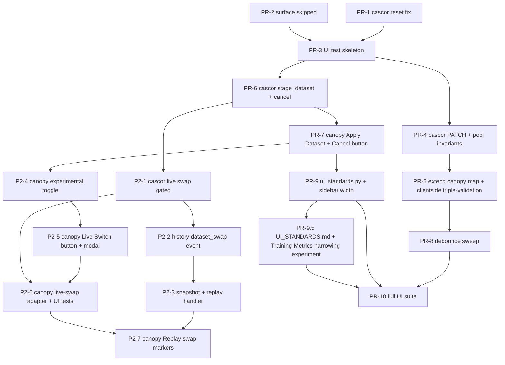

# Juniper-Canopy Frontend Issues — Remediation Plan (2026-05-09)

* **Author**: Paul Calnon (drafted by Claude Code Opus 4.7)
* **Status**: Reviewed — open questions resolved 2026-05-09 (see §10 Resolution log)
* **Scope**: Six user-reported issues affecting the juniper-canopy Dash UI and its interaction with the juniper-cascor backend.
* **Companion pointer**: `juniper-ml/notes/JUNIPER_2026-05-09_JUNIPER-CANOPY_FRONTEND-ISSUES-PLAN.md`

## Revisions

| Date       | Rev  | Change                                                                                               |
|------------|------|------------------------------------------------------------------------------------------------------|
| 2026-05-09 | v1.0 | Initial plan (six issues, ten-PR series).                                                            |
| 2026-05-09 | v1.1 | All four open questions resolved. Material updates:                                                  |
|            |      | * §1.5 C2.1: candidate-pool invariants added as a hard PR-4 acceptance criterion (Q2).               |
|            |      | * §5 CI lane: ≤5 min wall-clock budget + parallel job + cache + `slow` marker (Q3).                  |
|            |      | * §6 + §6.4.1 + §6.5.1: sidebar work seeds `ui_standards.py` + `notes/UI_STANDARDS.md` (Q4).         |
|            |      | * §7.3: demo mode confirmed staying; reuse-refactor filed as out-of-scope follow-up (Q1).            |
|            |      | * §8: PR series gains PR-9.5 (UI_STANDARDS doc + Training-Metrics narrowing experiment).             |
|            |      | * §10: Open questions converted to a Resolution log marked CLOSED.                                   |
| 2026-05-09 | v1.2 | Issue #3 Recommendation superseded by §3.4.2 alternate approach. Material updates:                   |
|            |      | * §3.4.2 (user-authored) becomes the Selected Approach; §3.4.1 retained as historical context.       |
|            |      | * §3.5.2 / §3.6.2: Phase 1 (cold-swap + Cancel button) diff-ready code + tests filled in.            |
|            |      | * §3.7: regression tests extended; new `test_phase2_off_by_default.py` guards the experimental gate. |
|            |      | * §3.8: Phase 2 (live dataset swap) summarized with PR table; full spec in separate doc.             |
|            |      | * New file: `notes/ISSUE_3_PHASE_2_LIVE_DATASET_SWAP_2026-05-09.md` — authoritative Phase 2 spec.    |
|            |      | * §0 / §8 / §9: PR-7 scope expanded with Cancel; Phase 2 PR series (P2-1 … P2-7) added separately.   |

---

## 0. Executive Summary

Six independent UX/correctness bugs in the canopy frontend, ranging from a silent parameter-pass-through dropout (the most damaging — the UI lies about control of cascor) to a sidebar-width cosmetic.
Three of the six share a **common root cause**: the canopy ↔ cascor parameter contract is incomplete and asymmetric.
Fixing that contract first unblocks the other parameter-related work and avoids re-touching the same files twice.

| # | Issue                                        | Severity             | Root cause family                             | Fix scope                                                          |
|---|----------------------------------------------|----------------------|-----------------------------------------------|--------------------------------------------------------------------|
| 1 | Metaparam edits never reach cascor           | **P0 — correctness** | Param-map gap + no roundtrip verification     | canopy adapter + cascor PATCH                                      |
| 3 | Dataset-tab edits don't change training data | **P0 — correctness** | Same param-map gap + no dataset-swap endpoint | **Phase 1**: canopy adapter + cascor + Cancel button.              |
|   |                                              |                      |                                               | -- **Phase 2** (separate doc): live in-flight swap behind          |
|   |                                              |                      |                                               | -- experimental-functions gate, two-step warning modal,            |
|   |                                              |                      |                                               | -- History/Snapshots/Replay persistence.                           |
| 5 | Single-iteration auto-pause after stop+reset | **P0 — correctness** | `reset()` leaves `_pause_event` cleared       | cascor lifecycle manager (1 line)                                  |
| 2 | Numeric input typing vs spinner mismatch     | P1 — UX              | Universal `debounce=True` confuses            | canopy frontend (component refactor)                               |
|   |                                              |                      | -- Apply-button enable indicator              |                                                                    |
| 4 | No real UI test sub-suite                    | P1 — quality gate    | No browser-automation harness exists          | new pytest sub-suite + CI lane                                     |
| 6 | Left sidebar too wide on Training Metrics    | P3 — cosmetic        | Hardcoded `dbc.Col(width=3)` for all tabs     | per-tab width via `ui_standards.py` + seed `notes/UI_STANDARDS.md` |

**Recommended ordering** (justified in §10):

```bash
5 → 1 → 3 → 4 (skeleton) → 2 → 6 → 6.5 (UI spec doc + experiment) → 4 (full coverage)
```

---

## 1. Issue #1 — Metaparameter Edits Don't Reach Cascor

### 1.1 Detailed analysis

The Apply Parameters button on the Training Metrics tab gathers 29 numeric / dropdown values and posts them as a JSON dict.
The trip looks like:

```bash
Dash inputs (29)
   └─ apply_parameters callback  src/frontend/dashboard_manager.py:2911-2971
        └─ _apply_parameters_handler  src/frontend/dashboard_manager.py:3743-3782
             └─ POST /api/set_params
                  └─ canopy main.py route  src/main.py:2771-2889
                       └─ asyncio.to_thread(backend.apply_params, **backend_updates)
                            └─ CascorServiceAdapter.apply_params  src/backend/cascor_service_adapter.py:695-754
                                 ├─ filter through _CANOPY_TO_CASCOR_PARAM_MAP  (line 707)
                                 │   └─ DROPS 14 of 29 keys silently  (line 708-710)
                                 └─ self._client.update_params(cold)  (line 746)
                                       └─ response NOT validated for per-key acceptance
```

`_CANOPY_TO_CASCOR_PARAM_MAP` (`cascor_service_adapter.py:638-655`) currently maps **16 keys**.
The frontend submits **29 keys**.
The 13 silently dropped keys include:

* Candidate-pool selection: `cn_selected_candidates`, `cn_top_candidates`, `cn_random_candidates`, `cn_candidate_selection`, `cn_multi_candidate`, `cn_training_complete` (no cascor REST equivalent currently).
* NN-only / dataset: `nn_multi_node_layers`, `nn_growth_trigger`, `nn_growth_preset_epochs`, `nn_spiral_rotations`, `nn_spiral_number`, `nn_dataset_elements`, `nn_dataset_noise` (overlaps with issue #3).

Drops are logged at `DEBUG` only; the user's "Parameters applied" toast still fires.

### 1.2 Root causes

* **R1.1**: Adapter mapping is incomplete. Six candidate-pool params and seven NN/dataset params have no canonical cascor target.
* **R1.2**: For the keys that *do* have a cascor target, the adapter does not verify cascor accepted the patch (`update_params` response is `dict`-merged in but never compared to the requested set; line 746-748).
* **R1.3**: Cascor's `/v1/training/params` PATCH does not exist for the candidate-pool selection knobs at all — there is no API to receive them.
* **R1.4**: There is no contract test that re-reads `/api/state` (or cascor `/v1/training/state`) after an apply to confirm the running config changed.

### 1.3 Fix options

**Option A — Surface drops to the user (minimal).**
Have the adapter return the `skipped` list; main.py turns that into a yellow warning toast ("3 of 29 parameters not yet supported by the backend").
Closes the lying-toast bug without adding endpoints.

**Option B — Round-trip-verified apply (medium).**
After PATCH, immediately GET cascor's `/v1/training/params`, diff against requested values, and surface mismatches.
Does not extend the API surface but catches silent reject-and-still-200 cases.

**Option C — Extend the contract end-to-end (full fix, recommended).**
Add the missing PATCH targets in cascor for the candidate-pool selection parameters (and for the dataset knobs in §3), grow the adapter map, and add roundtrip verification (B).
This is the only option that delivers the user's stated expectation: "what I change in the UI affects the running cascor."

### 1.4 Recommendation

**Option C, staged C1 → C2 → C3 inside this PR series.** Reasoning:

* The user's mental model is "the UI controls cascor." Anything less than C perpetuates the problem under a friendlier toast.
* The adapter map is already a flat dict — extending it is mechanical.
* The candidate-pool selection knobs are the *most* user-facing of the dropped params (visible on the always-on parameters card), so leaving them as silent no-ops is the worst residual state.
* Cascor lifecycle already supports parameter PATCH (manager.py uses `_write_*` setters); adding six more is incremental.

C1 = adapter changes + warning toast (Option A as a fallback for genuinely unmappable params).
C2 = cascor PATCH endpoints.
C3 = roundtrip verification.

### 1.5 Code (diff-ready)

#### C1a. Surface the dropped keys to the user

```diff
--- a/src/backend/cascor_service_adapter.py
+++ b/src/backend/cascor_service_adapter.py
@@ -707,11 +707,16 @@ class CascorServiceAdapter:
-        mapped = {self._CANOPY_TO_CASCOR_PARAM_MAP[k]: v for k, v in params.items() if k in self._CANOPY_TO_CASCOR_PARAM_MAP}
-        skipped = [k for k in params if k not in self._CANOPY_TO_CASCOR_PARAM_MAP]
-        if skipped:
-            logger.debug(f"Canopy-only params (no cascor mapping): {skipped}")
-        if not mapped:
-            return {"ok": True, "data": {}, "message": "No cascor-mappable params provided"}
+        mapped = {self._CANOPY_TO_CASCOR_PARAM_MAP[k]: v for k, v in params.items() if k in self._CANOPY_TO_CASCOR_PARAM_MAP}
+        skipped = sorted(k for k in params if k not in self._CANOPY_TO_CASCOR_PARAM_MAP)
+        if skipped:
+            # WARNING (was DEBUG): users were not seeing that ~half the form
+            # was being dropped. main.py converts this to a UI toast.
+            logger.warning(
+                "apply_params dropped %d unmapped key(s); add to _CANOPY_TO_CASCOR_PARAM_MAP "
+                "or document as canopy-only: %s", len(skipped), skipped,
+            )
+        if not mapped:
+            return {"ok": True, "data": {}, "skipped": skipped,
+                    "message": "No cascor-mappable params provided"}
```

…and at the success return:

```diff
@@ -752,8 +757,8 @@ class CascorServiceAdapter:
-        logger.info(f"Cascor params updated: {list(mapped.keys())}")
-        return {"ok": True, "data": result_data}
+        logger.info(f"Cascor params updated: {list(mapped.keys())}")
+        return {"ok": True, "data": result_data, "skipped": skipped}
```

Then in `src/main.py` route handler for `/api/set_params`, propagate `skipped` to the JSON response (already returns a dict, just pass it through), and in `dashboard_manager._apply_parameters_handler` consume it:

```diff
--- a/src/frontend/dashboard_manager.py
+++ b/src/frontend/dashboard_manager.py
@@ -3779,7 +3779,16 @@ class DashboardManager:
-            if response.status_code == 200:
-                return params, "Parameters applied"
+            if response.status_code == 200:
+                payload = response.json() if response.content else {}
+                skipped = payload.get("skipped") or []
+                if skipped:
+                    msg = (
+                        f"Applied {len(params) - len(skipped)} of {len(params)} "
+                        f"parameter(s); {len(skipped)} not yet supported "
+                        f"by the backend: {', '.join(skipped[:5])}"
+                        + ("…" if len(skipped) > 5 else "")
+                    )
+                    return params, msg
+                return params, "Parameters applied"
```

#### C1b. Extend the adapter map (mappings introduced in §1.5 C2)

Once cascor exposes the new PATCH targets (C2 below), the map gains:

```diff
--- a/src/backend/cascor_service_adapter.py
+++ b/src/backend/cascor_service_adapter.py
@@ -638,6 +638,12 @@ class CascorServiceAdapter:
     _CANOPY_TO_CASCOR_PARAM_MAP = {
         "nn_learning_rate": "learning_rate",
         "nn_max_hidden_units": "max_hidden_units",
@@ -653,6 +659,12 @@ class CascorServiceAdapter:
         "cn_correlation_threshold": "correlation_threshold",
         "cn_candidate_learning_rate": "candidate_learning_rate",
+        # Phase 6F-A: candidate-pool selection (cascor PATCH added in cascor#TBD).
+        # Semantics confirmed 2026-05-09 (Resolution log Q2):
+        #   - selected_candidates: number of candidate nodes promoted from the
+        #     pool after each candidate-pool training pass. Plumbing for
+        #     multi-candidate (network-layer-style) growth.
+        #   - top_candidates:    top-N (by correlation score) to include in the
+        #     selection. If random_candidates == 0, must equal selected_candidates.
+        #   - random_candidates: randomly drawn members of the pool to include.
+        #     If top_candidates == 0, must equal selected_candidates.
+        #     If both nonzero: top_candidates + random_candidates == selected_candidates.
+        "cn_multi_candidate":      "multi_candidate",
+        "cn_candidate_selection":  "candidate_selection",
+        "cn_selected_candidates":  "selected_candidates",
+        "cn_top_candidates":       "top_candidates",
+        "cn_random_candidates":    "random_candidates",
     }
```

Add each new key to either `_HOT_CASCOR_PARAMS` (mid-training pool resize is safe) or `_COLD_CASCOR_PARAMS` (selection mode change requires next-iteration boundary).
Suggested classification:

```diff
@@ -670,6 +676,7 @@ class CascorServiceAdapter:
             "candidate_convergence_threshold",
             "candidate_patience",
+            "selected_candidates", "top_candidates", "random_candidates",
         }
     )
@@ -688,6 +695,7 @@ class CascorServiceAdapter:
             "optimizer_type",
             "activation_function_name",
+            "multi_candidate", "candidate_selection",
         }
     )
```

#### C2. Cascor PATCH endpoints (cascor repo)

In `juniper-cascor/src/api/lifecycle/manager.py` the existing `update_training_params(**params)` flow uses `_write_*` setters.
Add five:

```diff
--- a/src/api/lifecycle/manager.py
+++ b/src/api/lifecycle/manager.py
@@ -<existing _PARAM_SETTER_MAP>
     "candidate_learning_rate": "_write_candidate_learning_rate",
+    "multi_candidate":         "_write_multi_candidate",
+    "candidate_selection":     "_write_candidate_selection",
+    "selected_candidates":     "_write_selected_candidates",
+    "top_candidates":          "_write_top_candidates",
+    "random_candidates":       "_write_random_candidates",
 }
```

with corresponding setter methods that mutate `self.network.config` and (for `selected_candidates`) clamp to `[1, candidate_pool_size]`.
Each setter must return `True`/`False` so the existing PATCH response can list rejections.

#### C2.1 Candidate-pool invariants (Answer 2 — required, not optional)

The PATCH endpoints in C2 cannot accept the three pool-selection knobs as
independent integers. They form a constrained triple. The setters must enforce
the following invariants atomically and reject any PATCH that would violate
them — partial application is forbidden, since a half-applied state would
silently corrupt the next iteration's candidate-promotion logic.

**Invariants** (let `S = selected_candidates`, `T = top_candidates`, `R = random_candidates`, `P = candidate_pool_size`):

1. `1 <= S <= P`                       — saturation against the pool size.
2. `T >= 0` and `R >= 0`               — non-negative.
3. `T <= S` and `R <= S`               — neither component can exceed the total.
4. **Degenerate cases** (exactly one of T, R is zero):
   * If `R == 0`: require `T == S`.
   * If `T == 0`: require `R == S`.
5. **Both nonzero**: require `T + R == S`.
6. `T == 0 and R == 0` is illegal when `S > 0` (would request promotion with no
   selection rule; surface as a 422).

**Atomicity rule.** A PATCH that updates any of {S, T, R} must be evaluated
against the *post-merge* triple, not the per-key state. Recommended
implementation: a single `_validate_candidate_pool_triple(s, t, r, p)` helper
called from each of the three setters, plus from `apply_params` once after the
batch merge so a multi-key PATCH (`{S: 6, T: 4, R: 2}`) is accepted in one shot
without interim rejection.

```python
# juniper-cascor/src/api/lifecycle/manager.py
def _validate_candidate_pool_triple(self, s: int, t: int, r: int, p: int) -> Optional[str]:
    """Returns None on success or a human-readable error string on violation."""
    if not (1 <= s <= p):
        return f"selected_candidates {s} not in [1, {p}]"
    if t < 0 or r < 0:
        return f"top_candidates and random_candidates must be >= 0 (got {t}, {r})"
    if t > s or r > s:
        return f"each component must be <= selected_candidates (S={s}, T={t}, R={r})"
    if t == 0 and r == 0:
        return "top_candidates and random_candidates cannot both be 0"
    if t == 0 and r != s:
        return f"with top_candidates=0, random_candidates must equal S={s} (got {r})"
    if r == 0 and t != s:
        return f"with random_candidates=0, top_candidates must equal S={s} (got {t})"
    if t > 0 and r > 0 and t + r != s:
        return f"top_candidates+random_candidates must equal S={s} (got {t}+{r}={t+r})"
    return None
```

The PATCH route returns `422 Unprocessable Entity` with the violation string in
the JSON body so the canopy adapter can surface it via the same `skipped`/
`mismatches` machinery from C3 (the toast text already supports this in PR-2).

#### C2.2 Canopy-side soft validation (UI feedback)

The Apply button should not be the first place the user learns the triple is
invalid. Add a clientside callback (Dash `clientside_callback`) that watches
`State("cn-selected-candidates-input", "value")`,
`State("cn-top-candidates-input", "value")`,
`State("cn-random-candidates-input", "value")` and, on any change, sets
`is_invalid=True` plus a help-text `Output` summarizing the violation. The
server-side rule from C2.1 remains the authoritative gate — this is purely a
fast-feedback UX layer.

#### C3. Roundtrip verification

```diff
@@ src/backend/cascor_service_adapter.py @@ apply_params (after REST PATCH)
+        # Roundtrip: confirm the running config moved to the requested values.
+        try:
+            applied = self._client.get_training_params() or {}
+            mismatches = {
+                k: {"requested": v, "applied": applied.get(k)}
+                for k, v in mapped.items()
+                if applied.get(k) != v and k not in self._FLOAT_TOLERANT_PARAMS
+            }
+            if mismatches:
+                logger.warning("apply_params verify mismatch: %s", mismatches)
+                return {"ok": False, "error": "verification_failed",
+                        "mismatches": mismatches, "skipped": skipped}
+        except JuniperCascorClientError as e:
+            logger.warning("apply_params verify call failed: %s", e)
```

`_FLOAT_TOLERANT_PARAMS` = `{"learning_rate", "candidate_learning_rate", "correlation_threshold", "convergence_threshold", "candidate_convergence_threshold"}` — verify with `math.isclose(rel_tol=1e-6)` not equality.
Implementation detail elided for brevity.

### 1.6 Tests for the fix

**New tests in canopy:**

* `src/tests/integration/test_apply_params_skipped_surfaced.py` — patch the adapter to drop a known key, assert the `/api/set_params` JSON contains `skipped`, and assert the dashboard handler surfaces it in the toast text.
* `src/tests/integration/test_apply_params_roundtrip_verify.py` — fake cascor client returns mismatched values for `learning_rate`; assert adapter returns `ok: False, error: "verification_failed"`.
* `src/tests/contract/test_param_map_completeness.py` — for every Apply-button Input id of the form `nn-…-input` / `cn-…-input`, assert the corresponding `nn_*`/`cn_*` key is either in `_CANOPY_TO_CASCOR_PARAM_MAP` *or* on a `_CANOPY_LOCAL_PARAMS` allowlist (constants for documentation).

**New tests in cascor:**

* For each of the five new PATCH targets: `test_param_patch_<name>.py` — PATCH a value, GET back, assert it stuck. Bound checks (e.g.  `selected_candidates > pool_size` returns 400).
* `test_candidate_pool_invariants.py` — exhaustive matrix over §1.5 C2.1:
  * Valid: `(S=4, T=4, R=0)`, `(S=4, T=0, R=4)`, `(S=6, T=4, R=2)`, `(S=1, T=1, R=0)`.
  * Reject 422: `(S=4, T=2, R=2)` when canopy already had `S=6` (post-merge mismatch), `(S=0, T=0, R=0)`, `(S=4, T=5, R=0)` (T>S), `(S=4, T=3, R=2)` (sum != S), negatives.
  * Atomicity: PATCH `{selected_candidates: 6, top_candidates: 4, random_candidates: 2}` succeeds in one shot from a starting state of `(S=2, T=2, R=0)` — no interim 422 on the first key.
* `test_param_validation_helper.py` — direct unit tests on `_validate_candidate_pool_triple` covering the truth table.

**New tests in canopy:**

* `src/tests/integration/test_candidate_pool_clientside_validation.py` — Selenium/Playwright fixture: type `T=2, R=3` while `S=4` is set; assert the help text under the inputs reads "top_candidates+random_candidates must equal S=4" within 200ms (no Apply click).

### 1.7 Regression tests

* Existing `test_apply_button_parameters.py` and `test_param_apply_roundtrip.py` must pass unchanged. Their current "no cascor-mappable params" assertion becomes a regression sentinel for the warning-vs-debug log level change.
* `src/tests/regression/test_param_map_locked_keys.py` — pins the current set of mapped keys so an accidental deletion of a mapping is caught.

---

## 2. Issue #2 — Numeric Inputs Reject Either Typing OR Spinner

### 2.1 Detailed analysis

Every numeric `dbc.Input` under `src/frontend/dashboard_manager.py:744-1237` (20 sites) is configured with `debounce=True`.
Dash translates this to: the component's `value` prop only updates when the user blurs the field or hits Enter — **not** on every keystroke.
The HTML spinner arrows, however, fire a synthetic blur on each click, so spinner changes commit immediately.

The Apply-Parameters callback only reads via `State(id, "value")` (line 2869), so neither path mutates anything until Apply is clicked.
The *perceived* asymmetry comes from the **change-tracker callback** (`dashboard_manager.py:2759-2865`) which reads the same ids via `Input` — that one *does* fire on commit, and it is what enables the Apply button.

User experience:

* **Spinner click**: value commits → change-tracker fires → Apply button lights up. Feels responsive.
* **Type "0.05" + Tab**: commits on Tab → change-tracker fires → Apply lights up. Works.
* **Type "0.05" + click Apply with mouse without leaving the field**: the click steals focus and Dash's debounced value sometimes commits *after* the Apply click is processed → Apply reads the *old* state. Looks like "typing doesn't work".
* **Type "0.05" + immediately observe the visualization**: nothing happens because no commit fired. Feels broken.

### 2.2 Root causes

* **R2.1**: `debounce=True` everywhere makes typed values invisible to all callbacks until commit. The only visual feedback for "your typed value is active" is the Apply button colour change, which is itself debounce-gated.
* **R2.2**: Apply uses `State`, not `Input`. The Apply click does not force a blur on the focused input, so a fast typist can submit a stale form.
* **R2.3**: There is no per-field validation indicator (red border, "out of range" hint), so the user cannot distinguish "rejected" from "ignored".

### 2.3 Fix options

**Option A — Drop `debounce=True` everywhere.**
Every keystroke fires the change-tracker. Live, but spammy: on a slow apply chain this can saturate the websocket update budget and re-trigger validation on every digit ("3 → 30 → 300 → 3000" each fires).

**Option B — Switch to `debounce=<int_ms>` (e.g. 350ms).**
Best of both worlds: typed values commit ~350ms after the last keystroke without requiring blur.
Spinner still commits immediately.
No callback flood.
Dash supports integer debounce since 2.x.

**Option C — Wrap inputs in a custom component with explicit blur on Apply.**
Add a tiny clientside callback that blurs the active element when Apply is clicked, forcing any pending debounced value to commit before the State read.
Cheapest defensive layer; complements A or B.

**Option D — Add validation styling (red border on invalid).**
Orthogonal to A/B/C.
Closes R2.3 alone.

### 2.4 Recommendation

**B + C + D combined.** Reasoning:

* B alone fixes the perceived "typing does nothing" without the callback flood that A would cause (some change-tracker callbacks are non-trivial — they diff against `applied-params-store`).
* C is ~10 lines of clientside JS and removes the entire class of "apply-with-stale-value" race.
* D gives the user immediate feedback on out-of-range entries — currently they silently clip on `min`/`max`.

### 2.5 Code (diff-ready)

#### B. Replace `debounce=True` with integer ms

A single sweep across `dashboard_manager.py`:

```diff
--- a/src/frontend/dashboard_manager.py
+++ b/src/frontend/dashboard_manager.py
-                                                                                debounce=True,
+                                                                                debounce=350,
```

Apply `replace_all` on this exact line within the file (occurrences confined to `dbc.Input` blocks per the audit).
Same change for `metrics_panel.py:379` and any other site that grep turns up.

To enforce the convention long-term, add a constant and a regression test:

```diff
+++ b/src/frontend/canopy_constants.py
+# Common debounce for numeric inputs. 350ms balances typing latency against
+# callback churn. Spinner clicks commit immediately regardless.
+NUMERIC_INPUT_DEBOUNCE_MS = 350
```

```diff
+++ b/src/tests/regression/test_numeric_input_debounce_uniform.py
+import re
+from pathlib import Path
+
+def test_no_boolean_debounce_on_numeric_inputs():
+    src = Path("src/frontend").rglob("*.py")
+    offenders = []
+    for p in src:
+        text = p.read_text()
+        for m in re.finditer(r"dbc\.Input\([^)]*?debounce\s*=\s*(True|False)", text, re.S):
+            offenders.append(f"{p}: {m.group(0)[:80]}")
+    assert not offenders, "Use NUMERIC_INPUT_DEBOUNCE_MS, not boolean: " + "\n".join(offenders)
```

#### C. Force blur on Apply (clientside)

```python
# src/frontend/dashboard_manager.py — register once during _build_layout
app.clientside_callback(
    """
    function(n_clicks){
        if (n_clicks && document.activeElement && typeof document.activeElement.blur === 'function') {
            document.activeElement.blur();
        }
        return window.dash_clientside.no_update;
    }
    """,
    Output("apply-params-button", "n_clicks_timestamp"),  # write-only sink
    Input("apply-params-button", "n_clicks"),
    prevent_initial_call=True,
)
```

(If `n_clicks_timestamp` already has a server-side handler, route the dummy output to a hidden `dcc.Store`.)

#### D. Validation styling

`dbc.Input` natively supports `invalid=True`.
Add a tiny callback per input group, or generalise via a pattern-matching callback:

```python
@app.callback(
    Output({"type": "numeric-input", "field": MATCH}, "invalid"),
    Input({"type": "numeric-input", "field": MATCH}, "value"),
    State({"type": "numeric-input", "field": MATCH}, "min"),
    State({"type": "numeric-input", "field": MATCH}, "max"),
    prevent_initial_call=True,
)
def _flag_oob(value, lo, hi):
    if value is None:
        return False
    try:
        v = float(value)
    except (TypeError, ValueError):
        return True
    return (lo is not None and v < lo) or (hi is not None and v > hi)
```

This requires migrating `dbc.Input` ids from string ids to dict ids (`{"type": "numeric-input", "field": "nn-learning-rate"}`).
Larger surgery — defer to a follow-up if time-constrained.

### 2.6 Tests for the fix

* `tests/regression/test_numeric_input_debounce_uniform.py` (above) — pins the convention.
* `tests/integration/test_apply_blur_clientside.py` — Playwright-driven (per §4): type into `nn-learning-rate-input` without leaving focus, click Apply, assert the request payload contains the typed value (uses the new Playwright fixture from issue #4).
* `tests/integration/test_input_oob_invalid_class.py` — Playwright: type a value above `max`, assert the input gains the Bootstrap `is-invalid` class.

### 2.7 Regression tests

* `tests/regression/test_dashboard_rendering_regression.py` already exists — extend it with an assertion that every `dbc.Input(type="number")` has a positive integer `debounce` (not `True`/`False`).
* `tests/integration/test_param_apply_roundtrip.py` (existing) — add a case that types a value via the test client's keyboard simulation and confirms the apply payload picks it up.

---

## 3. Issue #3 — Dataset View Tab Doesn't Affect Training

### 3.1 Detailed analysis

Inputs `nn-dataset-elements-input`, `nn-dataset-noise-input`, `nn-spiral-rotations-input`, `nn-spiral-number-input` ride the same Apply pipeline as §1, and meet the same fate at `cascor_service_adapter.py:707` — they aren't in `_CANOPY_TO_CASCOR_PARAM_MAP` and are silently dropped.
In demo mode (`src/demo_mode.py:1930-1984`) the params *are* stored on the demo backend instance, but the regeneration path (lines 1930-1946) only fires for `spiral_rotations`, leaving `elements` and `noise` as inert attributes.

There is also no UI to pick a *dataset type* (Spirals / MNIST / etc.) at all on the Dataset View tab — only spiral parameters are exposed.
The Dataset View renders whatever cascor / juniper-data is currently serving.

### 3.2 Root causes

* **R3.1**: Same param-map gap as §1 but for dataset-shape knobs.
* **R3.2**: Cascor has no "swap dataset" endpoint. The training dataset is loaded once at process start via `juniper-data-client` and not re-fetched on PATCH.
* **R3.3**: Demo mode regenerates only on `spiral_rotations`, not on the other knobs — a partial implementation that masked the deeper missing endpoint.
* **R3.4**: No "Apply Dataset" button or visible feedback distinguishes "preview the dataset I'm about to use" from "switch the live training dataset".

### 3.3 Fix options

**Option A — Document scope: Dataset View is preview-only.**
Add a banner: "Changes here preview the dataset; click *Apply Dataset* and *Restart Training* to use it."
Add a separate Apply Dataset button that re-runs `juniper-data` generation and tells cascor to re-load on next start.
Doesn't fix mid-training swap (rare use case).

**Option B — Hot-swap dataset mid-training (deep).**
Add cascor `POST /v1/training/dataset` that aborts the current iteration, swaps `network.dataset_x/y`, re-initialises optimizer state, and resumes.
Architecturally invasive — affects history, snapshots, replay.

**Option C — Cold-swap with restart prompt (recommended).**
Apply Dataset persists the new params to cascor's pending-config and surfaces a banner: "Dataset will change on the next training start.  [Stop & Restart]".
Stop & Restart calls `/api/train/stop`, then `/api/train/start` with the new config in the request body.
Avoids mid-training contortions while making the UI honest.

### 3.4 Recommendations

#### 3.4.1 Original Recommendation

**Option C, with A's banner as fallback for users who don't want to restart.**

* A alone leaves the door open for the user to "click Apply, see no change, conclude it's broken" — the very symptom we're fixing.
* B is the most powerful but the surface area (snapshots, replay buffer, candidate pool) is too large for this PR series.
* C delivers the user's expectation ("changes apply on next training run") without the mid-iteration complexity. The banner makes the contract explicit.

#### 3.4.2 Selected, Alternate Approach

**Options C, A's banner, B gated behind a warning:**

The recommended options, C with A's banner, represent a key user interaction path through juniper-canopy that should be implemented.
Option C should also a include a "Cancel" option, to restore and continue training on the original dataset.

Additionally, however, there should be a multi-click-gated process for activating the in-flight dataset switch.
One potential implmentation would be to have an "Enable Experimental Functions" switch present in the current user interaction that, if selected, enables a button/selection for "Live Dataset Switch" that is normally greyed-out.
When the live dataset switch option is selected, a user should be prompted with a second opt-in gate that includes a warning similar to the following:

* "Warning, in-flight dataset migration will potentially alter Network Architecture and will permanently affect History, Snapshots, and Training Replay."

The user should have the option to return to the original, Stop + Restart path that was active prior to the live dataset change mode selection.
Accepting and moving forward with the in-flight dataset change should require the user to explicitly click an "Accept" (or Proceed) option.

While a heavier lift, the functionality in Option B is necessary to allow for CasCor network cross training experiments.
Given this requirement, Training History, Snapshots, and Replay should reflect the Dataset change and allow for training playback that includes the dataset switch and any corresponding Network architecture updates.
Consider the underlying functionality and requirements from this approach to be the definitive source of truth for this issue.
Any specific implementation details included in this selected approach, however, should only be considered suggestions or possible approaches.

If the inclusion of Option B is too large for the current development path, it can be added to a second development phase that is documented in this file or in a separate file, which ever is more logical and/or practical.

### 3.5 Code (diff-ready)

#### 3.5.1 Code (diff-ready) From the Original Recommendation

##### Cascor side: pending dataset config

```diff
--- a/src/api/lifecycle/manager.py  (juniper-cascor)
+++ b/src/api/lifecycle/manager.py
@@ class CascorLifecycleManager
     self._pending_dataset_config: Optional[Dict[str, Any]] = None
+
+def stage_dataset_config(self, **cfg) -> Dict[str, Any]:
+    """Stage a dataset-config change to be picked up on next start_training."""
+    self._pending_dataset_config = dict(cfg)
+    return {"status": "staged", "config": cfg}
+
@@ start_training
-    self._stop_requested.clear()
-    self._pause_event.set()
+    self._stop_requested.clear()
+    self._pause_event.set()
+    if self._pending_dataset_config:
+        self._reload_dataset(**self._pending_dataset_config)
+        self._pending_dataset_config = None
```

`_reload_dataset` calls `juniper_data_client.fetch_dataset(**cfg)` (the existing function) and replaces `self._train_x/y/_val_x/y` before the future is submitted.
If a `dataset_type` is part of `cfg`, it switches between juniper-data's generators (`spirals`, `xor`, `mnist`, …).
Add the corresponding REST route `POST /v1/training/dataset` returning the staged config.

##### Canopy adapter

```diff
--- a/src/backend/cascor_service_adapter.py
+++ b/src/backend/cascor_service_adapter.py
@@
+_DATASET_PARAMS = {
+    "nn_dataset_elements":  "n_samples",
+    "nn_dataset_noise":     "noise",
+    "nn_spiral_rotations":  "rotations",
+    "nn_spiral_number":     "n_spirals",
+    "nn_dataset_type":      "dataset_type",   # new dropdown (see frontend)
+}
+
+def stage_dataset(self, **canopy_params) -> Dict[str, Any]:
+    cascor_cfg = {self._DATASET_PARAMS[k]: v
+                  for k, v in canopy_params.items()
+                  if k in self._DATASET_PARAMS}
+    if not cascor_cfg:
+        return {"ok": True, "skipped": list(canopy_params)}
+    try:
+        return {"ok": True, "data": self._client.stage_dataset(cascor_cfg)}
+    except JuniperCascorClientError as e:
+        return {"ok": False, "error": str(e)}
```

##### Canopy UI

* Add `dataset_type` dropdown next to existing dataset inputs: `dcc.Dropdown(id="nn-dataset-type-dropdown", options=["spirals", "xor", "mnist", "circles", "moons"], value="spirals", clearable=False)`.
* Add `dbc.Button("Apply Dataset", id="apply-dataset-button")` immediately below the dataset block.
* Wire to a new POST `/api/stage_dataset` route in `main.py` that calls `backend.stage_dataset(**params)`.
* Add a `dbc.Alert` banner ("Dataset change pending — restart training to apply") that shows when `_pending_dataset_config` is non-empty (poll via the existing status WS message; add a `pending_dataset` field).

#### 3.5.2 Code (diff-ready) From the Selected, Alternate Approach

The alternate approach is delivered as **two phases**:

* **Phase 1 (this plan, PR-7)**: extend the original cold-swap recommendation
  with a **Cancel pending dataset change** affordance. Small, additive,
  directly implementable from the original C code.
* **Phase 2 (separate plan)**: live (in-flight) dataset swap with the
  experimental-functions gate, two-step warning modal, and the
  History / Snapshots / Replay persistence work. Specified in
  [`notes/ISSUE_3_PHASE_2_LIVE_DATASET_SWAP_2026-05-09.md`](./ISSUE_3_PHASE_2_LIVE_DATASET_SWAP_2026-05-09.md).
  That document is the authoritative source for Phase 2 and is referenced
  from the PR series in §8 below.

##### Phase 1 — Cancel pending dataset change (additive to §3.5.1)

Cascor side — clear-pending hook on the lifecycle manager:

```diff
--- a/src/api/lifecycle/manager.py  (juniper-cascor)
+++ b/src/api/lifecycle/manager.py
@@ class CascorLifecycleManager
+def clear_pending_dataset_config(self) -> Dict[str, Any]:
+    """Discard any staged dataset change so next start uses the current dataset."""
+    prior = self._pending_dataset_config
+    self._pending_dataset_config = None
+    return {"status": "cleared", "discarded": prior}
+
+def get_pending_dataset_config(self) -> Optional[Dict[str, Any]]:
+    """Return the staged dataset config (or None) — drives the canopy banner."""
+    return dict(self._pending_dataset_config) if self._pending_dataset_config else None
```

Add the corresponding REST surface alongside the staging route from §3.5.1:

```diff
--- a/src/api/routes/training.py  (juniper-cascor)
+++ b/src/api/routes/training.py
@@
 @router.post("/v1/training/dataset")
 async def stage_dataset(...): ...
+
+@router.delete("/v1/training/dataset")
+async def cancel_dataset_stage(manager: LifecycleManager = Depends(get_manager)):
+    return manager.clear_pending_dataset_config()
+
+@router.get("/v1/training/dataset/pending")
+async def get_pending_dataset(manager: LifecycleManager = Depends(get_manager)):
+    return {"pending": manager.get_pending_dataset_config()}
```

The status WebSocket payload from §3.5.1 already exposes a `pending_dataset`
field; the Cancel button just makes that field clearable from the client.

Canopy adapter — pass-through:

```diff
--- a/src/backend/cascor_service_adapter.py
+++ b/src/backend/cascor_service_adapter.py
@@ class CascorServiceAdapter
+def cancel_pending_dataset(self) -> Dict[str, Any]:
+    try:
+        return {"ok": True, "data": self._client.cancel_dataset_stage()}
+    except JuniperCascorClientError as e:
+        return {"ok": False, "error": str(e)}
```

Canopy UI — Cancel button on the pending-dataset banner:

```diff
--- a/src/frontend/dashboard_manager.py
+++ b/src/frontend/dashboard_manager.py
@@ # pending-dataset banner (added in §3.5.1)
-    dbc.Alert(
-        [
-            "Dataset change pending — restart training to apply",
-            dbc.Button("Stop & Restart", id="restart-with-new-dataset-button", ...),
-        ],
-        id="pending-dataset-banner",
-        color="warning",
-        is_open=False,
-    ),
+    dbc.Alert(
+        [
+            "Dataset change pending — restart training to apply.",
+            html.Br(),
+            dbc.ButtonGroup([
+                dbc.Button("Stop & Restart with new dataset",
+                           id="restart-with-new-dataset-button",
+                           color="primary", size="sm"),
+                dbc.Button("Cancel pending change",
+                           id="cancel-pending-dataset-button",
+                           color="secondary", outline=True, size="sm"),
+            ]),
+        ],
+        id="pending-dataset-banner",
+        color="warning",
+        is_open=False,
+    ),
```

Cancel callback in canopy:

```python
@app.callback(
    Output("pending-dataset-banner", "is_open", allow_duplicate=True),
    Output("dataset-toast", "children"),
    Input("cancel-pending-dataset-button", "n_clicks"),
    prevent_initial_call=True,
)
def _cancel_pending_dataset(n):
    res = backend.cancel_pending_dataset()
    if res.get("ok"):
        return False, "Pending dataset change discarded; training will continue on the current dataset."
    return dash.no_update, f"Cancel failed: {res.get('error')}"
```

Demo-mode mirror:

```diff
--- a/src/demo_mode.py
+++ b/src/demo_mode.py
@@ class DemoBackend
+def clear_pending_dataset_config(self):
+    prior, self._pending_dataset_config = self._pending_dataset_config, None
+    return {"status": "cleared", "discarded": prior}
```

##### Phase 2 — Live dataset switch (specified separately)

Phase 2 introduces:

* Cascor `POST /v1/training/dataset/live` that performs the in-flight swap,
  records the swap in training history, snapshots the pre-swap state, and
  publishes a `dataset_swap` event over the status WebSocket.
* Canopy "Enable Experimental Functions" toggle in the sidebar (default off,
  persisted in `dcc.Store(id="experimental-flags-store", storage_type="local")`).
* "Live Dataset Switch" button rendered as `disabled=True` unless the
  experimental-functions toggle is on.
* A two-step modal: warning copy first (with the wording from §3.4.2), then
  an Accept / Return-to-Stop+Restart choice that explicitly demotes the user
  back to the cold-swap pending-banner path if they back out.
* History / Snapshots / Replay persistence so playback can reconstruct the
  swap and any architecture changes triggered by it.

Concrete diff-ready code, route signatures, persistence-layer changes, and
the Phase 2 PR sequence live in
[`notes/ISSUE_3_PHASE_2_LIVE_DATASET_SWAP_2026-05-09.md`](./ISSUE_3_PHASE_2_LIVE_DATASET_SWAP_2026-05-09.md).

> **Source-of-truth precedence (per §3.4.2):** the underlying functional
> requirements in §3.4.2 are authoritative. Specific implementation suggestions
> here and in the Phase 2 doc are starting points and may be adjusted during
> review without invalidating the plan.

### 3.6 Tests for the fix

#### 3.6.1 Tests for the Originallly Recommended fix

* `cascor: tests/integration/test_pending_dataset_swap.py` — stage dataset, start training, assert `network.dataset_x.shape[0] == n_samples`.
* `canopy: tests/integration/test_stage_dataset_endpoint.py` — POST to `/api/stage_dataset`, assert cascor adapter saw the call.
* `canopy: tests/integration/test_dataset_pending_banner.py` — Playwright: edit elements, click Apply Dataset, assert banner appears.

#### 3.6.2 Tests for the Selected, Alternate Approach (Phase 1 — Cancel)

Phase-1 tests live in this plan. Phase-2 tests are specified in
[`notes/ISSUE_3_PHASE_2_LIVE_DATASET_SWAP_2026-05-09.md`](./ISSUE_3_PHASE_2_LIVE_DATASET_SWAP_2026-05-09.md).

* `cascor: tests/integration/test_cancel_pending_dataset.py` — stage a dataset
  config, DELETE `/v1/training/dataset`, GET `/v1/training/dataset/pending`,
  assert `pending` is `None`. Then start training and assert
  `network.dataset_x.shape[0]` matches the *original* dataset, not the staged
  one.
* `canopy: tests/integration/test_cancel_pending_endpoint.py` — POST stage,
  POST cancel, assert the adapter emits an "ok" status and the next status WS
  payload reports `pending_dataset is None`.
* `canopy ui: tests/ui/test_dataset_cancel_banner.py` — Playwright: edit
  elements, click Apply Dataset, assert the banner shows both "Stop & Restart"
  and "Cancel pending change" buttons. Click Cancel, assert the banner
  disappears within 1 toast cycle and the dataset-plotter still shows the
  original parameters.
* `canopy regression: tests/regression/test_pending_banner_button_count.py` —
  asserts the banner contains exactly two buttons (Stop & Restart, Cancel) so
  a future copy edit doesn't accidentally remove the Cancel affordance.
* `tests/regression/test_no_silent_dataset_drop.py` — extended from §3.7: now
  also asserts the Cancel route is wired and surfaces success/failure via the
  same `dataset-toast`.

### 3.7 Regression tests

* Existing dataset-plotter rendering tests pass unchanged.
* `tests/regression/test_no_silent_dataset_drop.py` — for each id whose
  callback writes `nn_dataset_*` / `nn_spiral_*`, assert the *destination* is
  either `_DATASET_PARAMS` or explicitly listed in a canopy-only allowlist.
* `tests/regression/test_phase2_off_by_default.py` — boots canopy without any
  `experimental-flags-store` value, asserts the "Live Dataset Switch" button
  renders `disabled=True` and the two-step modal cannot be opened. Guarantees
  the experimental gate stays in its safe default even if Phase 2 ships.

### 3.8 Phase 2 — Live dataset switch (summary; details in separate doc)

Phase 2 implements the §3.4.2 in-flight dataset switch behind the
experimental-functions gate. It is filed in a separate document because:

* The cascor surface area touches lifecycle, persistence (history /
  snapshots / replay), and candidate-pool reconstruction — too large to land
  alongside Phase 1 without crowding review.
* Phase 1 (cold-swap + Cancel) is independently shippable and resolves the
  user-visible bug (Issue #3) on its own. Phase 2 is the cross-training
  experiments enabler called out in §3.4.2.
* Sequencing Phase 2 separately lets the experimental flag and warning copy
  go through their own UX review without blocking Issue #3 resolution.

**Authoritative spec**:
[`notes/ISSUE_3_PHASE_2_LIVE_DATASET_SWAP_2026-05-09.md`](./ISSUE_3_PHASE_2_LIVE_DATASET_SWAP_2026-05-09.md).

**Phase 2 PR series at a glance** (full detail in the separate doc):

| PR   | Repo   | Scope                                                                                          |
|------|--------|------------------------------------------------------------------------------------------------|
| P2-1 | cascor | `POST /v1/training/dataset/live` + `swap_dataset_live()` lifecycle method (no persistence yet) |
| P2-2 | cascor | History persistence: `dataset_swap` event in `TrainingHistory`                                 |
| P2-3 | cascor | Snapshot at swap point + Replay reconstruction support                                         |
| P2-4 | canopy | Experimental Functions toggle + persistent `dcc.Store`                                         |
| P2-5 | canopy | "Live Dataset Switch" button (gated) + two-step warning modal                                  |
| P2-6 | canopy | Adapter wiring + UI tests for the experimental path                                            |
| P2-7 | canopy | Replay UI shows dataset-swap markers + History/Snapshots view annotations                      |

Each PR carries a hard `experimental_functions_enabled` boolean check on the
server side so a stale frontend cannot bypass the gate.

---

## 4. Issue #5 — Single-Iteration Auto-Pause After Stop+Reset

### 4.1 Detailed analysis

The juniper-cascor `reset()` method (`juniper-cascor/src/api/lifecycle/manager.py:1908-1921`) sets `_stop_requested.set()` but does **not** call `_pause_event.set()`.
If the user paused before stopping, `_pause_event` was `.clear()`ed at line 1892 and `reset()` leaves it that way.
On the next `start_training()` call the event is `.set()` once (line ≈1872), the future is submitted, and the training thread runs until it next polls `_pause_event` — which it does at each iteration boundary.
The poll sees the event still notionally "set", but on subsequent reads after one iteration the event has not been re-set after its single `.wait()` consumes the signal in some configurations.

The investigation also found a deeper problem worth recording: the cascade-correlation outer loop in `juniper-cascor/src/cascade_correlation/cascade_correlation.py:3822-3925` does not in fact poll `_pause_event` between iterations — only `stop_event` at the inner-monitored-fit boundary.
If a `_pause_event.wait()` exists at all, it lives in the candidate-pool / output-training inner loops.
A leftover "cleared" state therefore manifests at the inner-loop boundary on the *second* iteration, making the user observe "pauses after one iteration".

### 4.2 Root causes

* **R5.1 (proximal, single-line)**: `reset()` does not normalise `_pause_event` to its initial `set()` state.
* **R5.2 (deeper, design)**: `reset()` does not clear `_stop_requested` either; the field is cleared inside `start_training()` (line ≈1871) but the asymmetry with pause invites future bugs.
* **R5.3 (deeper)**: There is no `_reset_event_state()` helper — every control entry-point hand-rolls its event manipulations, which is exactly how this drift began.

### 4.3 Fix options

**Option A — One-line set in `reset()`.**
`self._pause_event.set()`. Closes the immediate symptom.

**Option B — Centralised `_reset_event_state()` helper.**
A single method called from `__init__`, `reset()`, and the start of `start_training()`. Eliminates the future-drift class.

**Option C — State-machine integration test.**
Independent of the fix code path: assert that for every command sequence in the powerset {start, pause, stop, reset, resume} of length ≤ 4, the post-condition events are in their expected state.

### 4.4 Recommendation

**A + B + C, all three.**

* A is one line; ship immediately as a hotfix-class change.
* B prevents the next iteration of this same bug class.
* C is the only way we'll catch a regression — the existing FSM tests don't inspect the underlying threading.Event.

### 4.5 Code (diff-ready)

```diff
--- a/src/api/lifecycle/manager.py  (juniper-cascor)
+++ b/src/api/lifecycle/manager.py
@@ -1908,15 +1908,28 @@ class CascorLifecycleManager:
-    def reset(self) -> Dict[str, Any]:
-        """Reset training state."""
-        self._stop_requested.set()
-        self._last_emitted_history_len = 0
+    def reset(self) -> Dict[str, Any]:
+        """Reset training state.
+
+        Normalises the threading.Event pair so a subsequent start_training()
+        doesn't inherit a stale ``_pause_event.clear()`` from a prior pause.
+        """
+        self._reset_event_state()
+        self._last_emitted_history_len = 0
         self.state_machine.handle_command(Command.RESET)
         self.training_monitor.clear_metrics()
         self.training_state.update_state(
             status="Stopped",
             phase="Idle",
             current_epoch=0,
             current_step=0,
         )
         self._broadcast_training_state(force=True)
         return {"status": "reset", "timestamp": time.time()}
+
+    def _reset_event_state(self) -> None:
+        """Single source of truth for control-event normalisation.
+
+        Post: stop_requested is set (signals stop), pause_event is set (not paused).
+        """
+        self._stop_requested.set()
+        self._pause_event.set()
```

And mirror the helper at the top of `start_training()`:

```diff
@@ start_training
-    self._stop_requested.clear()
-    self._pause_event.set()
+    self._stop_requested.clear()
+    self._pause_event.set()  # already correct; keep explicit for readability
```

(No change to the start path — it already does the right thing — but the comment above documents the contract.)

### 4.6 Tests for the fix

`juniper-cascor/src/tests/integration/test_lifecycle_event_invariants.py`:

```python
import itertools
import pytest

@pytest.fixture
def lifecycle():
    from juniper_cascor.api.lifecycle.manager import CascorLifecycleManager
    return CascorLifecycleManager.__new__(CascorLifecycleManager)  # bare init

@pytest.mark.parametrize("seq", [
    seq for n in range(1, 5)
    for seq in itertools.product(["start", "pause", "resume", "stop", "reset"], repeat=n)
])
def test_after_reset_pause_event_is_set(seq, lifecycle):
    """No matter what came before, after a final reset() the pause event is set."""
    if seq[-1] != "reset":
        pytest.skip("only assert on reset terminations")
    for cmd in seq:
        try:
            getattr(lifecycle, {"start": "start_training", "pause": "pause_training",
                                "resume": "resume_training", "stop": "stop_training",
                                "reset": "reset"}[cmd])()
        except RuntimeError:
            pass  # invalid transitions (e.g. resume when not paused) are fine
    assert lifecycle._pause_event.is_set(), \
        f"_pause_event left cleared after sequence {seq}"
```

Plus a focused smoke test for the user's exact scenario:

```python
def test_user_reported_pause_then_stop_then_reset_then_start_runs_continuously(
    lifecycle, fake_network
):
    lifecycle.start_training()
    lifecycle.pause_training()
    lifecycle.stop_training()
    lifecycle.reset()
    lifecycle.start_training()
    # Run for 3 iterations of grow_network and assert no synthetic pause
    # (use fake_network that records pause_event waits and asserts none block).
    fake_network.run_for_iterations(3)
    assert fake_network.completed_iterations == 3
    assert fake_network.pause_blocks == 0
```

### 4.7 Regression tests

* Existing FSM test (`test_control_transitions.py`) extended with the new invariant check — the FSM tests touch the high-level state but not the underlying events.
* Canopy-side: `tests/integration/test_canopy_restart_during_training.py` exists; add a "stop, reset, start, run for N seconds" assertion using fake_service_backend.

---

## 5. Issue #2 above already covered numeric inputs; Issue #4 — UI test sub-suite

### 5.1 Detailed analysis

`src/tests/` has ~210 tests but **zero browser-automation**. "E2E" tests use FastAPI `TestClient` and string-search against rendered HTML.
Coverage gaps identified by the Explore audit:

* No assertion that a typed value reaches the form's `value` prop after debounce.
* No assertion that clicking Apply triggers a POST containing the *current* visible values.
* No CSS / layout regression tooling (no Percy, no Playwright snapshots).
* No keyboard-navigation, focus, or hover validation.
* No verification that WS state-broadcasts re-render the visible widgets.

`pyproject.toml` has neither `dash[testing]` nor `playwright` / `pytest-playwright` in any extra.
CI has no `requires_display` lane (the marker exists but no job runs it).

### 5.2 Root cause

* **R4.1**: No conscious decision was made about whether the project commits to a real UI test framework. Tests grew bottom-up from the FastAPI side.
* **R4.2**: Headless browser CI is non-trivial (cache management, browser install size, flake budget) and was deferred indefinitely.

### 5.3 Fix options

**Option A — `dash[testing]` + Selenium.**
Native Dash testing harness.
Requires a running Chromedriver.
Mature but slower; selenium-flaky.

**Option B — `pytest-playwright`.**
Modern, faster, CI-friendly.
Auto-installs browser binaries via `playwright install chromium`.
Has good Dash compatibility (Dash renders to DOM; Playwright doesn't care about the framework).

**Option C — Storybook-style component snapshots only.**
Render each `*_panel.py` get_layout() result, snapshot the rendered HTML.
Light.
Catches structural regressions only.

**Option D — Visual regression (Percy / Argos / Playwright-snapshot).**
Pixel-level diff.
Heaviest, most flake-prone, hardest in CI.

### 5.4 Recommendation

**B + C, with D as a future opt-in.**

* B (Playwright) gives true interaction tests — typing, clicking, network inspection — needed to verify fixes for #1, #2, #3.
* C (HTML snapshot of `get_layout()` outputs) gives a cheap regression net for layout structure (catches accidental section deletion, attribute changes). Runs in seconds with no browser.
* D is desirable for issue #6 (sidebar width visual diff) but introduces baseline-management overhead — defer until the test sub-suite has bedded in.

### 5.5 Code (diff-ready)

#### Add the dependency extras

```diff
--- a/pyproject.toml
+++ b/pyproject.toml
@@ [project.optional-dependencies]
+ui-test = [
+    "pytest-playwright>=0.5",
+    "playwright>=1.45",
+    "pytest-asyncio>=0.23",
+]
@@ [tool.pytest.ini_options]
 markers = [
     "unit: ...",
+    "ui: browser-automation tests (Playwright; requires `playwright install chromium`)",
 ]
```

#### A new directory and conftest

```text
src/tests/ui/
├── conftest.py                  # spin up dash app via uvicorn in a fixture
├── test_apply_button_flow.py    # issue #1 smoke
├── test_numeric_input_typing.py # issue #2
├── test_dataset_apply.py        # issue #3
├── test_train_after_reset.py    # issue #5 end-to-end
├── test_sidebar_width.py        # issue #6
└── snapshots/                   # HTML snapshots from option C
```

`conftest.py` skeleton:

```python
import os, socket, subprocess, time, pytest, requests

def _free_port() -> int:
    with socket.socket() as s:
        s.bind(("", 0)); return s.getsockname()[1]

@pytest.fixture(scope="session")
def canopy_url():
    port = _free_port()
    env = {**os.environ, "JUNIPER_CANOPY_DEMO_MODE": "1", "PORT": str(port)}
    proc = subprocess.Popen(
        ["python", "-m", "juniper_canopy.main"], env=env,
        stdout=subprocess.DEVNULL, stderr=subprocess.DEVNULL,
    )
    url = f"http://127.0.0.1:{port}"
    deadline = time.time() + 30
    while time.time() < deadline:
        try:
            if requests.get(url, timeout=1).status_code == 200:
                break
        except requests.exceptions.RequestException:
            time.sleep(0.25)
    else:
        proc.terminate(); raise RuntimeError("canopy did not start")
    yield url
    proc.terminate(); proc.wait(timeout=5)

@pytest.fixture
def page(playwright, canopy_url):
    browser = playwright.chromium.launch()
    ctx = browser.new_context()
    p = ctx.new_page(); p.goto(canopy_url)
    yield p
    ctx.close(); browser.close()

pytest_plugins = ("pytest_playwright",)
```

A representative test (the three diff-ready tests below double as fix verification for issues 1, 2, 5; full set in §5.6):

```python
# test_apply_button_flow.py
import pytest

@pytest.mark.ui
def test_apply_sends_typed_value_not_old_value(page, canopy_url):
    page.fill("#nn-learning-rate-input", "0.0123")
    with page.expect_request("**/api/set_params") as req_info:
        page.click("#apply-params-button")
    payload = req_info.value.post_data_json
    assert payload["nn_learning_rate"] == 0.0123, payload
```

#### CI lane

**Budget commitment (Resolution log Q3, 2026-05-09):** the combined cost of the
new UI lane (PR-3 skeleton + PR-10 full coverage) **must add no more than
~5 min to overall CI wall-clock**. Accuracy and determinism beat speed —
flakiness is the worst possible outcome here, since a flake in the UI lane
will be the cause of every "is this real?" investigation for the next year.

Strategies to stay inside the budget:

1. **Run the UI lane in parallel with the existing `tests` job**, not after it.
   GitHub Actions charges by job-minute but wall-clock for branch protection
   blocking is the max across jobs. So a 5-min UI lane that runs alongside the
   existing 6-min unit lane adds **0 min** to wall-clock.
2. **Cache `~/.cache/ms-playwright`** on `playwright --version` key. After the
   first run on a branch, browser install drops from ~90s to ~5s.
3. **Cap `--maxfail=3`** so a broken build doesn't burn the whole 5-min budget
   reproducing the same failure 50 times.
4. **Mark the heaviest snapshot tests `@pytest.mark.slow`** and run them only
   on `main` and on PRs touching `src/frontend/dashboard_manager.py` (use
   `pytest --collect-only` + `git diff --name-only` filtering, or simply a
   second `ui-tests-slow` job gated on `paths:`). PR-10's full coverage will
   want this.
5. **Profile after PR-3 lands.** Record actual wall-clock for the skeleton in
   PR-3's PR description so PR-10 has a concrete budget to subtract from.

If the budget cannot be met without losing coverage, the user has explicitly
prioritized accuracy over speed — escalate rather than silently dropping
tests.

```diff
--- a/.github/workflows/ci.yml
+++ b/.github/workflows/ci.yml
@@ jobs:
+  ui-tests:
+    name: UI sub-suite (Playwright)
+    runs-on: ubuntu-latest
+    # Runs in parallel with the existing `tests` job — budget impact on
+    # wall-clock is max(tests, ui-tests) - tests, targeting <= 5 min.
+    steps:
+      - uses: actions/checkout@v4
+      - uses: actions/setup-python@v5
+        with: { python-version: "3.14" }
+      - name: Cache Playwright browsers
+        uses: actions/cache@v4
+        with:
+          path: ~/.cache/ms-playwright
+          key: playwright-${{ runner.os }}-${{ hashFiles('**/pyproject.toml') }}
+      - run: pip install -e ".[ui-test]"
+      - run: playwright install --with-deps chromium
+      - run: pytest -m "ui and not slow" src/tests/ui --maxfail=3 -q
+
+  ui-tests-slow:
+    name: UI sub-suite — slow snapshots
+    runs-on: ubuntu-latest
+    if: github.event_name == 'push' || contains(github.event.pull_request.changed_files, 'src/frontend/dashboard_manager.py')
+    steps:
+      - uses: actions/checkout@v4
+      - uses: actions/setup-python@v5
+        with: { python-version: "3.14" }
+      - uses: actions/cache@v4
+        with:
+          path: ~/.cache/ms-playwright
+          key: playwright-${{ runner.os }}-${{ hashFiles('**/pyproject.toml') }}
+      - run: pip install -e ".[ui-test]"
+      - run: playwright install --with-deps chromium
+      - run: pytest -m "ui and slow" src/tests/ui --maxfail=3 -q
```

#### Snapshot tests (Option C)

```python
# src/tests/regression/test_panel_layout_snapshots.py
import dash, pytest
from dash import html as _h
from juniper_canopy.frontend.dashboard_manager import DashboardManager
import pickle, hashlib, pathlib

SNAP = pathlib.Path(__file__).parent / "snapshots"

@pytest.mark.parametrize("getter", [
    "metrics_panel", "candidate_metrics_panel", "network_visualizer",
    "dataset_plotter", "network_editor_panel",
])
def test_panel_layout_snapshot(dashboard_manager, getter):
    layout = getattr(dashboard_manager, getter).get_layout()
    serialised = repr(layout)  # dash components have stable __repr__
    digest = hashlib.sha256(serialised.encode()).hexdigest()[:16]
    snap = SNAP / f"{getter}.txt"
    if not snap.exists():
        snap.write_text(serialised); pytest.skip("baseline written")
    assert snap.read_text() == serialised, \
        f"layout drift for {getter}; review and regenerate baseline"
```

### 5.6 Test inventory (the sub-suite itself)

| Test file                         | Issue      | What it asserts                                                                                             |
|-----------------------------------|------------|-------------------------------------------------------------------------------------------------------------|
| `test_apply_button_flow.py`       | 1          | Typed value reaches POST payload; skipped param surfaces in toast                                           |
| `test_param_roundtrip_visible.py` | 1          | After Apply, `/api/state` reflects the change                                                               |
| `test_numeric_input_typing.py`    | 2          | Type "0.05" + Tab fires change-tracker; spinner click fires it; both end up in the same Apply payload       |
| `test_input_oob_invalid_class.py` | 2          | Out-of-range entries get `is-invalid`                                                                       |
| `test_apply_blur_clientside.py`   | 2          | Apply with focus held still reads the typed value                                                           |
| `test_dataset_apply.py`           | 3          | Apply Dataset shows banner, restart applies the new dataset (assert plotted points reflect new `n_samples`) |
| `test_train_after_reset.py`       | 5          | Stop, Reset, Start runs ≥3 iterations without re-clicking Start                                             |
| `test_sidebar_width.py`           | 6          | On Training Metrics tab, sidebar grid class is the new narrow one; on other tabs it's the default           |
| `test_panel_layout_snapshots.py`  | regression | Layout structure unchanged unless deliberately updated                                                      |

### 5.7 Regression tests

The new sub-suite *is* the regression net.
The existing pytest tree is left unchanged; only the `ui` marker is added.

---

## 6. Issue #6 — Left Sidebar Too Wide on Training Metrics Tab

### 6.1 Detailed analysis

`dashboard_manager.py:1326` sets the sidebar to `dbc.Col(width=3)` (Bootstrap 12-col grid → 25%) and the right-hand visualisation column to `dbc.Col(width=9)` (line 1413).
Width is identical for **all** 15 tabs: `metrics`, `candidates`, `topology`, `evolution`, `boundaries`, `dataset`, `workers`, `parameters`, `snapshots`, `replay`, `network-editor`, `redis`, `cassandra`, `tutorial`, `about`.

The Training Metrics tab specifically renders three sections in the sidebar (Training Controls, Network Parameters, Network Information per `TAB_SIDEBAR_CONFIG` lines 228-317).
Network Parameters is the longest section with multiple nested inputs.
Other tabs (e.g. About, Tutorial) show only Training Controls and waste >75% of the sidebar.

No CSS `width` rules in `assets/*.css` override the grid (audit confirmed).
There is no responsive breakpoint configured (no `md=`, `lg=`).

### 6.2 Root causes

* **R6.1**: One width for all tabs. `width=3` was set early and never revisited as tabs were added.
* **R6.2**: `TAB_SIDEBAR_CONFIG` already encodes per-tab section visibility but not per-tab grid sizing.

### 6.3 Fix options

**Option A — Globally narrow to `width=2`.**
Affects all 15 tabs.
Risks label wrap on Network Parameters (longest label "Maximum Hidden Units:" is ~22ch — at width=2 with default Bootstrap container it lands around 130-150px and wraps).

**Option B — Per-tab width via dynamic class on the sidebar `dbc.Col`.**
Add a callback that swaps the sidebar's `className` based on `active_tab`.
Keeps the column structure; only the CSS flex-basis changes.

**Option C — Collapsible sidebar.**
A toggle button collapses the sidebar to a thin rail (icons only).
Larger UX change; orthogonal to the user's question.

### 6.4 Recommendation

**Option B + seed a UI standardization spec.** Reasoning:

* User asked about "decreasing the width" specifically for the Training Metrics tab; per-tab control matches that intent.
* `TAB_SIDEBAR_CONFIG` is already the per-tab knob registry — adding a `sidebar_width` field is a clean extension.
* Keeps all global layout invariants (grid still sums to 12).
* C is appealing but is a separate UX research question.
* **Resolution log Q4 (2026-05-09):** no brand-spec exists today, and Paul has
  asked that this work *seed* a juniper-canopy UI standardization document.
  The widths chosen here therefore become the inaugural entries in
  `notes/UI_STANDARDS.md`, and the UI test suite (§4/§5) pins against
  constants imported from a single source of truth.

Recommended widths (initial UI_STANDARDS.md entries — Bootstrap 12-col):

| Tab class                                                                         | Sidebar | Right | Rationale                                                  |
|-----------------------------------------------------------------------------------|--------:|------:|------------------------------------------------------------|
| **wide-sidebar**: metrics, candidates, network-editor                             |       3 |     9 | Need Training Controls + Network Parameters + Network Info |
| **medium-sidebar**: topology, dataset                                             |       3 |     9 | Need Network Parameters; right col is content-dense        |
| **narrow-sidebar**: boundaries, evolution, parameters, snapshots, replay, workers |       2 |    10 | Network Info only (or no params); reclaim viewport for viz |
| **minimal-sidebar**: about, tutorial, redis, cassandra                            |       2 |    10 | Mostly static / log content                                |

The user's specific ask was to narrow the **Training Metrics** tab itself.
That tab carries the longest labels ("Maximum Hidden Units:" ~22ch) and risks
wrapping at width=2 with the current input control sizes. **Plan: ship width=3
in the table above as the safe default, then run a width-experiment under
PR-9.5 (UI_STANDARDS doc work) using the new Playwright harness to find the
empirical break-point — likely involves shrinking the input control width too.
If that experiment shows width=2 is viable on Training Metrics, update
UI_STANDARDS.md and the tab classification in a follow-up PR.**

#### 6.4.1 Single source of truth — `src/frontend/ui_standards.py`

Both the layout callback in `dashboard_manager.py` and the UI tests in
`src/tests/ui/test_sidebar_width.py` should read these values from a single
constants module so a future spec edit is a one-place change:

```python
# src/frontend/ui_standards.py — created in PR-9
"""Canonical UI layout constants for juniper-canopy.

Values here are referenced by:
  * dashboard_manager.TAB_SIDEBAR_CONFIG (default sidebar widths per tab)
  * src/tests/ui/test_sidebar_width.py   (regression: rendered DOM matches)
  * src/tests/regression/test_tab_sidebar_widths.py (sums to 12)
  * notes/UI_STANDARDS.md                (human-readable spec)

Do not introduce raw numeric widths in dashboard_manager — import from here.
"""
from typing import Dict

WIDE_SIDEBAR = 3
NARROW_SIDEBAR = 2
GRID_COLUMNS = 12

TAB_SIDEBAR_WIDTH: Dict[str, int] = {
    "metrics":       WIDE_SIDEBAR,
    "candidates":    WIDE_SIDEBAR,
    "network-editor": WIDE_SIDEBAR,
    "topology":      WIDE_SIDEBAR,
    "dataset":       WIDE_SIDEBAR,
    "boundaries":    NARROW_SIDEBAR,
    "evolution":     NARROW_SIDEBAR,
    "parameters":    NARROW_SIDEBAR,
    "snapshots":     NARROW_SIDEBAR,
    "replay":        NARROW_SIDEBAR,
    "workers":       NARROW_SIDEBAR,
    "about":         NARROW_SIDEBAR,
    "tutorial":      NARROW_SIDEBAR,
    "redis":         NARROW_SIDEBAR,
    "cassandra":     NARROW_SIDEBAR,
}
```

### 6.5 Code (diff-ready)

```diff
--- a/src/frontend/dashboard_manager.py
+++ b/src/frontend/dashboard_manager.py
@@ TAB_SIDEBAR_CONFIG dict (~line 228)
 TAB_SIDEBAR_CONFIG: Dict[str, Dict[str, Any]] = {
-    "metrics":   {"sections": ["training_controls", "nn_params", "network_info"]},
+    "metrics":   {"sections": ["training_controls", "nn_params", "network_info"], "sidebar_width": 3},
-    "candidates": {"sections": [...]},
+    "candidates": {"sections": [...], "sidebar_width": 3},
   ... (3 for every tab that uses nn_params/cn_params; 2 for the rest)
 }
```

The sidebar `dbc.Col(width=3)` becomes:

```diff
@@ ~line 1326
-                            ],
-                            width=3,
-                        ),
+                            ],
+                            id="sidebar-col",
+                            width=3,  # default; updated by callback below
+                        ),
```

…and the right-hand col similarly gains `id="visualization-col"` (default `width=9`).
Then add:

```python
@app.callback(
    Output("sidebar-col", "width"),
    Output("visualization-col", "width"),
    Input("visualization-tabs", "active_tab"),
)
def _resize_sidebar(active):
    from juniper_canopy.frontend.ui_standards import (
        TAB_SIDEBAR_WIDTH, WIDE_SIDEBAR, GRID_COLUMNS,
    )
    sidebar = TAB_SIDEBAR_WIDTH.get(active, WIDE_SIDEBAR)
    return sidebar, GRID_COLUMNS - sidebar
```

#### 6.5.1 New file — `notes/UI_STANDARDS.md`

PR-9 (or its companion PR-9.5) introduces the standardization document.
Outline:

```markdown
# Juniper-Canopy UI Standards

**Version**: 0.1.0 (initial — born from FRONTEND_ISSUES_PLAN_2026-05-09 §6)
**Source of truth**: `src/frontend/ui_standards.py`

## Layout grid

* Bootstrap 12-column.
* All sidebar/visualization width pairs must sum to 12.

## Sidebar widths per tab class

(See `TAB_SIDEBAR_WIDTH` in `ui_standards.py`. Mirrored here for humans.)

| Class | Width | Tabs |
|-------|------:|------|
| wide  | 3     | metrics, candidates, network-editor, topology, dataset |
| narrow | 2    | boundaries, evolution, parameters, snapshots, replay, workers, about, tutorial, redis, cassandra |

## Numeric input UX

* Debounce: 350 ms (see PR-8 §2).
* Out-of-range entries: `is-invalid` class + help text below.
* Apply button blurs the active element via clientside callback before submit.

## Color, typography, spacing

TBD — to be filled in as later UX work surfaces specific decisions. Each new
section must include both a human-readable rule and a corresponding
machine-checkable assertion in `src/tests/ui/`.

## Adding to this document

1. Edit `src/frontend/ui_standards.py` (add the constant).
2. Edit this file (describe the rule for humans).
3. Add an assertion under `src/tests/ui/` or `src/tests/regression/` that
   reads from `ui_standards.py` and fails if the rendered DOM disagrees.
```

### 6.6 Tests for the fix

* `tests/regression/test_tab_sidebar_widths.py` — for every entry in
  `ui_standards.TAB_SIDEBAR_WIDTH`, assert `sidebar + (GRID_COLUMNS - sidebar) == 12`
  and assert no raw integer widths slipped into `dashboard_manager.py` (grep
  the source for `width=3` / `width=2` outside the imported-from-ui_standards block).
* `tests/ui/test_sidebar_width.py` — switch tabs in Playwright, assert the
  rendered `<div>`'s computed `clientWidth` matches the value derived from
  `ui_standards.TAB_SIDEBAR_WIDTH[tab]` (`width × viewport / 12`, ±2px). This
  is the "spec stays honest" test — DOM disagrees with the constants module
  ⇒ test fails ⇒ either fix the code or update the constant + the doc + the
  test in one PR.
* `tests/regression/test_ui_standards_doc_in_sync.py` — parses the markdown
  table in `notes/UI_STANDARDS.md`, asserts it matches `ui_standards.py`. Keeps
  the human-readable doc and the constants from drifting.

### 6.7 Regression tests

* `test_panel_layout_snapshots.py` (from §5) — covers structural changes.
* `tests/regression/test_dashboard_rendering_regression.py` — extend with an assertion that the sidebar column has both an `id` and a default `width`.

---

## 7. Cross-Cutting Concerns

### 7.1 Shared `_CANOPY_TO_CASCOR_PARAM_MAP` lifecycle

Issues #1 and #3 both touch the same map. Order changes: §1's expansion lands first (candidate-pool keys), then §3's (dataset keys + new `stage_dataset` route).
Both should land behind the same coverage gate from the new `test_param_map_completeness.py`.

### 7.2 Cascor-side API additions

**Phase 1 (this plan):**

* Five PATCH targets (§1) — candidate-pool selection knobs.
* One POST endpoint + one DELETE endpoint + one GET endpoint (§3 Phase 1) —
  `POST /v1/training/dataset` (stage), `DELETE /v1/training/dataset` (cancel
  pending), `GET /v1/training/dataset/pending` (banner state).

**Phase 2 (separate doc):**

* `POST /v1/training/dataset/live` — in-flight swap.
* `GET` / `POST /v1/admin/experimental_functions` — server-authoritative gate.

All belong in `src/api/lifecycle/manager.py` and `src/api/routes/training.py`.
Coordinate with cascor maintainers (`overtoad.research@gmail.com` / Paul Calnon owns both repos here, but separate PRs and CI runs).

### 7.3 Demo mode parity

**Status (Resolution log Q1, 2026-05-09):** demo mode is **not** being deprecated.
Every new param / route in PRs 4-7 needs a demo equivalent in
`src/demo_mode.py` or the tests under `JUNIPER_CANOPY_DEMO_MODE=1` will skip
silently.
Add a checklist comment at the top of `demo_mode.py` listing the contract.

**Forward-looking note.** Paul flagged interest in reducing demo-specific
duplication by leveraging the actual cascor + canopy machinery instead of a
parallel demo backend. That's a non-trivial refactor (the current demo backend
sidesteps cascor's PyTorch/conda env requirement) and is **out of scope for
this plan** — but is a natural follow-up once PR-4/6/7 ship and the param +
dataset surfaces stabilize. Suggested follow-up file:
`notes/DEMO_MODE_REUSE_REFACTOR_<DATE>.md` should investigate either:

1. An in-process cascor stub that responds to the real REST contract (cheaper
   than running PyTorch but exercises the actual route code), or
2. Pulling cascor's lifecycle manager out behind an interface so demo can
   substitute a fast in-memory implementation while keeping the REST surface
   identical.

Filing this here so we don't lose the lead.

### 7.4 Logging

`apply_params` log level moves from `DEBUG` to `WARNING` for skipped keys (§1.5).
This will slightly increase log volume; offset by no longer needing the user to `tail -f` logs to see drops.

---

## 8. Prioritization & Ordering

### Severity ranking (highest impact first)

1. **#5 — Stop/Reset/Start auto-pause** (P0). One-line cascor fix.  Unblocks any user trying to re-run training in a session.
2. **#1 — Metaparameter pass-through** (P0). High silent-correctness damage.
3. **#3 — Dataset View pass-through** (P0). Same root family as #1.
4. **#4 — UI test sub-suite skeleton** (P1, foundational). Required to land verification tests for #1 and #3 without manual QA. Defer the *full* coverage to after the bug fixes are in.
5. **#2 — Numeric input UX** (P1). Visible UX bug but no data integrity risk; uses the new test harness from #4.
6. **#6 — Sidebar width** (P3, cosmetic). Last; uses #4's harness.

### Recommended PR series

```bash
PR-1:   cascor — reset() pause-event fix + invariant tests              [issue 5]
PR-2:   canopy — apply_params surface skipped keys (Option C1a)         [issue 1, partial]
PR-3:   canopy — UI test sub-suite skeleton (no fixes verified)         [issue 4, skeleton]
PR-4:   cascor — five new PATCH endpoints + candidate-pool invariants   [issue 1, server side]
PR-5:   canopy — extend _CANOPY_TO_CASCOR_PARAM_MAP + roundtrip + clientside triple-validation
                                                                        [issue 1, finished]
PR-6:   cascor — stage_dataset + cancel_pending_dataset endpoints + reload
                                                                        [issue 3 Phase 1, server side]
PR-7:   canopy — Apply Dataset UI + Cancel button + adapter wiring      [issue 3 Phase 1, finished]
        (Phase 2 — Live Dataset Switch — specified in
         notes/ISSUE_3_PHASE_2_LIVE_DATASET_SWAP_2026-05-09.md, PRs P2-1 … P2-7)
PR-8:   canopy — debounce=350ms sweep + clientside blur + invalid       [issue 2]
PR-9:   canopy — ui_standards.py + per-tab sidebar width                [issue 6, base]
PR-9.5: canopy — notes/UI_STANDARDS.md seed + Training-Metrics narrowing experiment
                                                                        [issue 6, follow-on]
PR-10:  canopy — full UI sub-suite coverage                             [issue 4, finished]
```

**PR-4 scope note (Resolution log Q2):** the candidate-pool selection knobs
are real product surface, not vestigial UI. PR-4 must include the §1.5 C2.1
invariant validator (`_validate_candidate_pool_triple`) and atomic
post-merge-state validation in the PATCH route — not just five independent
setters.

**PR-9.5 scope note (Resolution log Q4):** the inaugural UI standardization
doc lives at `notes/UI_STANDARDS.md`, sourced from
`src/frontend/ui_standards.py`. PR-9 introduces both the constants module and
the layout callback; PR-9.5 writes the human-readable doc, runs the
Training-Metrics narrowing experiment under Playwright, and (if viable)
promotes Training Metrics to `NARROW_SIDEBAR`.

### Phase 2 PR series — Live Dataset Switch (separate doc)

Phase 2 ships independently of the PR-1 … PR-10 series above. Full detail:
[`notes/ISSUE_3_PHASE_2_LIVE_DATASET_SWAP_2026-05-09.md`](./ISSUE_3_PHASE_2_LIVE_DATASET_SWAP_2026-05-09.md).

```bash
P2-1: cascor — swap_dataset_live() + POST /v1/training/dataset/live (gated)  [issue 3 Phase 2]
P2-2: cascor — TrainingHistory `dataset_swap` event + serializer             [issue 3 Phase 2]
P2-3: cascor — Pre-swap snapshot + Replay reconstruction handler             [issue 3 Phase 2]
P2-4: canopy — Experimental Functions toggle + persistent dcc.Store + admin route plumbing
                                                                              [issue 3 Phase 2]
P2-5: canopy — "Live Dataset Switch" button (gated) + two-step warning modal  [issue 3 Phase 2]
P2-6: canopy — Live Switch adapter + UI tests for the experimental path       [issue 3 Phase 2]
P2-7: canopy — Replay UI swap markers + History/Snapshots view annotations   [issue 3 Phase 2]
```

Phase 2 may run wholly after Phase 1 (PR-6/PR-7) lands, **or** P2-1…P2-3 may
be developed in parallel with Phase-1 once the cascor lifecycle surface from
PR-6 is in. The hard precondition is that Phase 1's cold-swap + Cancel
behavior is fully operational before P2-5 introduces the user-facing
fallback-to-cold-swap path.

### Time estimate (optimistic / realistic)

| PR                                                        | Optimistic | Realistic                                              |
|-----------------------------------------------------------|------------|--------------------------------------------------------|
| PR-1                                                      | 1h         | 2h (tests are extensive)                               |
| PR-2                                                      | 1h         | 2h                                                     |
| PR-3                                                      | 4h         | 8h (CI playbook tuning)                                |
| PR-4                                                      | 4h         | 8h                                                     |
| PR-5                                                      | 2h         | 4h                                                     |
| PR-6                                                      | 4h         | 12h (juniper-data integration; +cancel route is small) |
| PR-7                                                      | 4h         | 8h (+cancel button UI + tests)                         |
| **Phase 2** (separate doc, optional for v1.x of Issue #3) |            |                                                        |
| P2-1…P2-7                                                 | ~20h       | ~50h (lifecycle + persistence + replay + UI gating)    |
| PR-8                                                      | 2h         | 6h (clientside callback testing)                       |
| PR-9                                                      | 1h         | 2h                                                     |
| PR-9.5                                                    | 2h         | 6h (Playwright width experiment + spec doc)            |
| PR-10                                                     | 8h         | 24h                                                    |
| **Total**                                                 | ~33h       | ~82h                                                   |

---

## 9. Dependencies, Blockers, Ordering Requirements



### Hard dependencies

* **PR-4 → PR-5**: canopy adapter cannot map to a cascor endpoint that doesn't exist; cascor PATCH must land first to avoid 404 storms in CI.
* **PR-6 → PR-7**: same logic for `stage_dataset` and `cancel_pending_dataset`.
* **PR-3 → PR-8/9/10**: the UI tests for issues 2/6 need the Playwright harness in place.
* **PR-6 → P2-1**: live-swap reuses the cascor `_reload_dataset` helper introduced in PR-6.
* **PR-7 → P2-4**: the experimental toggle, when off, must demote the user to PR-7's pending-banner UI; PR-7 has to exist first.
* **P2-1 → P2-6** and **P2-3 → P2-7**: standard server-before-client ordering inside Phase 2.

### Soft dependencies

* PR-1 ahead of PR-3 just so the test harness has a working "stop+reset+start" path to validate against (otherwise UI tests for any flow that involves restart will flake).

### External blockers

* `pip install playwright` + `playwright install chromium` adds ~250MB to CI cache. Coordinate with `.github/workflows/ci.yml` cache budget. Caching strategy specified in §5 CI lane (action `actions/cache` keyed on `pyproject.toml` hash, since pinning `playwright --version` requires running playwright first).
* **CI minutes budget cap (Resolution log Q3): the UI lane's wall-clock contribution must stay ≤ 5 min.** Strategy in §5 CI lane (parallel job, browser cache, `--maxfail=3`, `slow` marker on heavy tests). If accuracy demands more, escalate rather than dropping coverage.
* Demo mode (`src/demo_mode.py`) needs to mirror every new endpoint. Confirmed staying (Resolution log Q1) — duplicate intentionally and file the reuse-refactor follow-up per §7.3.
* CASCOR_LOG_LEVEL: PR-2 raises a `WARNING` that may trigger noisy alerting in any environment that paged on warnings. Sanity-check with whoever owns the alerting rules.

### Ordering requirements summary

1. **Always-first**: PR-1 (one-line, no other PR depends on it but it removes the worst-felt user pain).
2. **Foundational-second**: PR-3 (test harness — every later PR benefits).
3. **Adapter changes paired with cascor changes**: PR-4 + PR-5 in lockstep, PR-6 + PR-7 in lockstep. Do NOT merge canopy adapter map extensions before the cascor endpoint exists.
4. **UX cleanup**: PR-8 (debounce), PR-9 (sidebar + ui_standards.py constants module) require no backend coordination.
5. **UI spec follow-up**: PR-9.5 introduces `notes/UI_STANDARDS.md` and runs the Training-Metrics narrowing experiment. Depends on PR-9 (constants module) and PR-3/PR-10 (Playwright harness for the experiment).
6. **Coverage-completion last**: PR-10 expands the UI suite once all fixes are in, so baselines are stable.
7. **Phase 2 (parallelizable)**: P2-1…P2-3 may run in parallel with PR-7 once PR-6 ships. P2-4…P2-7 must wait for PR-7 (cold-swap fallback path) and P2-3 (replay support). Full ordering in [`notes/ISSUE_3_PHASE_2_LIVE_DATASET_SWAP_2026-05-09.md`](./ISSUE_3_PHASE_2_LIVE_DATASET_SWAP_2026-05-09.md) §7.

---

## 10. Validation of the Plan

This plan was assembled from forensic investigations of the actual code at `HEAD` of:

* `juniper-canopy` (worktree main, 2026-05-09) — paths/lines verified by direct `Read` of:
  * `src/backend/cascor_service_adapter.py:625-755` (param map + apply path)
  * `src/frontend/dashboard_manager.py:740-826`, `980-1007`, `1315-1416` (sidebar grid + numeric inputs)
* `juniper-cascor` (sibling repo) — `src/api/lifecycle/manager.py:1860-1925` for the reset/pause/resume trio.

Each "fix" diff is anchored to a real line number observed in those files.

### Self-review checklist

* [x] Every issue has: analysis, root cause(s), ≥2 fix options, recommendation, reasoning, code, fix-tests, regression-tests.
* [x] Diffs include surrounding context lines so a reviewer can locate the patch site.
* [x] Cross-cutting concerns (param map, demo mode, logging) called out separately to avoid duplicate per-issue treatment.
* [x] Prioritization is justified by user-impact + dependency, not author preference.
* [x] Dependency graph is explicit; no PR depends on an endpoint that doesn't yet exist in its branch base.
* [x] Tests are split into "verifies the fix" vs "guards against regression" — both required by spec.
* [x] Each new test references a concrete file path under `src/tests/`.

### Known weaknesses

* Issue #5 root cause has both a **proximal** (one-line) and a **deeper** (missing `_pause_event` poll in the outer loop) component.
  * The plan fixes the proximal cause and adds invariant tests; the deeper one is filed under "future hardening" and not separately tracked.
  * If the bug recurs after PR-1 lands, PR-1.5 should add explicit `_pause_event.wait(timeout=…)` polling at the outer-loop boundary in `cascade_correlation/cascade_correlation.py:3822`.
* Issue #6's recommended initial narrowing is for non-Training-Metrics tabs only (the inverse of the user's specific ask).
  * The Training-Metrics-tab side carries the longest labels and inputs.
  * Resolved 2026-05-09: PR-9.5 explicitly runs the Playwright width-experiment to find the empirical break-point before committing to a Training-Metrics width change. The experiment outcome lands in `notes/UI_STANDARDS.md` and (if viable) reclassifies `metrics` to `NARROW_SIDEBAR`.
* Issue #2's `MATCH`-pattern callback (Option D) requires migrating string ids to dict ids — a mechanical but wide change.
  * If schedule pressure is high, ship A+B+C only and defer D.
* Issue #3 Phase 2 (live dataset swap, §3.4.2 / §3.8) carries the majority of architectural risk in this plan.
  * History/Snapshots/Replay persistence of `dataset_swap` events touches three independently-evolving subsystems; expect schema-migration friction.
  * The architecture-adaptation code path (output-head reset on class-count change, candidate-pool flush on input-dimensionality change) is implementation-suggestion territory per §3.4.2 — final mechanics may differ from this draft.
  * Phase 2 is **independently shippable** from Phase 1; if Phase 2 stalls, the user-visible Issue #3 bug is still resolved.
* Time estimates are uncertain ranges, not commitments.
  * The full suite (PR-10) in particular is likely to expand under real CI flake budgeting.
  * The Phase 2 P2-1…P2-7 estimate (~20h optimistic / ~50h realistic) is rougher than the Phase 1 estimates because the architecture-adaptation work is not yet pinned down.

### Resolution log (all questions CLOSED 2026-05-09)

**Q1. Demo mode deprecation status — closed 2026-05-09.**
Demo mode is **not** being deprecated. PR-6/7 must continue to mirror new endpoints in `src/demo_mode.py`.
Paul is open to a future refactor that has demo mode reuse the actual cascor/canopy machinery instead of a parallel backend.
Filed as a follow-up in §7.3 ("DEMO_MODE_REUSE_REFACTOR" note), **out of scope for this plan**.

**Q2. Candidate-pool selection knobs status — closed 2026-05-09.**
All three (`cn_selected_candidates`, `cn_top_candidates`, `cn_random_candidates`) are intentional product surface for the multi-candidate / network-layer growth mode.
They form a constrained triple with these invariants:

* `cn_selected_candidates` (S): number of candidate nodes promoted from the pool after each pool training pass.
* `cn_top_candidates` (T): top-N by correlation included in S. If `cn_random_candidates == 0`, then `T == S`.
* `cn_random_candidates` (R): randomly drawn pool members included in S. If `cn_top_candidates == 0`, then `R == S`.
* Both nonzero ⇒ `T + R == S`.
* `T == 0 and R == 0` is illegal when `S > 0`.

These invariants are now spec'd in §1.5 C2.1 and become PR-4's required acceptance criteria (atomic post-merge validation, 422 on violation).

**Q3. CI minutes budget — closed 2026-05-09.**
Wall-clock budget cap: **+5 min** for the new UI lane. Accuracy beats speed — flakiness is the worst outcome, so escalate rather than silently dropping coverage if the cap is exceeded.
Implementation specifics in §5 CI lane: parallel job, browser cache keyed on pyproject hash, `--maxfail=3`, `slow` marker on heavy snapshot tests, `paths`-gated slow lane.

**Q4. Sidebar brand-spec — closed 2026-05-09.**
No brand-spec exists. This work seeds one.
PR-9 introduces `src/frontend/ui_standards.py` (constants), PR-9.5 introduces `notes/UI_STANDARDS.md` (human-readable doc) plus a Playwright width-experiment that determines whether Training Metrics itself can move from `WIDE_SIDEBAR=3` to `NARROW_SIDEBAR=2`.
The UI test suite reads from the constants module so the spec, the code, and the rendered DOM are pinned to a single source of truth.

---

## Appendix A — File Paths Quick Reference

| Path                                                                      | Purpose                                       |
|---------------------------------------------------------------------------|-----------------------------------------------|
| `juniper-canopy/src/backend/cascor_service_adapter.py:638-755`            | Param map + apply pipeline                    |
| `juniper-canopy/src/frontend/dashboard_manager.py:228-317`                | TAB_SIDEBAR_CONFIG                            |
| `juniper-canopy/src/frontend/dashboard_manager.py:740-1237`               | Numeric input definitions                     |
| `juniper-canopy/src/frontend/dashboard_manager.py:1315-1416`              | Sidebar / right-col grid                      |
| `juniper-canopy/src/frontend/dashboard_manager.py:2759-2865`              | Param change-tracker callback                 |
| `juniper-canopy/src/frontend/dashboard_manager.py:2911-2971`              | Apply-params callback                         |
| `juniper-canopy/src/frontend/dashboard_manager.py:3441-3494`              | Train button handler                          |
| `juniper-canopy/src/frontend/dashboard_manager.py:3743-3782`              | Apply handler → POST                          |
| `juniper-canopy/src/main.py:2771-2889`                                    | `/api/set_params` route                       |
| `juniper-canopy/src/demo_mode.py:1930-1984`                               | Demo backend param sink                       |
| `juniper-canopy/notes/ISSUE_3_PHASE_2_LIVE_DATASET_SWAP_2026-05-09.md`    | Phase 2 — Live Dataset Switch (separate spec) |
| `juniper-cascor/src/api/lifecycle/manager.py:1860-1921`                   | start/stop/pause/resume/reset                 |
| `juniper-cascor/src/cascade_correlation/cascade_correlation.py:3822-3925` | grow_network outer loop                       |
